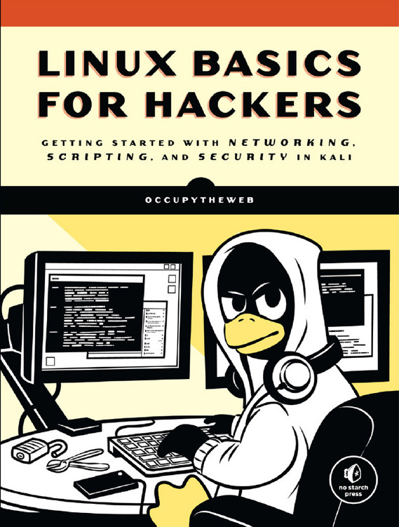

## 《Linux Basics for Hackers》

#项目内容 
- 书籍：《Linux Basics for Hackers》2019版
- 目的：已在不影响其原著作权前提下公开，首发在“信安之路”微信公众号，~~暂时主要为翻译团队内部使用~~
- 时间：2019/01/11--2019/04/11
- 人员：共5人，共同承担全部章节翻译任务
- 义务：~~在翻译完成发布前~~复制传播时，不得私自作为收费传播，不得损害原作者及出版商的权益
- 其他：在保持原作者内容基础上，部分进行了语境调整，而其他可能涉及个人观点的部分，尽量保持原意，不代表译者观点。能力有限，难免存在错误之处，欢迎提交修改，谢谢。

#参与人员
- [HawooSeclab](https://github.com/hawoosec)汉武安全实验室(http://www.hawoo.net) (总体框架统一格式)
- [byr0nchan](https://github.com/byr0nchan)（第*1、4、8、9、10、11、12、13*章节）（两块，乙方网络新数据安全研究从业者，标准合规及风险评估，RHCE/RHCA(Cloud)/DJCP/CISP/CISSP）
- [ink247GG](https://github.com/ink247GG)（第*3、14、15*章节）
（信息安全持续搬砖中，具有CompTIA security+ ce和OSWP认证，据说目前在努力考取OSCP中）
- [咸鱼]()（第*2、16、17*章节）（大数据安全工程师，加拿大本科大三，具有RHCE，CompTIA security+ 认证）
- [nJcx](https://github.com/nJcx)（第*5、6*章节）（甲方安全开发工程师，主要负责nids、hids、waf的研发，偶尔业余挖挖src，喜欢骑行、做饭、爬山）
- [sara961](https://github.com/sara961)（第*7*章节）（石帅哥，等级保护测评安全从业者，超级无敌大帅哥，精通各种划水技术）

#项目进度 
- v0.1.0：初始创建（20190111）
- v0.1.1：完成翻译本的主体框架，除正文章节外已简译完成（20190118）
- v0.1.2：完成第1章节（20190119）
- v0.1.3：完成第12章节（20190121）
- v0.1.4：完成第3、4章节及第13章节(20190210-20190213）
- v0.1.5：完成第2、8、9、10、11章节，原部分进行修订(20190213-20190217）
- v0.1.6：完成第16、17章节（20190226），原部分绪论进行修订，添加目录结构，完成第14、15章节（20190303）
- v0.1.7：预计完成第7章节（20190311）
- v0.1.8：预计完成第5、6章节（20190331）
- v0.1.9：完成初步审核，完成初稿（20190404）
- v1.0：完成初稿发布（20190409）
- v1.1：中文勘误

#友情关注 
- [Opensec知识星球](https://t.zsxq.com/vrvjAuN)
- [Hawoo知识星球](https://t.zsxq.com/2bQvFYJ)

